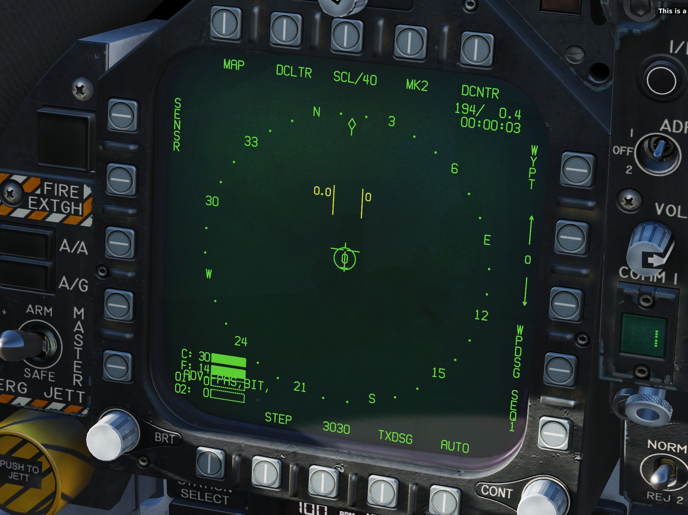

# F/A-18C 左DDI の ADV- ブランクを消す

**※ファイル改変なので導入は自己責任で**

F/A-18C の左 DDI はデフォルトでアドバイザリー/コーションの表示領域に指定されており、下側が1行分だけマスクされています。
実機でも同様の仕様ですが、アドバイザリーに何も表示するものが無い場合はこのブランクが消えるとあります。

以下では、そのブランクを強制的に削除する方法について紹介します。

1. **DCS のインストールフォルダの中にある、以下のファイルを開く**
   > \DCS World OpenBeta\Mods\aircraft\FA-18C\Cockpit\Scripts\
   Multipurpose_Display_Group\Common\Indicator\Pages\MPD\CautAdvAndMenuPage.lua

2. **181 行目の "local AdvisoriesTotalSymbolsNum = 4 + 6 * 7" を "local AdvisoriesTotalSymbolsNum = 0" にする**

改変後は以下のようにマスキング部分が削除され、左 DDI をフルに使うことができます。(文字はオーバーラップされる)

 

ここで変更したファイルは DCS の更新によって元の仕様に戻ってしまうため、その度に書き換える必要があります。

毎回の作業が煩わしい方は、ユーザーファイルを簡単に置換できるツール **JSGME** を使うと良いでしょう。

- [JSGME の導入手順](https://wikiwiki.jp/dcs-world/HowToUseJSGME)
