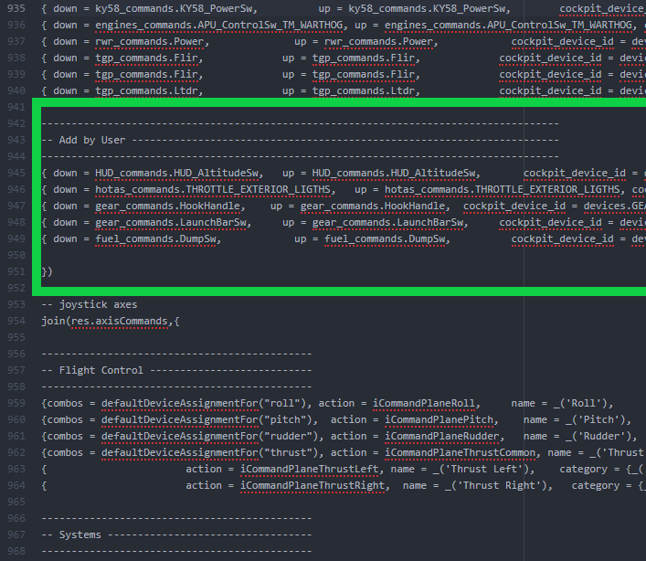

# F/A-18C キーアサインを追加する

**※ファイル改変なので導入は自己責任で**

DCS ではユーザーの環境に合わせて様々なキーアサインができるようになっていますが、用途によっては足りない部分もあります。

キーコンフィグを追加することで、例えば「コントローラーのスイッチの入力信号がオフになると、ゲーム内でスイッチがオフになる」などの OFF 入力を反映させることができます。

**1. DCS のインストールフォルダの中にある、以下のファイルを開く**

   >\DCS World OpenBeta\Mods\aircraft\FA-18C\Input\FA-18C\joystick\default.lua

1行1行がそれぞれのキーアサイン項目を示しています。

- cockpit_device_id: 各スイッチの識別名
- down: 識別したスイッチの down 機能
- up: 識別したスイッチの up 機能
- value_down: 入力信号
- value_up: 入力信号

**2. 940行目あたりの **-- joystick axes** の上の **})** の上に、追加したアサインだと分かるようにするための行を追加する**

改変例として、いくつかの追加アサインを示します。

- 高度計スイッチを、入力 ON のときに BARO に、入力 OFF のときに RDR にする

>{	down = HUD_commands.HUD_AltitudeSw,		up = HUD_commands.HUD_AltitudeSw,				cockpit_device_id = devices.HUD,	value_down =  1.0, value_up = 0.0,		name = _('Altitude Switch - USER ALT'),									category = {_('Instrument Panel'), _('HUD Control Panel')}},

- 着艦フックハンドルを、入力 ON のときに UP に、入力 OFF のときに DOWN にする

>{	down = gear_commands.HookHandle,		up = gear_commands.HookHandle,  cockpit_device_id = devices.GEAR_INTERFACE,		value_down =  1.0,	value_up = 0.0,      name = _('Arresting Hook Handle - USER ALT'),					category = {_('Right Vertical Panel')}},

- 発艦バースイッチを、入力 ON のときに RETRACT に、入力 OFF のとにに EXTEND にする

>{	down = gear_commands.LaunchBarSw,			up = gear_commands.LaunchBarSw,			cockpit_device_id = devices.GEAR_INTERFACE,		value_down =  -1.0,	value_up = 1.0,	name = _('Launch Bar Control Switch - USER ALT'),						category = {_('Left Vertical Panel')}},

- 燃料投棄スイッチを、入力 ON のときに ON に、入力 OFF のときに OFF にする

>{	down = fuel_commands.DumpSw,						up = fuel_commands.DumpSw,					cockpit_device_id = devices.FUEL_INTERFACE,			value_down =  1.0,		value_up = -1.0,	name = _('Fuel Dump Switch - USER ALT'),								category = {_('Left Console'), _('Fuel Control Panel')}},

これらを設定することで、片方にしか入力信号が無いトグルスイッチでも、両方にコマンドを与えることが可能です。

 

ここで変更したファイルは DCS の更新によって元の仕様に戻ってしまうため、その度に書き換える必要があります。

毎回の作業が煩わしい方は、ユーザーファイルを簡単に置換できるツール **JSGME** を使うと良いでしょう。

- [JSGME の導入手順](https://wikiwiki.jp/dcs-world/HowToUseJSGME)
