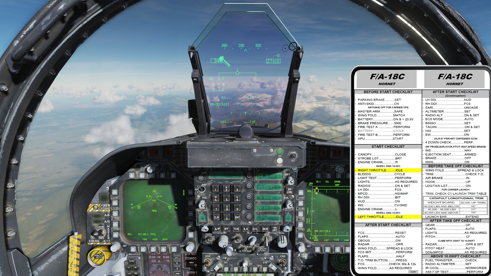
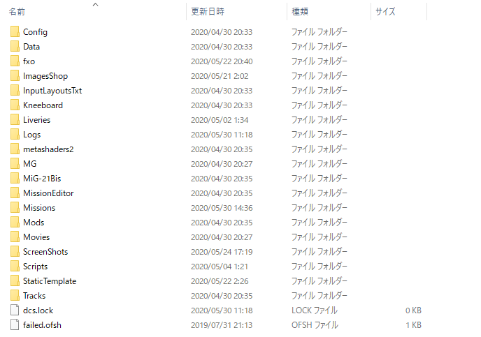

# ニーボード 導入手順

**※ファイル改変なので導入は自己責任で**

ゲーム内で使えるニーボードの導入手順について紹介します。

ニーボードは **[K]** で開き、**[ [ ]** と **[ ] ]** でページをめくります。
**[RShift+K]** で固定表示します。

ニーボードはゲーム内の一角に表示される都合上、高い解像度は適していません。

768x1024 や 900x1200 などの 3:4 の比率で作成すればよいでしょう。

## クライアント環境に入れる

**1.** ユーザー\ユーザー名\保存したゲーム\DCS.openbeta を開きます。

**2.** ファイルを新規作成し、"Kneeboard" に名前を変更します。

**3.** 全ての機体のニーボードに入れたい場合

 - Kneeboard フォルダの中に、更にフォルダを新規作成し、"IMAGES" に名前を変更します。
 - 画像ファイル (.jpg か .png) を入れます。

**4.** 機体別にニーボードを入れたい場合

 - Kneeboard フォルダの中に、更にフォルダを新規作成し、機体に応じた名前に変更します。

    フォルダの名前は DCS のインストールフォルダ内の
    DCS World OpenBeta\CoreMods\aircraft\各機体のフォルダ\Liveries を開き、
    その中のフォルダ名と同じにします。

    例: F-14B の場合は "f-14b", F-16C の場合は "F-16C_50", F/A-18C の場合は "FA-18C_hornet"

- 画像ファイル (.jpg か .png) を入れます。

## ミッションフォルダに入れる

**1.** ミッションフォルダの名前を変更し、拡張子を "miz" から "zip" にします。

**2.** ファイルを解凍します。

**3.** ファイルを新規作成し、"Kneeboard" に名前を変更します。

**4.** クライアント手順の **3.** もしくは **4.** と同様の手順で画像を入れます。

**5.** フォルダを zip に圧縮し、拡張子を "miz" に変更します。
