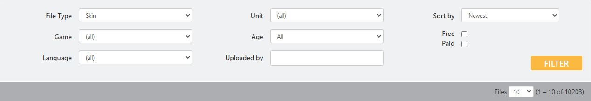

# ユーザースキン 導入手順

**※多くのユーザースキンは二次配布が禁止されています。**

**※製作者の許可の範囲内で使用してください。**

**※ファイル改変なので導入は自己責任で**

ユーザーによって作成されたカスタムスキンを DCS で使う方法について紹介します。

**1. DCS の公式サイトからユーザースキンをダウンロードします**

:fa-external-link: [DCS-Downloads User Files](https://www.digitalcombatsimulator.com/en/files/)

"File Type" を **Skin** にして、"Unit" からお好みの機体を選択します。

**2. ダウンロードしたファイルを解凍します**

**3. DCS のインストールフォルダを開き、次のディレクトリに解凍したファイルを移動して完了です**

- プレイヤーモジュール (F/A-18C) の場合

>\DCS World OpenBeta\CoreMods\aircraft\FA-18C\Liveries\FA-18C_hornet

いくつかの機体は AI 機と同じ場所にあります。

- AI 機 (C-130) の場合

>\DCS World OpenBeta\Bazar\Liveries\C-130

- 上記のディレクトリの場合、デフォルトのものと見分けが付かなくなるので Cドライブに入れる方法もあります。
(ファイルが無い場合は作成します。)

>C:ユーザー\ユーザー名\保存したゲーム\DCS.openbeta\Liveries\FA-18C_hornet
