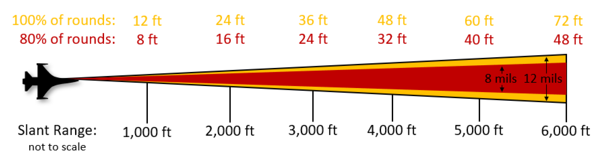
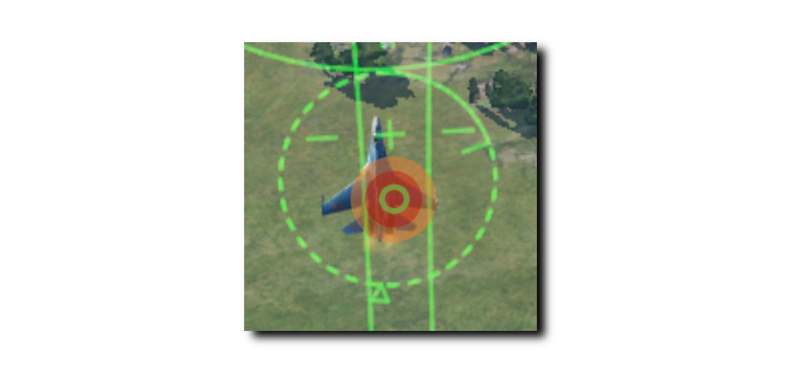
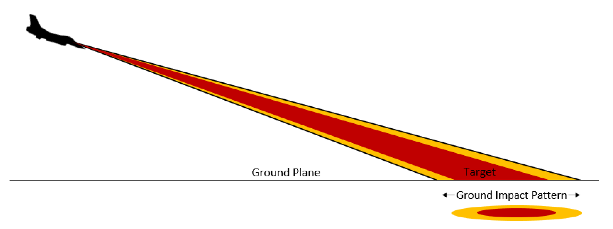
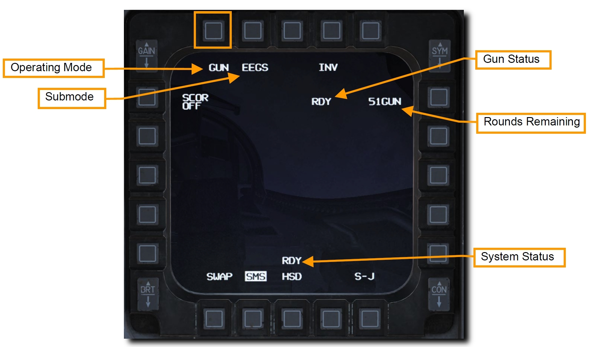
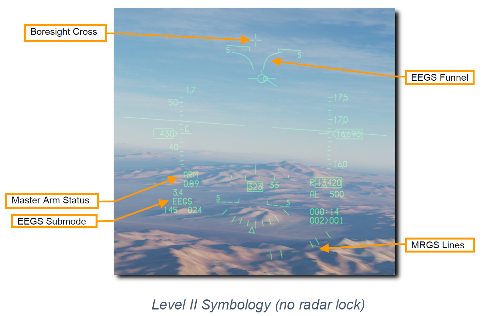
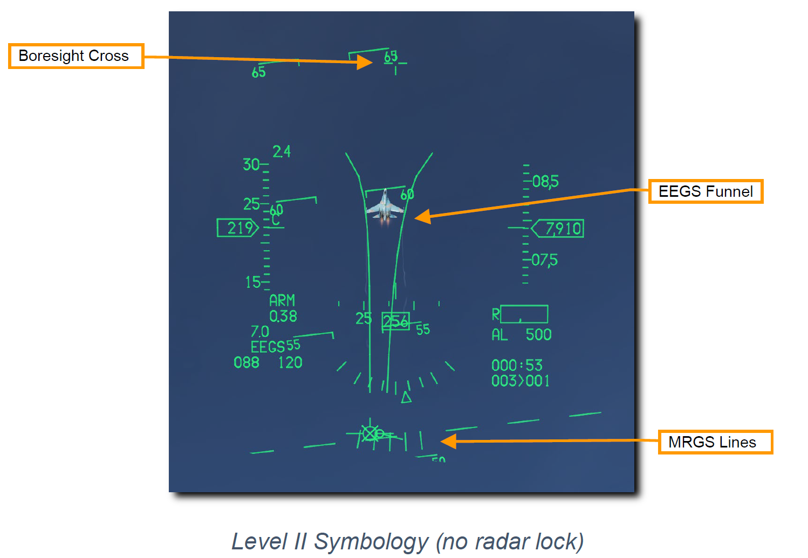
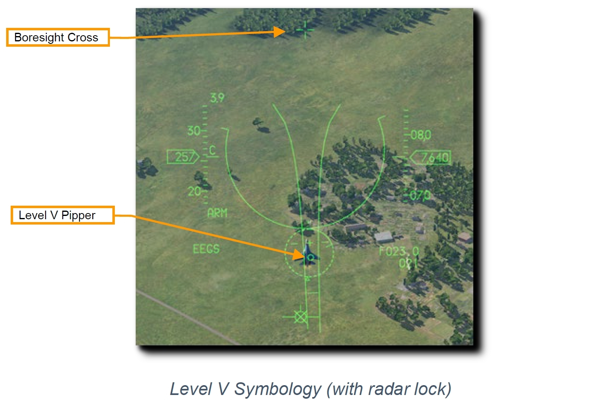
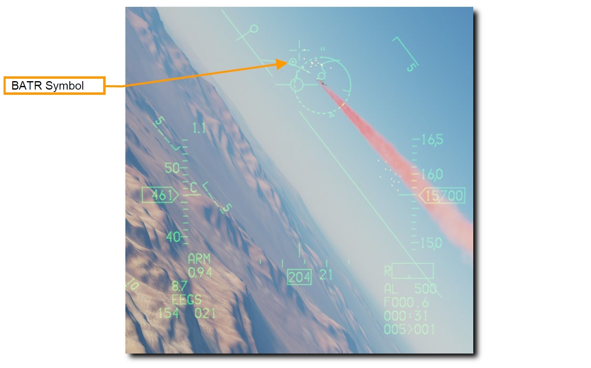

# 空対空機関砲

M61A1 20mm 自動機関砲システムは、パイロットに強力な武器能力とを提供します。
これは6本の銃身をもつガトリング砲で、航空機の左ストレーキに装備されています。
512 発の弾丸と、毎分 6,000 発の連射能力を備えています。

## 銃弾の散布界

どの機関砲システムよって発射された弾丸も完全に真っ直ぐ飛んでいくことはなく、マズルから射出されたあと、円錐形に散らばっていきます。
距離が離れるほど散布界は大きくなります。
円錐のパターン内を通過する弾丸の密度は、パターンの端に近づくほど薄くなります。

M61A1 の平均散布界は 8 ミルで 80 % 、12 ミルで 100 % です。
アメリカ空軍はこれらの仕様を満たすためにボアサイトプログラムを搭載しています。

1 ミルは 1/1000 ラジアンに等しいので、8 ミルは距離 1,000 フィートにおいて 直径 8 フィートに相当し、12 ミルは直径 12 フィートに相当します。
これらの円の大きさは距離によって増加し続けます。

実用上においては、機関砲を発射するときの精度に余裕をもたせていることになります。
下図の例では (中央の小さい) 緑色の機関砲ピパー は直径 4 ミルの円です。
この円内に弾丸が最も集中します。
赤い影付きの領域は 8 ミルの円で、弾丸の 80 % がここを通ります。
橙色の領域は 12 ミルの円で、弾丸の 100 % がここを通ります。

機関砲から発射される弾丸の散布界は、目標が飛行経路に対して垂直な場合にのみ円形になります。
地面に水平な目標に対しては楕円形に広がります。

>**要約**
>
> 1. A-A マスターモードかドッグファイトモードを選択
> 2. マスターアームスイッチを ARM に
> 3. ACM モードで目標を捕捉 (任意)
> 4. 目標に EEGS ファンネルとピパーが重なるように操縦
> 5. トリガーを2段目まで引き、機関砲を発射

以下の2種類の方法で正しい SMS 設定を行います。

**1a. GUN が表示されるまで MFD の OSB 1 を押して、空対空機関砲モードを選択します**

**1b. Dogfight/Missile Override (DOGFIGHT) スイッチを DGFT にします**

こうすることで機関砲と空対空ミサイルの両方を射撃するためのシンボルが HUD に現れます。

**2. HUD 上の空対空機関砲シンボルを確認します**

**Enhanced Envelope Gun Sight (EEGS)** は、レーダーが目標をロックしているかどうかに応じて様々なレベルの情報を表示します。

- **Level I**: 慣性航法装置 (INS) と角速度センサー装置 (RSU) が故障したときに**ボアサイトクロス**のみが表示される故障モードです。これが表示されることはほとんどありません。
- **Level II**: 目標をロックしていないときに、弾道予測を表示されます。**ボアサイトクロス**、**EEGS ファンネル**、**Multiple Reference Gunsite (MRGS) ライン**が表示されます。
- **Level III** & **Level IV**: レベル5に繋がる内部レベルで、普通の場合表示はパイロットには見えません。
- **Level V**: レーダーロックが完了し、そのデータをもとに発射ソリューションが算出されたあとに表示されます。**ターゲットデジグネーター**、**T シンボル**、**スラントレンジ (傾斜距離)**、**接近率**、**レベル5ピパー**を含む、追加のリファレンスシンボルが HUD に表示されます。

- **ボアサイトクロス**: このシンボルは常に表示され、ボアサイトの方向を示します。重力や空気抵抗を受けていないときの弾丸の弾道を示しています。
- **EEGS ファンネル**: ファンネルに沿ったそれぞれの位置は、それぞれの距離で機関砲を正しく照準するための目標を示しています。つまり、目標となる航空機の翼幅がファンネルと同じになっていれば、その時点で射撃した弾丸が命中する正しい距離をとれています。

    距離が縮めば目標は大きく見えます。このとき、目標の翼端がファンネルの両側に接するように、目標がファンネルのより上側にこなければなりません。その結果、目標は HUD のより上部に位置し、さらにはボアサイトクロスに近づくためリードが減少します。

- **Multiple Reference Gunsight (MRGS) Lines**: MRGS サイトは、機関砲の照準線の方向を指す5本線で構成され、HUD の下部で弧を描くように表示されます。この正確な照準ソリューションによって、長距離かつ高アスペクト角において目標をファンネル上に維持するのを補助します。

    MRGS ラインを使ったときに目標がその線よりも小さければ、射程外であるか予測よりも目標の速度が速いため、さらなるリードが必要です。反対に大きければ、予測よりも遅いため必要なリードはより短くなります。

- **ターゲットデジグネーター**: このシンボルはレーダーロックした目標の中心に表示されます。**Target Aspect Caret** と呼ばれる三角形の符号は目標のアスペクト角を示しています。シンボルの外側には2本線の **In-Range Cue** があり、機関砲の最大射程距離を表します。**Target Range Caret** はロックした目標の 1,000 フィートずつのスラントレンジ (傾斜距離) を、それぞれの時計方向の位置で表します。
    - 12 時方向: 12,000 フィート
    - 9 時方向: 9,000 フィート
    - 6 時方向: 6,000 フィート
    - 3 時方向: 3,000 フィート
- **Target Slant Range**: ロックした目標までの距離です。1マイル以上ある場合は 10 マイル単位で表示されます。1マイル未満であれば 100 フィート単位で表されます。
- **Closure Rate**: 目標の接近率をノットで表します。
- **T-Symbol** ロックした目標への2つの発射ソリューションです。+ シンボル、"1-G ピパー" は非機動目標へのリード角を表します。小さな水平線である "9-G ピパー" は最大維持旋回 G での目標へのリード角です。これらはレベル5ピパーが表示されないときのバックアップとして使います。

    1-G ピパーの両側には2本の **Maneuver Potential Line** が表示されています。より長いほうの線は、アウト・オブ・プレーン・マニューバの潜在方向を示します。

- **Level V Pipper**: コンピュータで算出された、現在の距離と速度における機関砲の発射ソリューション (照準点) を示します。このピパーを目標に重ねて機関砲を発射します。

**3. EEGS ファンネル内に目標を収めるように機体を操縦します**

ファンネルに沿ったそれぞれの位置は、それぞれの距離で機関砲を正しく照準するための目標を示しています。
つまり、目標となる航空機の翼幅がファンネルと同じになっていれば、その時点で射撃した弾丸が命中する正しい距離をとれています。

目標の翼端がファンネルの両側に接するようにするか、レベル5ピパーを目標に重ねたまま維持します。

**4. ファンネルの両側に翼端が接する (レベル2) か、ピパーを目標に重ねて (レベル5) からトリガーを2段目までいっぱいに引きます**

スラントレンジは機関砲の有効性に大きく影響します。
機関砲から発射された弾丸は大きく散らばって速度も失われます。
散布界と速度の喪失が大きくなるにつれて、機関砲の精度と効果が減少します。
ファンネルの上の頂点は最小射程の 600 フィートを表しています。
下の頂点は最大射程の 3,000 フィートの位置です。
目標がファンネルの下部よりも小さく見える場合は機関砲の射程外です。

**Bullets at Target Range (BATR) Symbol** と呼ばれるシンボルは、発射後の弾丸を示します。
BATR は最初の弾丸が通過する目標範囲を表し、最後の弾丸が通過すると消えます。
このシンボルは EEGS レベルがレーダーロックした場合であるレベル3, 4, 5のときにのみ表示されます。

