# レーダー (空対空モード)

F-16C で最も重要なセンサーは AN/APG-68 火器管制レーダー (FCR) である.
AN/APG-68 は, 全天候, コヒーレント, マルチモード, 捜索追跡レーダーであり, プログラム可能なデジタルプロセッサーを使用して, 空対空タスクにおいて優れた柔軟性を発揮する.
視界外戦闘 (BVR) と格闘戦 (ACM) の両方で使えるパルスドップラー能力, ルックダウン/シュートダウン能力を持つ.
レーダーは, 左右 60° , 上下 60° の範囲内の目標を探知, 追跡できる.

FCR は探知・捕捉・追跡ができる, 2つの基本的な空対空モードを備えている.

- [Combined Radar Mode (CRM): 複合レーダーモード](#combined-radar-mode-crm)
    このモードは捜索に用いる空対空サブモードを複合している.
    - [Range While Search (RWS): 捜索中測距サブモード](#range-while-search-rws)
    - [Track While Scan (TWS): 捜索中追跡サブモード](#track-while-scan-tws)
- [Air Combat Mode (ACM): 格闘戦モード](#air-combat-mode-acm)
    このモードは自動目標捕捉に用いるすべてのモードを複合している.
    - [30° x 20° (HUD Scan): HUD スキャンサブモード](#30-x-20-hud-scan-hud)
    - [Boresite (BORE): ボアサイトサブモード](#boresite-bore)
    - [10° x 60° (Vertical Scan): 垂直スキャンサブモード](#10-x-60-vertical-scan)
    - [Slewable](#slewable)
- [Single Target Track Mode (STT): 単一目標追跡モード](#single-target-track-mode-stt)
    このモードは RWS もしくは ACM モードで目標をロックオンしたときに切り替わる.
- [Expand Feature (EXP): 拡大機能](#expand-feature-exp)
- [IFF Interrogation: 敵味方識別尋問](#iff-interrogation)

 

レーダーを用いた空対空兵装の発射については以下の項で紹介する.

- 空対空機関砲
- AIM-9M/X
- AIM-120

---

まずは, 複数のモードに共通する機能について触れ, 装備や兵装ごとの特定の機能については後で紹介する.

空対空レーダー画面は, 自機を画面の手前中央位置とした, 標準的なBスコープ表示である.
すなわち, Bスコープ上に表示されるすべての目標は, 自機の前方に存在している.
自機に近い目標はスコープの下側に表示され, 距離が離れるにつれてスコープ上側に表示される.
自機の左右に存在する目標は, 方位角にしたがってディスプレイの左右に表示される.

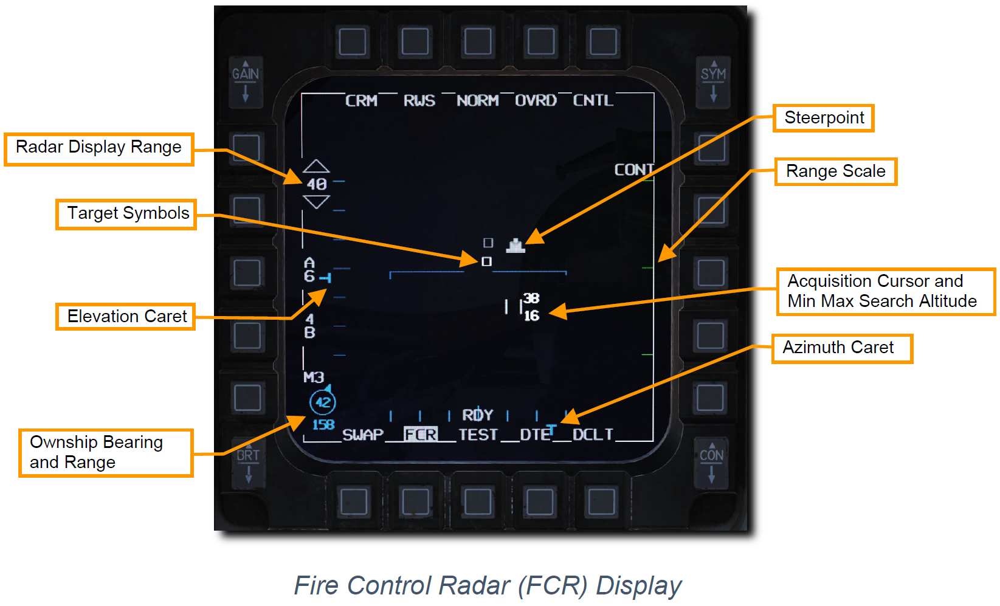

ディスプレイに表示される基本的な要素は以下の通り

- **Radar Display Range (レーダーディスプレイ表示距離)**: ディスプレイの左には現在選択している MFD の表示距離がある. 対応する OSB (Optional Select Button) を押すか, カーソルを上端もしくは下端に動かすことで, 表示距離を拡大・縮小できる.
- **Target Symbols (ターゲットシンボル)**: ターゲットシンボルは正方形で表示される (Bricks) . シンボルの水平位置は自機正面からの角度を表し, 垂直位置は自機からの距離を表す.
- **Acuisition Cursor (捕捉カーソル)**: 2本の縦線で構成され, スロットルの Cursor/Enable スイッチで操作できる. レーダーが捜索モードのとき, レーダービームが照射されている高度がカーソルの上下に表示される.
    ターゲットシンボルに重ねてから操縦桿の TMS 上を押すことで, 目標をロックオンできる.
- **Range Scale (距離目盛り)**: Bスコープの右側にはレーダーの表示距離が示される. それぞれの目盛りは, レーダー表示距離の 1/4, 1/2, 3/4 を表す.
- **Antenna Azimuth and Elevation Caret (アンテナ水平角/仰俯角符号)**: 現在のレーダーの水平角度は, ディスプレイの下端に, 仰俯角度は左端に T で表示される. 符号は, アンテナの最大動作角度である ±60° の範囲で度盛りに沿って動く.
- **Ownship Bearing and Range (自機からの方位/距離)**: ブルズアイまでの自機からの方位と距離が表示される.

モードを選択するには, 現在の表示に隣接する OSB を押す.
使用可能なすべての空対空モードのメニューは, 画面の左側に表示される.
目的のモードに隣接する OSB を押して選択する.

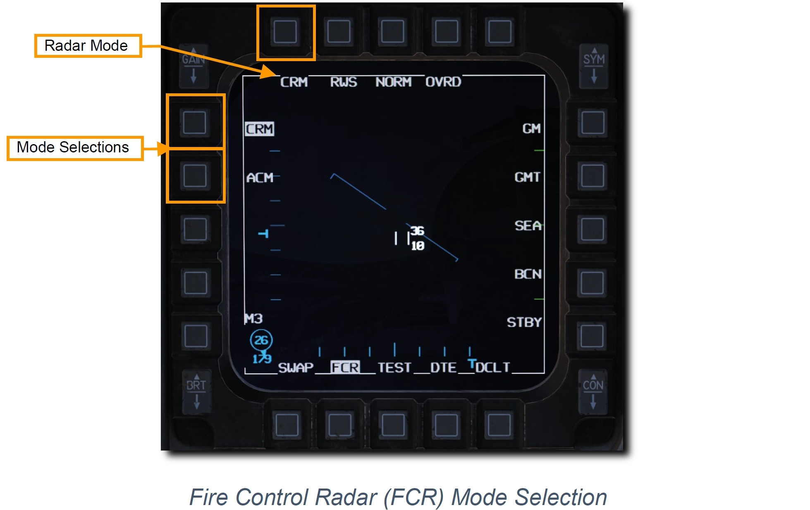

## Combined Radar Mode (CRM): 複合レーダーモード

このモードは, レーダー画面を選択したときのデフォルトとして表示される.
パイロットの負担軽減のために捜索用のサブモードを複合した設計になっている.

- Range While Search (RWS): 捜索中測距
- Track While Scan (TWS): 走査中追跡

サブモード表示に隣接する OSB を押すと RWS と TWS が切り替わる.

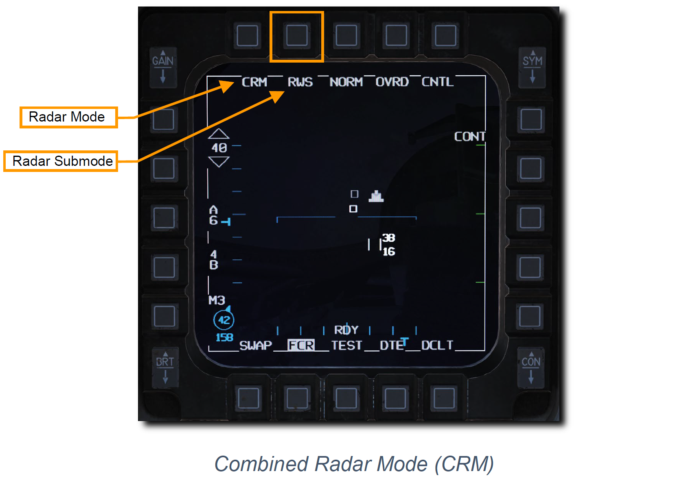

また, 操縦桿の TMS 右を1秒以上長押しすることでも切り替えられる.

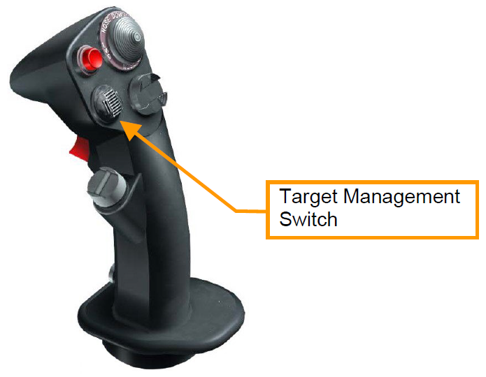

### Range While Search (RWS): 捜索中測距サブモード

捜索中測距 (RWS) サブモードは, 長距離の捕捉と交戦に用いられる.
パイロットは, 表示距離を **10, 20, 40, 80, 160 海里**から選択でき, 加えてレーダーアンテナの水平角と仰俯角も変更できる.

目標は Situational Awareness Mode (SAM: 状況認識モード) と Single Target Track (STT: 単一目標追跡) のいずれかで捕捉 (ロックオン) できる.

#### Situational Awareness Mode (SAM) aquisition: 状況認識モード捕捉

ターゲットシンボルにカーソルを重ねて TMS 上を短押しすることで, 目標をロックできる.
これを行うと SAM モードでのロックオンが実行される.

ロックしている間, レーダーアンテナは最後に判明した目標の位置に向かって指向し, **4バー**, **±10°** のレーダービームが照射される.

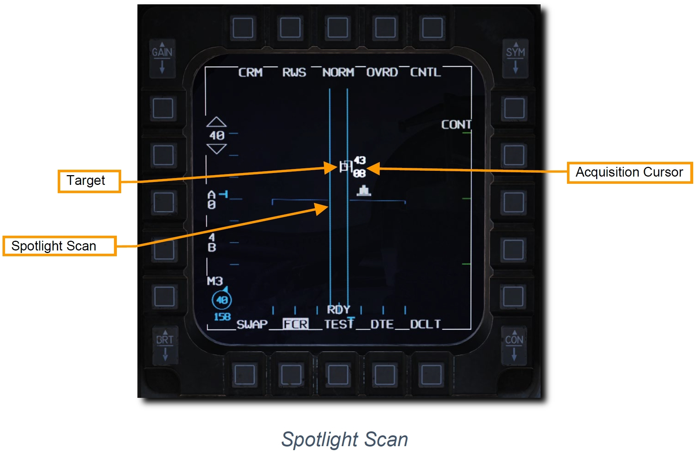

TMS 上を押したときにカーソルの下に目標がいない場合は, 前の走査パターンに戻る.

ロックが成功すると SAM モードに切り替わる.
目標の捕捉中でもエリア内のレーダーの走査は継続され, 他の目標も表示される.
この状態は, 目標を **"Designate: 指定"** もしくは **"Bugging: バグ"** と定義される.

AIM-120 AMRAAM は, STT ロックではなく, バグした目標にも誘導できる.

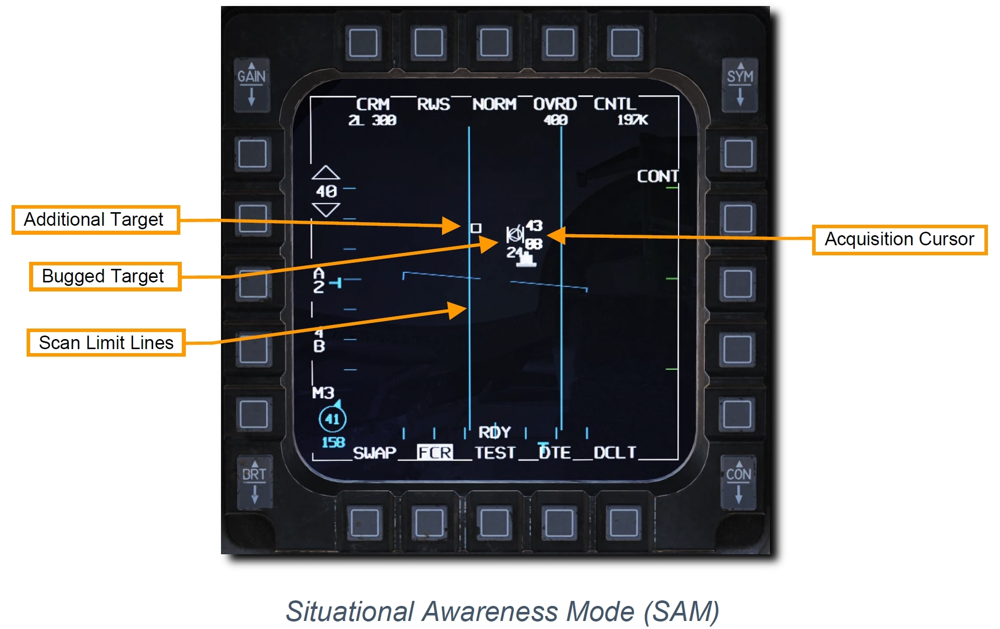

- Additional Target: 他の目標
- Bugged Target: バグした目標
- Scan Limit Lines: 走査範囲リミット

操縦桿の TMS 下を押すと SAM モードを解除できる.
SAM でバグした目標にカーソルを重ねて再度 TMS 上を押すと, その目標を STT モードでロックする.

#### Single Target Track (STT) aquisition: 単一目標追跡捕捉

ターゲットシンボルにカーソルを重ねて TMS 上を素早く2回短押しすることで, 目標をロックできる.
手順は SAM モードと似ているが, 捕捉できる目標は1つのみである.

レーダーはすべてのエネルギーを1機の目標に対して指向し, 継続的な情報更新を可能にする.
しかし, このときレーダーは他の目標を探知できず, ロックされた目標はレーダーロックオン警報を受けることになる.

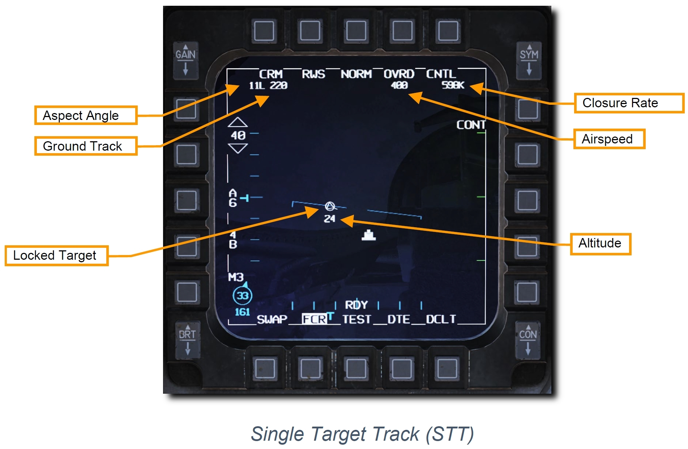

操縦桿の TMS 下を押すと STT モードを解除できる.
TWS 下を1回押すと, 目標をバグした SAM モードに戻り, もう一度押すと RWS モードに戻る.

このモードにの詳細ついては [Single Target Track (STT)](#single-target-track-mode-stt) で紹介する.

### Track While Scan (TWS): 捜索中追跡サブモード

このモードは RWS と STT の特徴を併せ持つ.
全般的に TWS の画面は RWS と類似しているが, それぞれのシンボルには針路を示す **Vector Line** と, その下に高度を示す数字が表示される.
これにより, 他の目標を探知するための走査を継続しながら, 詳細な目標情報を取得できる.

TWS にはいくつかの制限がある.
レーダーはそれぞれの目標に対するトラックファイルを形成しようとするが, 走査範囲が広い場合は走査頻度が落ちる.
レーダーはそれぞれの走査間も, 次の走査での目標の未来位置を予測する.
しかし, 目標が高Gでの回避機動をとり, 軌道と速度が素早く変化すると, レーダーは誤ったトラックファイルを形成してしまい, 目標を失探する可能性がある.
Using such a defensive tactics, the hunter can quickly become the hunted.

TWS と AIM-120 を組み合わせると, 強力で迅速な同時多目標同時交戦能力を発揮できる.
だが, TWS での目標追跡の信頼性は SAM よりも低く, STT と比べるとさらに低い.
STT と異なり, TWS での AIM-120 発射は, 敵目標にレーダーロック警報とミサイル発射警報が行われない.
敵のパイロットが最初に警報を受けるのは, AIM-120 が目標に接近し, 内蔵のアクティブレーダーシーカーを作動させたときである.

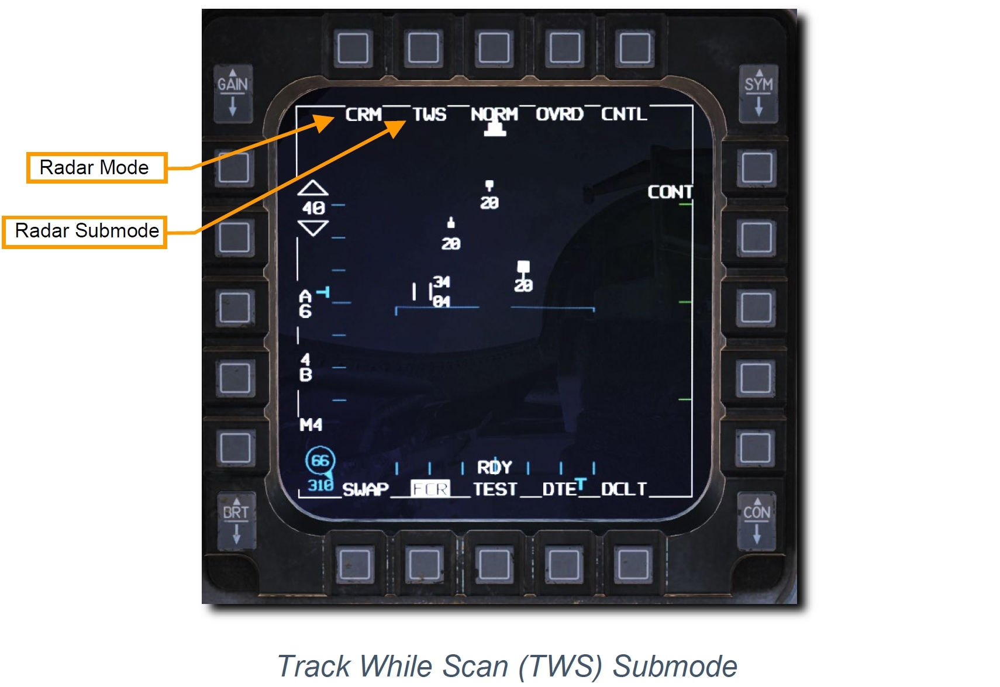

レーダーの掃引 (走査に合わせた画面上の表示) ごとの情報を元に, トラックファイルを10個まで形成する.
レーダー走査範囲設定は RWS と同じだが, 目標をバグしたときは **3バー**, **±25°** に制限される.

目標の優先度に応じて, **Search Target**, **Track Target**, **System Target**, **Bugged Target** の4種類のシンボルが割り当てられる.

#### Search Target: サーチ (捜索) ターゲット

トラックファイルを形成する十分な情報がない目標である.
RWS と同じく, 小さな正方形として画面に表示される.

レーダーの掃引によるトラックが得られなかった場合, これらの目標表示は消滅する.
2回の連続した掃引による有効なトラックが得られた場合, 目標はトラックターゲットとなる.

#### Track Target: トラック (追跡) ターゲット

針路を示す **Vector Line** をもつ, 大きめの白塗りの正方形で表される.
それぞれのシンボルの下にはその目標の高度が表示される.
同時に10個までのトラックが形成される.

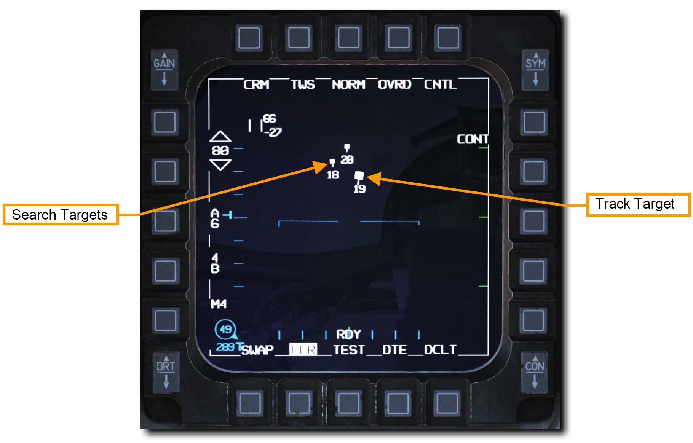

トラックターゲットは基準的な目標シンボルの種類とみなされる.
目標がこの段階のシンボルになると, 他のオプションが利用できるようになる.
目標は IFF 尋問により敵か味方かに判別され, トラックターゲットとして残る.
より注意が必要な目標はシステムターゲットに変更できる.

#### System Target: システムターゲット

より重要なトラックターゲットとして識別を容易にしたい場合はシステムターゲットを用いる.
**Vector Line** と高度を含む, 空の正方形として表示される.

トラックターゲットをシステムターゲットに以降する方法の1つは, レーダーカーソルをトラックターゲットに重ねて操縦桿の TMS 上を押す.
また, 表示される他のシステムターゲットが無い場合に TMS 右を押すと, すべてのトラックターゲットがシステムターゲットに置き換わる.

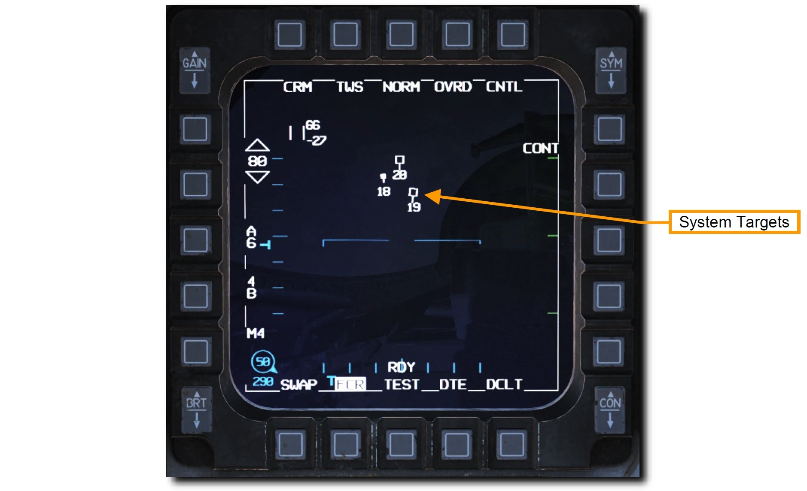

カーソルをシステムターゲットの上に重ねると, その目標を Estrablishment (確立) できる.

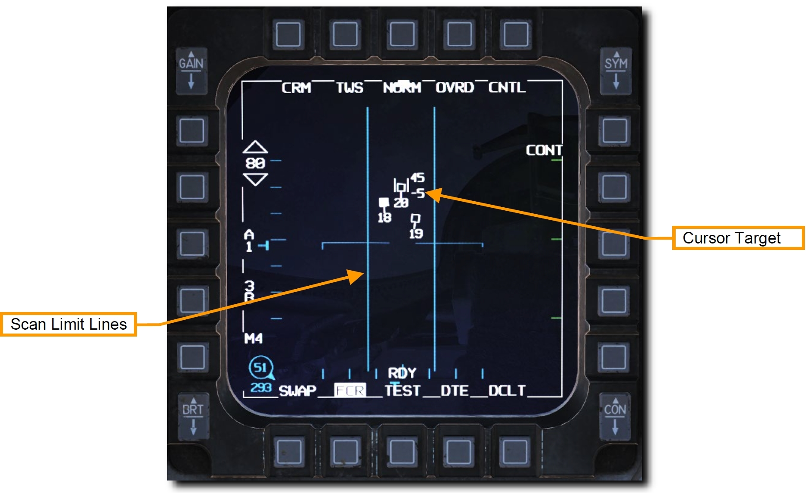

この場合, その目標を中心に**3バー**, **±25°** の走査に制限され, より高い更新頻度を可能にするとともにトラック失探の可能性を低減する.
AIM-120 の発射に用いることはできないが, その目標に対するレーダー更新頻度を向上させられる.

カーソルを他のシステムターゲットに重ねることで, これを変更できる.
どのシステムターゲットにも重なっていない場合, レーダーは通常の走査に戻る.

システムターゲットにカーソルを重ねて TMS 上を押すと, バグターゲットとして指定できる.
移行すると, バグターゲットを中心に**3バー**, **±25°** の走査となり, より高い更新頻度を可能にするとともにトラック失探の可能性を低減する.

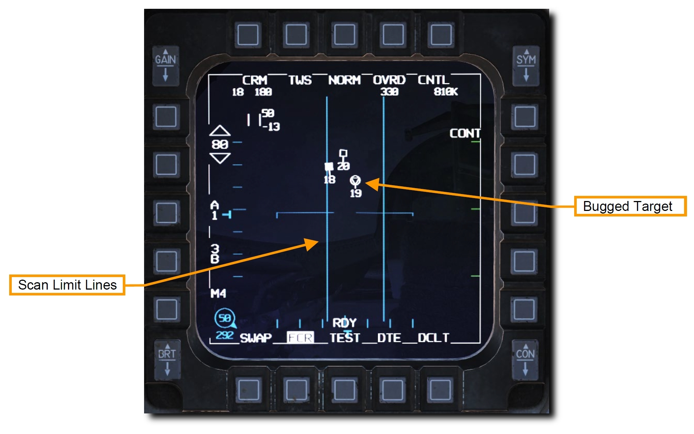

#### Bugged Target: バグターゲット

すべてのトラックファイルのなかで最も高い優先度の目標であり, AIM-120 はバグした目標に誘導される.
シンボルには円が表示される.

TMS 右を押すと, 最も近いシステムターゲットがバグターゲットに置き換わる.
続けて TMS 右を押すと, 表示されているすべてのシステムターゲットが順番にバグターゲットに置き換わる.

これにより, AIM-120 を用いた交戦手順は次のようになる.

1. トラックターゲットのうち, 交戦する目標をシステムターゲットに移行する
2. 最も脅威度の高いシステムターゲットをバグし, ミサイルを発射する
3. システムターゲットを順番にバグして, それぞれにいミサイルを発射する

さらに, レーダーカーソルをバグターゲットに重ねて TMS 上を押すと, STT 追跡に移行する.

STT から TWS モードに戻るには TMS 下を押す.
続けて TMS 下を押すごとに, トラックファイルの優先度が降格する.

## Air Combat Mode (ACM): 格闘戦モード

格闘戦モードでは, 近くの航空機を自動的に捕捉する.
このモードは主に, 目標が目視圏内に入ってから使用する.
パイトットは目標をレーダーで捕捉するために, 適切な位置に機体を操縦しなければならない.

異なる走査パターンをもつ4つのサブモードがある.

- 30° x 20° (HUD Scan): HUDスキャン
- Boresite (BORE): ボアサイト
- 10° x 60° (Vertical Scan): 垂直スキャン
- Slewable

どのサブモードであっても, レーダーは最初に探知した目標をロックする.
ボアサイトモードの最大捕捉距離は 20 海里で, 他のすべての ACM モードの最大捕捉距離は 10 海里である.
それぞれのモードには長所と短所があり, それぞれの状況において最大の効果を発揮する.

ACM モードに入る方法は次の2つである.

1. スロットルの Dogfight/Missile Override (DOGFIGHT) スイッチを DOFT に倒す
2. ディスプレイ左のレーダーモードから ACM に隣接する OSB を押す

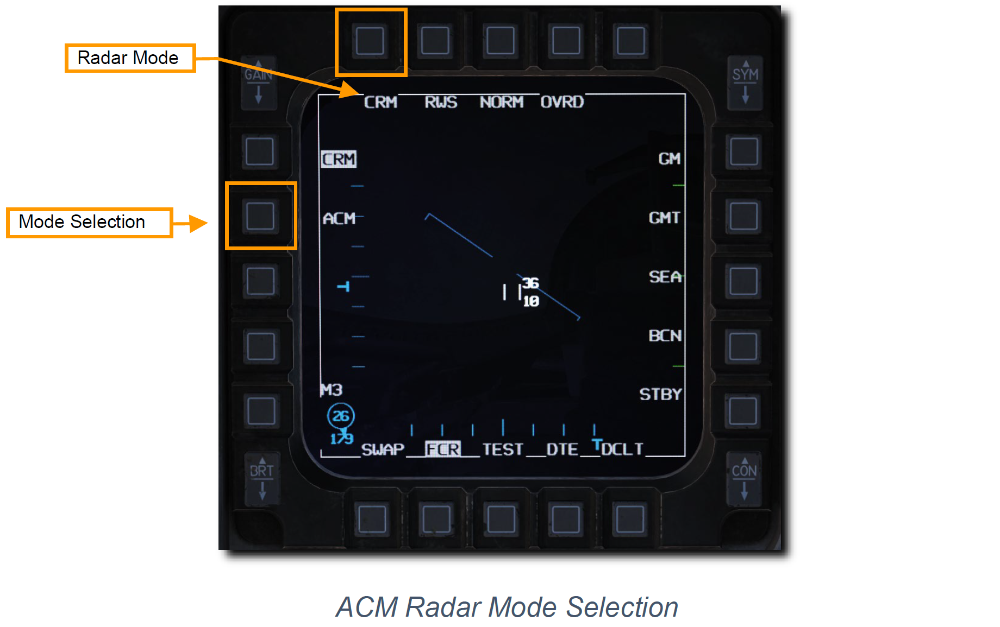

ACM モードに切り替えると, デフォルトで 30° x 20° (HUD スキャン) サブモードが 電波を放出しない状態 (NO RAD) で選択される.
操縦桿の TMS か, MFD からサブモードを切り替えると, レーダーの電波放出が開始される.

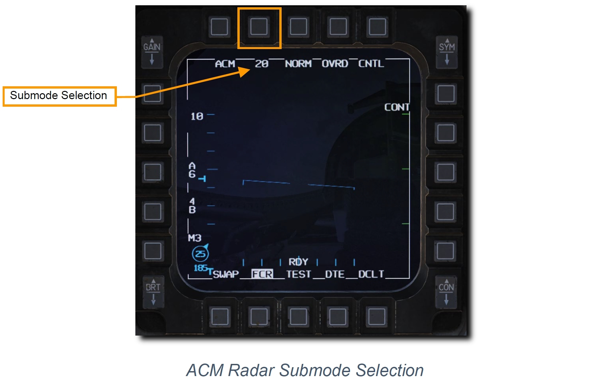

ACM モードでレーダー画面が SOI になっているとき, HOTAS の TMS は次のように機能する.

- TMS 上
    - ボアサイトサブモード
- TMS 下
    - 目標をロックしていない場合: 10° x 60° 垂直スキャン
    - 目標をロックしている場合: ロック解除 + 30° x 20° HUD スキャン
- TMS 左
    - 機能なし
- TMS 右
    - 30° x 20° HUD スキャン

### 30° x 20° (HUD Scan): HUD スキャンサブモード

30° x 20° HUD スキャンパターンは, HUD の視野角よりも少しだけ広い範囲を捜索する.
目標捕捉距離は 10 海里である.
レーダーは, この範囲内に入った最初の目標を自動的にロックする.
ロックすると, 目標は自動的に STT モードで追跡される.

このサブモードは特別な HUD シンボルをもたない.

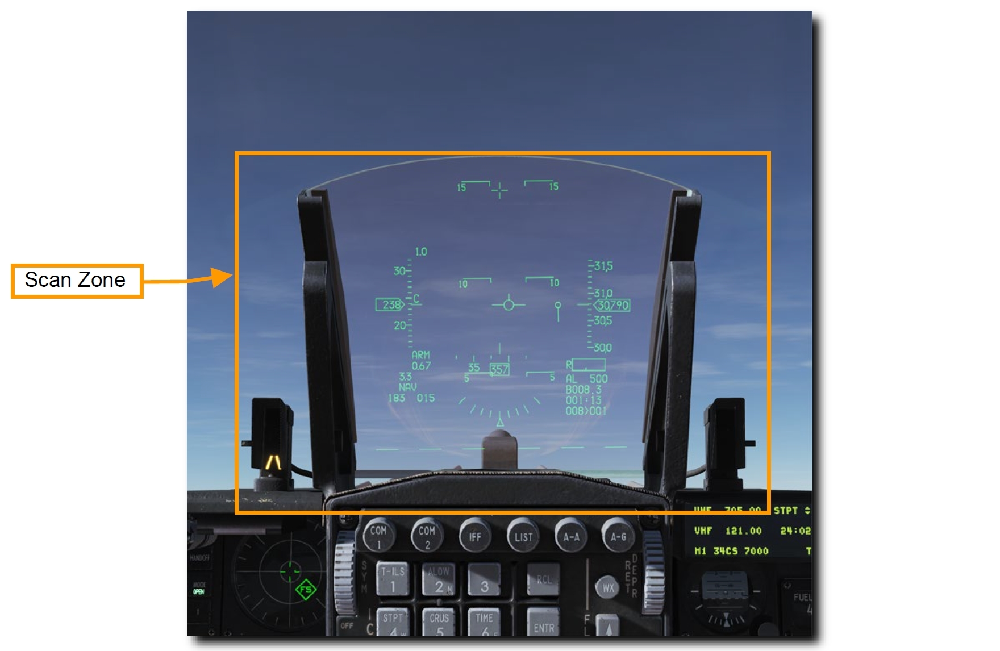

このモードは, ボアサイトモードより精度が低く, レーダーの捜索対象となる領域が広いため, 目標のロックに時間が掛かる可能性がある.

### Boresite (BORE): ボアサイトサブモード

ボアサイトスキャンパターンは, HUD のガンクロスより下 3° の1回分のビーム幅の範囲を捜索する.
HUD にはレーダー捜索範囲を中心とした**ボアサイトクロス**が表示され, 目標にレーダービームを照射する目印となる.

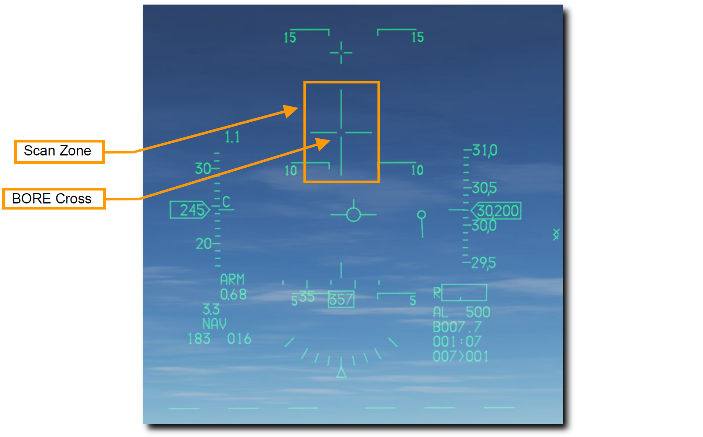

ボアサイトモードは, 視界内戦闘 (WVR) での素早いロックに最適で, ロックされる目標をある程度細かく制御できる.
20 海里内の探知した最初の目標を自動的に STT モードで追跡する.

### 10° x 60° (Vertical Scan): 垂直スキャンサブモード

10° x 60° 垂直スキャンサブモードでは, レーダーは幅 10 °, 垂直 60° の範囲を捜索する.
走査の中心はガンクロスより 23° 上方である.
このモードでは, ガンクロスから HUD の下部に伸びる垂直線が表示される.

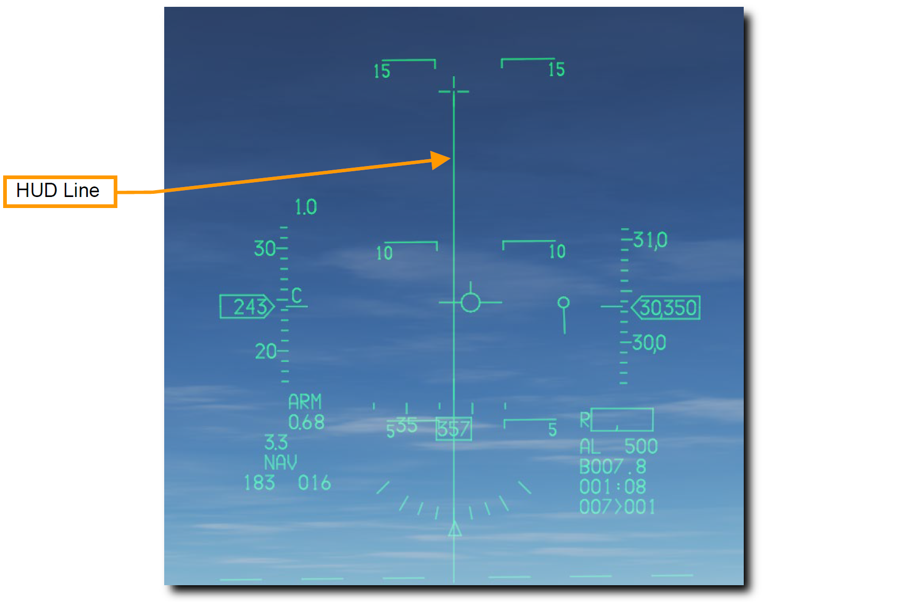

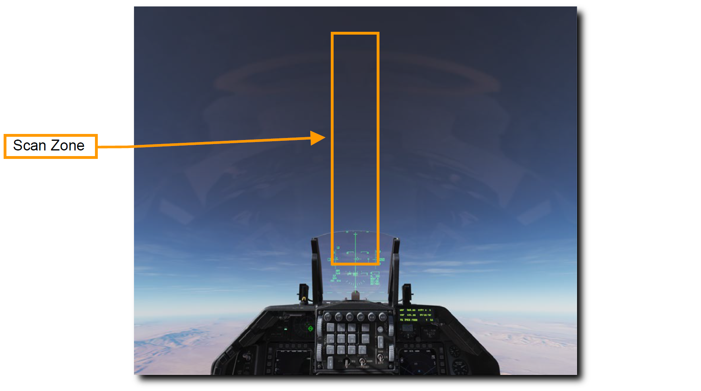

ロックできるのは 10 海里までの範囲である.
範囲内に入った最初の目標をロックし, 自動的に STT モードで追跡する.

このモードは格闘戦において最も使用頻度が高い.
ドッグファイトのとき, パイロットの頭上にいる目標を HUD 内に引き込もうと, 操縦桿を引こうとする.
このモードであれば, HUD フレームよりずっと上方であっても目標を素早くロックできる.

### Slewable: スルーアブルサブモード

このモードの走査範囲はおよそ高さ 20° x 幅 60° である.
このモードが選択されると, 走査は機体正面の水平線上で行われる.
スロットルの CURSOR/ENABLE スイッチで, この範囲をスルー (移動) して目標をロックする.
スルーできる範囲は, レーダーアンテナが可動できる限界域までである.

他のモードと同様, 範囲内に入った最初の目標を自動的にロックし, STT モードで追跡する.

このモードは, "敵機が2時方向 上方" というような目視では確認できていない状況において, 直接ロックしにいくのに向いている.

!!! missing "Not Implemented in DCS"
    早期版では未実装

## Single Target Track Mode (STT): 単一目標追跡モード

RWS か ACM サブモードで目標をロックした後, レーダーは STT モードに切り替わる.

レーダーはすべてのエネルギーを1機の目標に対して指向し, 継続的な情報更新を可能にする.
しかし, このときレーダーは他の目標を探知できず, ロックされた目標はレーダーロックオン警報を受けることになる.

STT モードでの MFD 画面のほとんどは RWS モードのときと似ているが, 次の違いがある.
**Locked Target (捕捉目標)** は, 飛行進路を表す Vector Line を含む, 円で囲まれた三角形で表示される.
シンボルの下には **Target Altitude (目標高度)** が表示される.
画面の上部には **Aspect Angle (アスペクト角)**, **Ground Track (磁気針路)**, **Airspeed (目標速度)**, **Closure Rate (接近率)** が表示される.

## Expand Feature (EXP): 拡大機能

レーダーは, 近接した目標グループに対する判別と分解能を高めるために, 視野角を拡大することができる.
これは, レーダーカーソルを中心とした4倍の拡大機能として扱われる.
この機能はレーダーのすべてのモードにおいて使用できる.

レーダー画面が SOI のときに, 操縦桿の **Expand/FOV Button (拡大/視野角変更ボタン)** もしくは MFD の NORM/EXP の文字に隣接する OSB を押すことで拡大機能を切り替えられる.

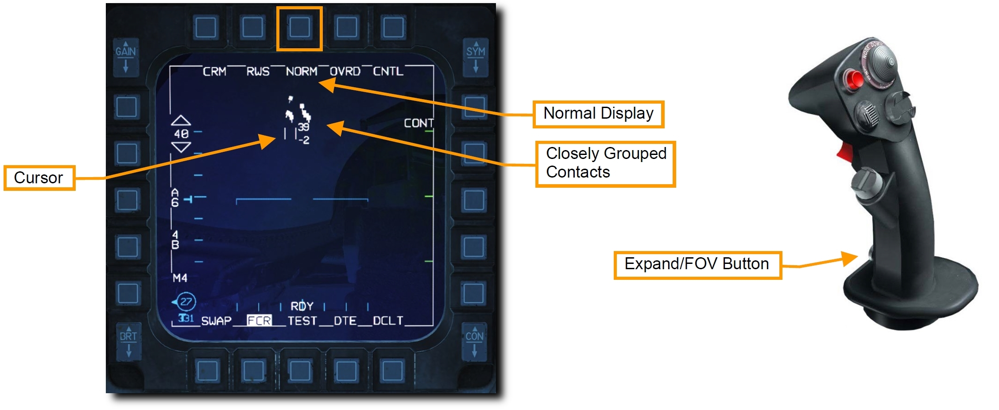

カーソルを中心とした 2 x 2 海里の範囲を拡大する.
その他の基本的な機能とシンボルは通常の画面と変わらない.

## IFF Interrogation: 敵味方識別尋問

敵味方識別 (IFF) システムは, 航空機が友軍であるか敵機であるかを判別する尋問を行う.
これは, レーダービームの水平角と仰俯角によって選択された範囲もしくはレーダーで探知した特定の目標に対して, シグナルコードを送信することで実行される.
友軍機であれば搭載されたトランスポンダーが正しいコードで応答する.

目標は, この応答によって分類され, レーダー画面に友軍もしくは敵機として表示される.
IFF システムはレーダーに依存しないため, レーダーがオフであっても尋問を行うことができる.

IFF 尋問を有効にするには, IFF パネルのマスタースイッチを NORM もしくは LOW にする必要がある.

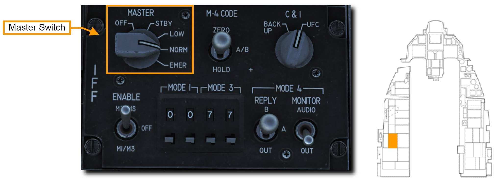

2通りの HOTAS 入力によって尋問を行うことができる.

- **Scan (スキャン)**: TMS 左を1秒以下で短押ししすると, レーダー走査範囲のすべての目標に対して尋問を行う.
- **Line of Sight (LOS: 見通し線)**: TMS 左を1秒以上長押しすると, ロックした目標もしくはレーダーカーソル周辺の目標に対して尋問を行う.

目標が友軍機であれば, シンボルを囲む緑色の円が3秒間表示される.
応答が無い場合はディスプレイには何も現れず, 目標は正体不明機と分類されたままである.
この場合, 目標は現在の作戦の交戦規定 (ROE) 上の敵機であると推定される可能性がある.

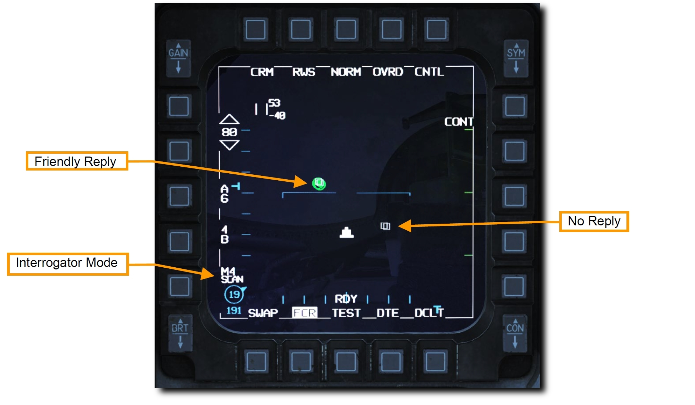
