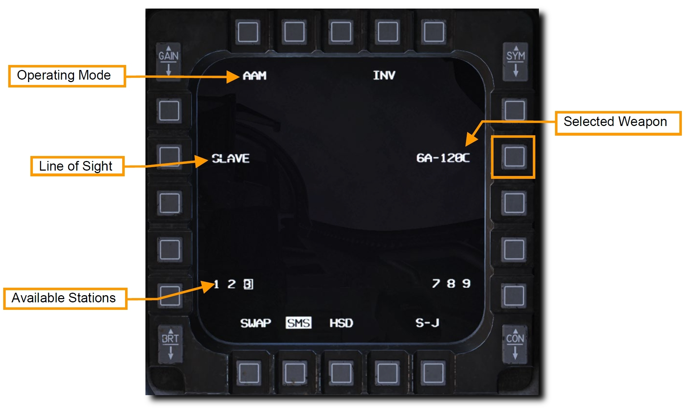
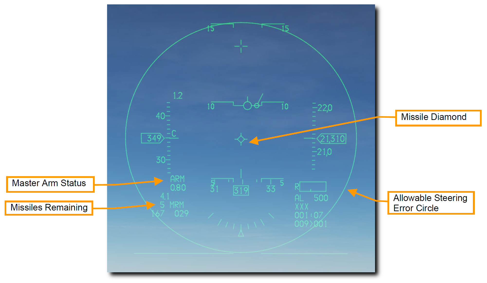
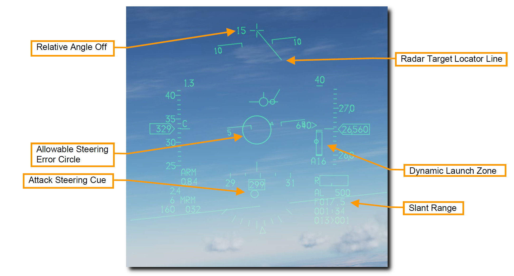
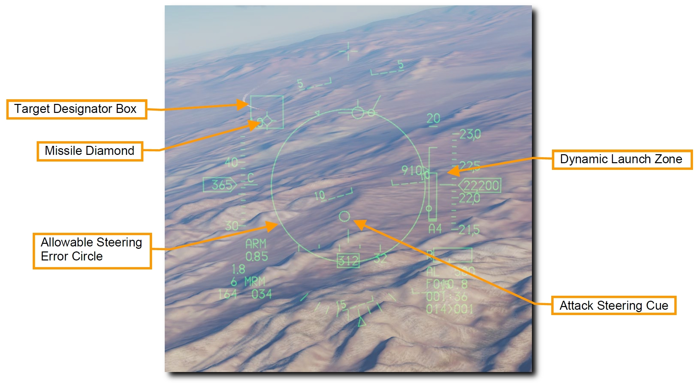

# AIM-120 AMRAAM

AIM-120 AMRAAM は、ノーズコーンに内蔵された小型レーダーを使って自己誘導が可能なアクティブレーダー誘導 (ARH) の空対空ミサイルです。
ミサイルは、[単一目標追跡モード (STT)](../aa-radar/#single-target-track-mode-stt) と[状況認識モード (SAM)](../aa-radar/#situational-awareness-mode-sam-aquisition) の両方で誘導できます。
アクティブシーカーのおかげで、同時に複数目標との交戦が可能です。
また、ミサイルを最後まで自機で誘導し続ける必要もありません。

AIM-120 は 20 海里以遠にいる目標と交戦できる中距離空対空ミサイルです。
しかし、実際の交戦距離は目標のアスペクト角、交戦高度、発射速度、発射後の目標の機動などに大きく影響されます。
このように、場合によっては 10 海里以下の交戦距離になることもあります。

格闘戦では、自機のレーダーロックを必要としない BORE モードで発射することができます。
AIM-120 は HUD に表示されたレティクル内に入った最初の目標を追跡します。
友軍機との誤射に注意してください。

>**要約**
>
> 1. A-A マスターモードかミサイルモードを選択
> 2. マスターアームスイッチを ARM に
> 3. レーダーで目標を捕捉 (任意だが推奨)
> 4. 射程範囲に目標が入るように操縦
> 7. WPN REL ボタンを押してミサイルを発射

## AIM-120 の運用

以下の2種類の方法で正しい SMS 設定を行います。

**1a. AIM-120 が表示されるまで MFD の OSB 7 を押して、AIM-120 を選択します**

**1b. Dogfight/Missile Override (DOGFIGHT) スイッチを MSL にします**

オーバーライドスイッチは他のマスターモードを空対空戦闘設定に変更します。
すると、空対空ミサイルを射撃するためのシンボルが HUD に現れ、搭載しているなかで射程が長いほうのミサイルが選択されます。

OSB 7 の隣にはミサイルの種類と数が表示されています。
下部にはミサイルが搭載されているステーションが表示され、選択中のステーションは四角で囲まれています。
操縦桿のミサイルステップボタンか選択したい側の OSB を押すと、ステーションを切り替えられます。

- **Line of Sight (照準線)**: レーダーアンテナの向きに追従する **SLAVE** と、正面を向く **BORE (ボアサイト)** のどちらかを選択します。スロットルの CURSOR/ENABLE コントロールを押し込むと、選択中のモードを切り替えます。
    - BORE モードの場合、自機からの目標情報を必要とせず、ミサイルは自身に内蔵されたレーダーで捕捉・追跡します。
    - SLAVE モードの場合、ミサイルは自身に内蔵されたレーダーで追跡できる距離に近づくまでは、航空機側のレーダーで得られた目標情報をデータリンクで受信します。

**2. HUD 上の空対空ミサイルシンボルを確認します**

空対空マスターモード選択時の HUD には、空対空ミサイルの状態と発射のための情報が投影されています。
シンボルのほとんどは NAV (航法) モードと同じですが、目標の捕捉とミサイルの発射のためにいくつかの機能が追加されています。

- **Master Arm**: マスターアームスイッチの状態を表します。
- **Missile Remaining**: ミサイル残弾数を表します。
- **Missile Diamond (ミサイルダイヤモンド)**: AIM-120 のレーダーシーカーの方向を表示します。最初はシーカーの取り付け位置に表示されていますが、SLAVE モードが選択されていれば、シーカーはレーダーがロックしている目標の方向を向きます。
- **Allowable Steering Error Circle (ASEC)**: 目標に命中させるため、発射前にはこの円の内側に **Attack Steering Cue (ASC: 攻撃操舵点)** を入れます。ASC はレーダーで目標をロックしたあとに表示されます。**ASEC** はミサイルを発射する際に許容できる目標との角度の誤差の最大値を表しています。つまり、目標との距離が縮めば円は大きくなり、より大きな角度誤差があってもミサイルを発射できるようになります。

**3. レーダーで目標を捕捉**

RWS モード、TWS モード、ACM サブモード、AIM-120 の SLAVE モードのいずれかを使って目標をロックします。

- **Target Locator Line (TLL)**: ロックした目標が HUD の視野角外にいるときにガンクロスから伸びるように表示され、目標の方向を指し示します。
- **Relative Angle**: ガンクロスの隣に表示され、ガンクロスと目標の角度差を 10° 毎に表示します。
- **Allowable Steering Error Circle (ASEC)**: 距離に応じて大きさが変化します。
- **Attack Steering Cue (ASC)**: 目標をロックすると表示されます。これを ASEC 内に入れることで、目標との角度誤差を減らします。
- **Slant Range**: 目標をロックすると表示されます。目標との距離を表します。

目標をロックすると、HUD の右側に様々な距離を表す **Dynamic Launch Zone** が表示されます。

- **Range Scale**: DLZ に表示されている距離の範囲です。
- **Maximum Missile Range**: 非機動目標に対するミサイルの理論上の最大射程距離です。
- **Maximum Missile Range vs Maneuvering Target**: 機動目標に対するミサイルの最大射程距離です。
- **Closure Rate and Range**: 接近率を数字で、現在の目標までの距離を Range Scale に対する符号の位置で表します。
- **Radar Activation Range**: AIM-120 に内蔵されたレーダーが起動する距離です。
- **Minimum Missile Range**: ミサイルの最小射程距離です。
- **Axx**: AIM-120 に内蔵されたレーダーが起動するまでの所要時間です。
- **Txx**: ミサイルが着弾するまでの所要時間です。

**4. Attack Steering Cur (ASC) が Allowable Steering Error Circle (ASEC) サークルに入るように操縦します**

**Allowable Steering Error Circle** の大きさは目標との距離とアスペクト角によって変動します。
**Attack Steering Cue** が ASEC サークルのできるだけ中心に位置するように航空機を操縦し、ミサイルが最も効率よく飛翔できるコースをとります。

HUD 内に目標を収めると、目標と重なるように **Target Designator Box (目標指示ボックス)** が表示され、**Missile Diamond** がそれを追跡します。

DLZ を注視し、最適な発射位置を決定できるよう状況を精査します。

**5. WPN REL ボタンを押してミサイルを発射します**

ミサイルが発射され、次のミサイルが発射準備に入ります。

BORE モードを使えば AIM-120 を自機のレーダーロック無しで発射できます。
これは、すぐさま撃たなければならないときや、レーダー照射をしたくないときに用いられます。
このときミサイルのレーダーが発射直後に起動し、最初に捉えた目標を追跡します。
そのため、友軍との誤射に注意しなければなりません。
