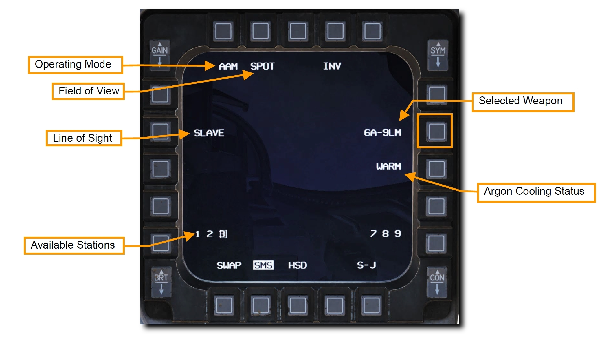
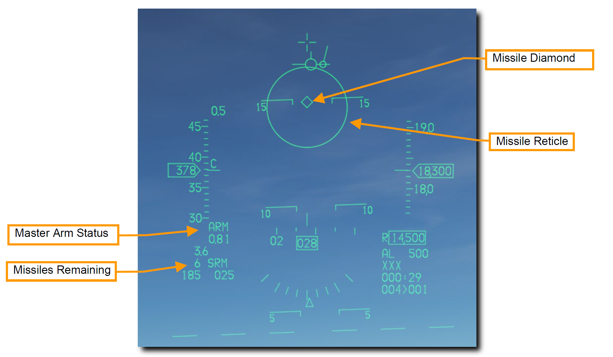
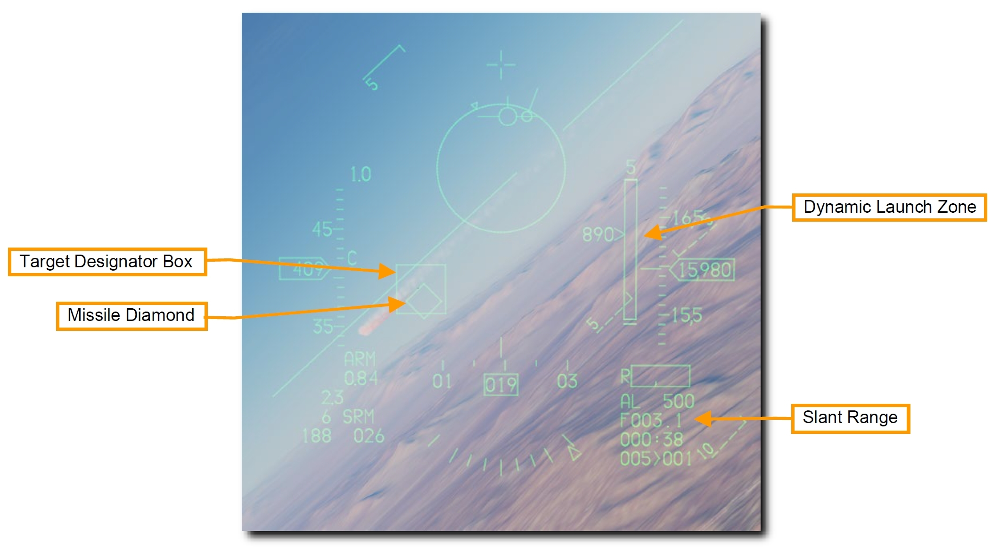
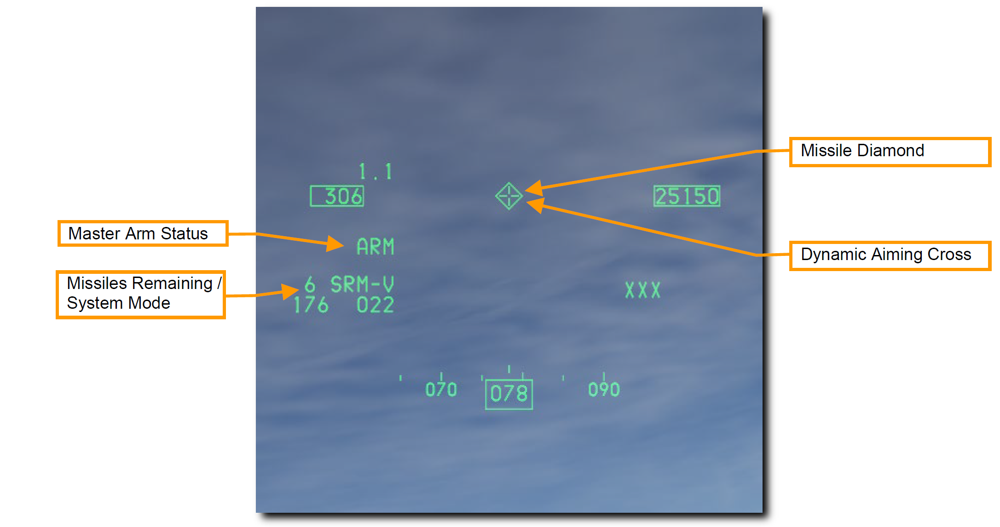
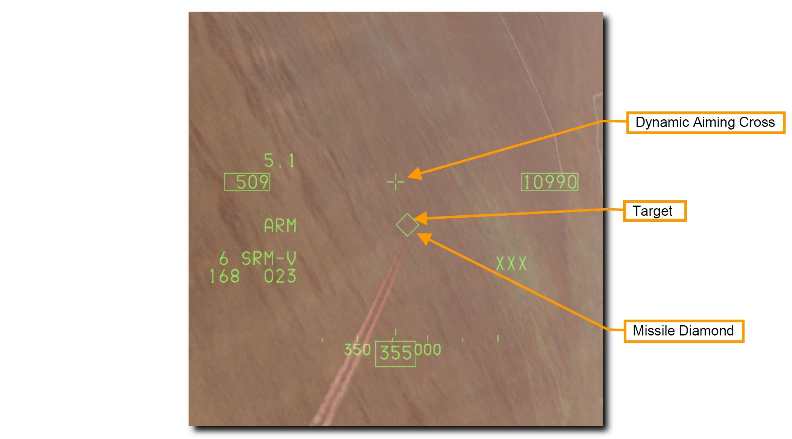
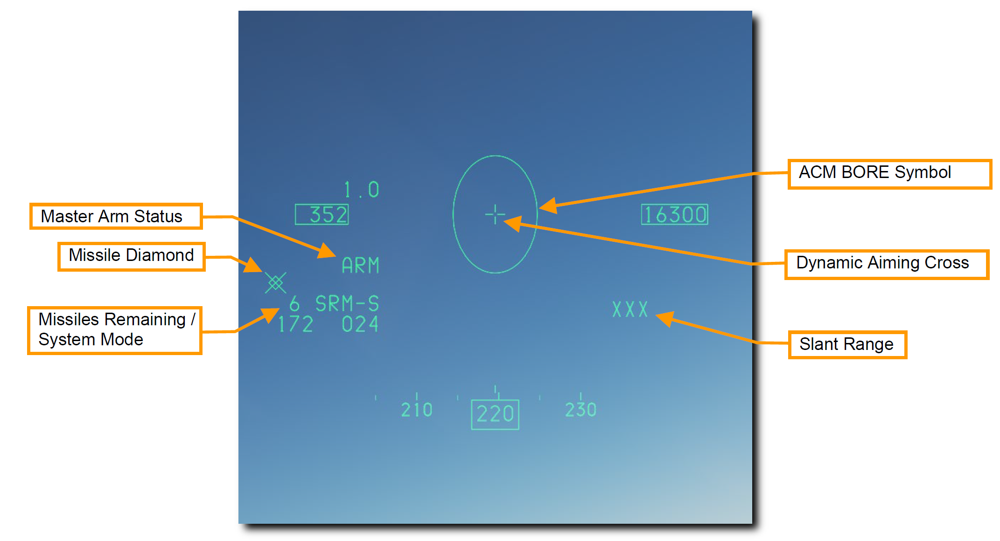

# AIM-9 Sidewinder

AIM-9 はドッグファイトで用いられる短距離赤外線誘導ミサイルです。
撃ちっ放し機能を備えており、レーダーロック無しでも発射できます。
高ピッチのロックトーンでシーカーが目標をロックしたことを伝えます。
また、シーカーをアンケージ (ジンバルを開放すること) すると、赤外線シーカーで最初に捉えた目標を追跡させることができます。

AIM-9 はフレアによって欺瞞されるため、発射する前にシーカーの視野角内にフレアが存在しないことを確かめるとロックオンの確実性が上がるでしょう。

>**要約**
>
> 1. A-A マスターモードかドッグファイトモードを選択
> 2. マスターアームスイッチを ARM に
> 3. レーダーで目標を捕捉 (任意)
> 4. 射程範囲に目標が入るように操縦
> 5. (必要であれば) アンケージスイッチを押して、シーカーを開放
> 6. ミサイルダイヤモンドの表示とロックトーンの再生を確認
> 7. WPN REL ボタンを押してミサイルを発射

- [AIM-9M/X の運用](#aim-9mx)
- [HMCS のミサイルボアサイトを使った AIM-9M/X の運用](#hmcs-aim-9mx)
- [HMCS のレーダーボアサイトを使った AIM-9M/X の運用](#hmcs-aim-9mx_1)

## AIM-9M/X の運用

以下の2種類の方法で正しい SMS 設定を行います。

**1a. AIM-9 が表示されるまで MFD の OSB 7 を押して、AIM-9 を選択します**

**1b. Dogfight/Missile Override (DOGFIGHT) スイッチを DGFT にします**

オーバーライドスイッチは他のマスターモードを格闘戦設定に変更します。
すると、機関砲と空対空ミサイルの両方を射撃するためのシンボルが HUD に現れます。
スイッチを MSL 位置にすると、HUD に現れるシンボルは空対空ミサイルのみを射撃するためのものになります。

OSB 7 の隣にはミサイルの種類と数が表示されています。
下部にはミサイルが搭載されているステーションが表示され、選択中のステーションは四角で囲まれています。
操縦桿のミサイルステップボタンか選択したい側の OSB を押すと、ステーションを切り替えられます。

- **Field of View (視野角)**: ミサイルの視野角を **SPOT** (狭域) と **SCAN** (広域) から切り替えます。SCAN にするとシーカーは正面を中心に弧を描くように回転して走査範囲を広げますが、探知距離は短くなります。
- **Line of Sight (照準線)**: **SLAVE** ではシーカーはレーダーの照準線に追従し、**BORE** では正面を走査し続けます。スロットルの CURSOR/ENABLE コントロールを押し込んでいる間は、選択中のモードを上書きします。離すと MFD で選択していた元のモードに戻ります。
- **WARM/COOL**: アルゴンによるシーカーの冷却のオンオフを切り替えます。**シーカーの感受性を高めるため、交戦前には COOL にしておくべきです。**ドッグファイトモードかミサイルオーバーライドモードを選択したときは自動的に COOL が開始されます。冷却用のアルゴンの持続時間は外気温、気圧、供給ボトルに入っている量に左右されますが、90 分が平均持続時間です。

**2. HUD 上の空対空ミサイルシンボルを確認します**

空対空マスターモード選択時の HUD には、空対空ミサイルの状態と発射のための情報が投影されています。
シンボルのほとんどは NAV (航法) モードと同じですが、目標の捕捉とミサイルの発射のためにいくつかの機能が追加されます。

- **Missile Diamond**: AIM-9 のシーカーヘッドの位置を表示します。最初はシーカーの取り付け位置に表示されていますが、シーカーがアンケージされるとレーダーの照準線を辿ったり、ロックしている目標を追跡したりします。
- **Missile Reticle**: シーカーの視野角を表します。MFD で選択した SPOT/SCAN 設定に応じて大きさが変化します。

**3. レーダーで目標を捕捉します (任意)**

AIM-9 で目標を捕捉する最も簡単で一般的な方法は、レーダーの ACM モードを使うことです。
SLAVE が選択されていれば、シーカーは目標をロックしているレーダーの方向を向きます。
目標が探知範囲内にあり、赤外線の探知条件を満たしていれば AIM-9 が目標をロックします。

**4. 目標が射程内に入るまで飛行します**

HUD に表示されたミサイルレティクルが目標に重なるように操縦します。
ミサイルが目標の赤外線エネルギーを探知すると、唸り声のような音でその状態を示します。

**5. アンケージスイッチを押して、ミサイルの自己誘導を指令します**

AIM-9 のシーカーが目標を探知したときにスロットルの **Cage/Uncage** ボタンを押すと、シーカーによるロックオンが可能になり、シーカーの可動域内で目標を追跡します。
ロックするとミサイルダイヤモンドが目標に追従します。

**6. ミサイルダイヤモンドの表示とロックトーンの再生を確認します**

目標をロックするとミサイルのトーン音のピッチが高くなります。
**Target Designator Box** はレーダーで捕捉している目標を示します。
目標にレーダー照射が行われている場合、ミサイルダイヤモンドはこのボックスに重なります。
目標をレーダーで捕捉していればスラントレンジが表示されます。

**Dynamic Launch Zone (DLZ)** はレーダーで目標をロックしているときに限り、HUD の右側に表示されます。
DLZ を注視し、最適な発射位置を決定できるよう状況を精査します。

ミサイルの最大射程に入るとミサイルダイヤモンドが点滅します。
機動目標に対する最大射程距離内に目標が入るとミサイルダイヤモンドに加えてターゲットデジグネーターボックスが点滅します。

- **Range Scale**: DLZ に表示されている距離の範囲です。
- **Maximum Missile Range**: 非機動目標に対するミサイルの理論上の最大射程距離です。
- **Maximum Missile Range vs Maneuvering Target**: 機動目標に対するミサイルの最大射程距離です。
- **Closure Rate and Range**: 接近率を数字で、現在の目標までの距離を Range Scale に対する符号の位置で表します。
- **Minimum Missile Range**: ミサイルの最小射程距離です。

**7. WPN REL ボタンを押してミサイルを発射します**

ミサイルが発射され、次のミサイルが発射準備に入ります。
AIM-9 は撃ちっ放し機能を備えているため、発射後に目標を追跡し続ける必要はありません。

## HMCS のミサイルボアサイトを使った AIM-9M/X の運用

ミサイルの BORE が選択されている場合、HMCS のクロスヘアにシーカーををスレーブ (追従) させることができます。
これは、目標をレーダーでロックできない、もしくはしたくないときに役立ちます。
HUD の代わりに HMD の照準線を使うこと以外は通常の AIM-9 の運用と同様です。
それ以外の機械的な側面も同じです。

**1. ヘルメット・マウンテッド・ディスプレイ (HMD) のシンボルの電源を入れます**

HMD の電源は、左補助コンソールの HMD 制御ノブから入れます。 OFF 位置にあるノブを INC (増加) へ時計回りに回すと、HMD が起動します。 続けて INC に回し続けると、HMD の輝度が増加します。

**2a. AIM-9 が表示されるまで MFD の OSB 7 を押して、AIM-9 を選択します**

**2b. Dogfight/Missile Override (DOGFIGHT) スイッチを DGFT にします**

シンボルとその機能は、HMCS を使わないときと同じです。
レーダーを使わずに AIM-9M/X でロックするために、Line of Sight モードを **BORE** に設定します。

**3. HMD で目標を捕捉します**

AIM-9 が BORE モードで HMD の電源が入っていれば、シーカーは HMD の **Dynamic Aiming Cross** に追従します。
エイミングクロスはボアサイトの位置と扱われます。
AIM-9 がロックできる位置まで飛行する必要は無く、単に目標の方を見るだけで捕捉できます。

周りを見渡しているときも、シーカーのジンバルの可動範囲には限界があることに注意してください。
**Missile Diamond** はシーカーの向いている方向を示します。
航空機の正面から大きく逸れすぎると、シーカーが追従できなくなりダイヤモンドに **×** が表示されます。

それ以外のシンボルのは HUD のものと酷似しています。

**4. アンケージスイッチを押して、ミサイルの自己誘導を指令します**

AIM-9 のシーカーが目標を探知したときにスロットルの **Cage/Uncage** ボタンを押すと、シーカーによるロックオンが可能になり、シーカーの可動域内で目標を追跡します。
ロックするとミサイルダイヤモンドが目標に追従します。

**5. ミサイルダイヤモンドの表示とロックトーンの再生を確認します**

目標をロックするとミサイルのトーン音のピッチが高くなります。
ミサイルダイヤモンドはエイミングクロスではなく目標を追跡するようになります。

**6. WPN REL ボタンを押してミサイルを発射します**

ミサイルが発射され、次のミサイルが発射準備に入ります。
AIM-9 は撃ちっ放し機能を備えているため、発射後に目標を追跡し続ける必要はありません。

## HMCS のレーダーボアサイトを使った AIM-9M/X の運用

レーダーが ACM ボアサイトモードのとき、HMCS を使えばレーダーの向きを HMCS のエイミングクロスに追従させることが可能です。

HUD の代わりに HMD の照準線を使うこと以外は通常の AIM-9 の運用と同様です。
それ以外の機械的な側面も同じです。

**1. ヘルメット・マウンテッド・ディスプレイ (HMD) のシンボルの電源を入れます**

HMD の電源は、左補助コンソールの HMD 制御ノブから入れます。 OFF 位置にあるノブを INC (増加) へ時計回りに回すと、HMD が起動します。 続けて INC に回し続けると、HMD の輝度が増加します。

**2a. AIM-9 が表示されるまで MFD の OSB 7 を押して、AIM-9 を選択します**

**2b. Dogfight/Missile Override (DOGFIGHT) スイッチを DGFT にします**

シンボルとその機能は、HMCS を使わないときと同じです。
レーダーと HMCS の両方で AIM-9M/X を運用するために、Line of Sight モードを **SLAVE** に設定します。

**3. レーダーの ACM BORE モードを選択し、HMD で目標を捕捉します**

レーダーが ACM BORE モードで HMD の電源が入っていれば、レーダーは HMD の **Dynamic Aiming Cross** に追従します。
エイミングクロスはボアサイトの位置と扱われます。
レーダーでロックできる位置まで飛行する必要は無く、単に目標の方を見るだけで捕捉できます。

周りを見渡しているときも、レーダーアンテナのジンバルの可動範囲には限界があることに注意してください。
**ACM BORE シンボル**はレーダーアンテナの向いている方向を示します。
航空機の正面から大きく逸れすぎると、シーカーが追従できなくなり **ACM BORE シンボル**は表示されなくなります。

ミサイルダイヤモンドは最初、HMD ディスプレイの外側にあります。
レーダーで目標をロックしたあとに **Cage/Uncage** ボタンを押してシーカーをアンケージすると、シーカーはレーダーの方向にスレーブします。

目標をレーダーで捕捉していれば **Slant Range (スラントレンジ)** が表示されます。

それ以外のシンボルのは HUD のものと酷似しています。

**4. レーダーの ACM BORE モードで目標を捕捉します**

レーダーは、**ACM BORE シンボル**内に最初に入った目標をロックします。
レーダーでロックした目標には **Target Designator Box** が重なって表示されます。

AIM-9 が SLAVE モードのとき、ミサイルのシーカーはレーダーアンテナの方向に追従します。
AIM-9 のシーカーが目標を探知したときにスロットルの **Cage/Uncage** ボタンを押すと、シーカーによるロックオンが可能になり、シーカーの可動域内で目標を追跡します。
ロックするとミサイルダイヤモンドが目標に追従します。

**Dynamic Launch Zone (DLZ)** はレーダーで目標をロックしているときに限り、HMD の右側に表示されます。
DLZ を注視し、最適な発射位置を決定できるよう状況を精査します。
ミサイルの最大射程に入るとミサイルダイヤモンドが点滅します。

**5. ミサイルダイヤモンドの表示とロックトーンの再生を確認します**

目標をロックするとミサイルのトーン音のピッチが高くなります。
ミサイルダイヤモンドはエイミングクロスではなく目標を追跡するようになります。

**6. WPN REL ボタンを押してミサイルを発射します**

ミサイルが発射され、次のミサイルが発射準備に入ります。
AIM-9 は撃ちっ放し機能を備えているため、発射後に目標を追跡し続ける必要はありません。
