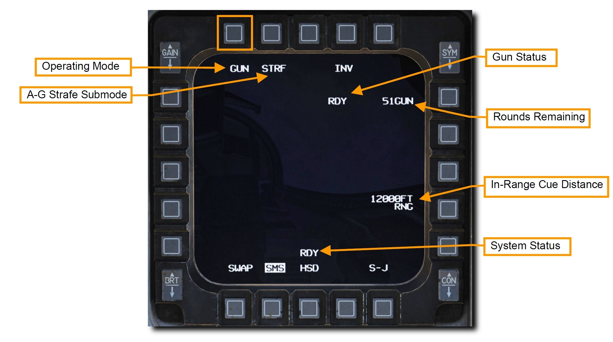
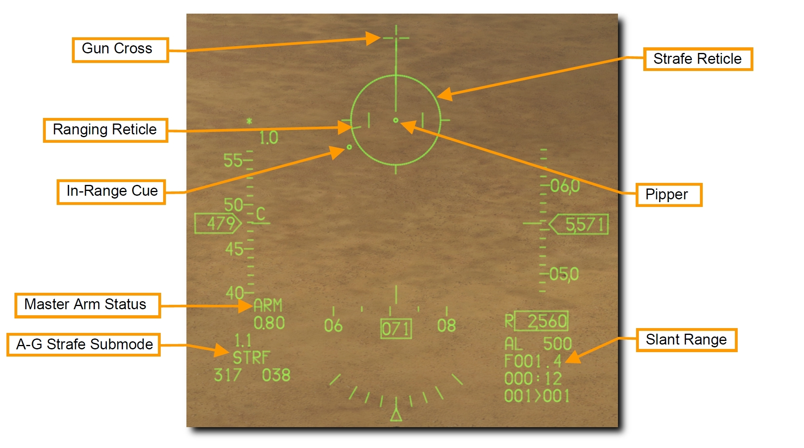
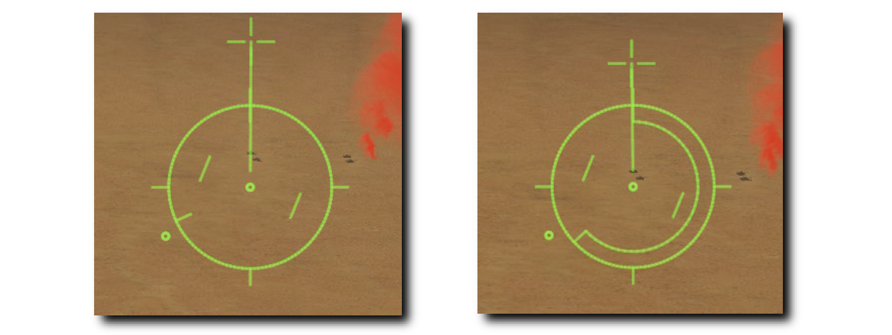
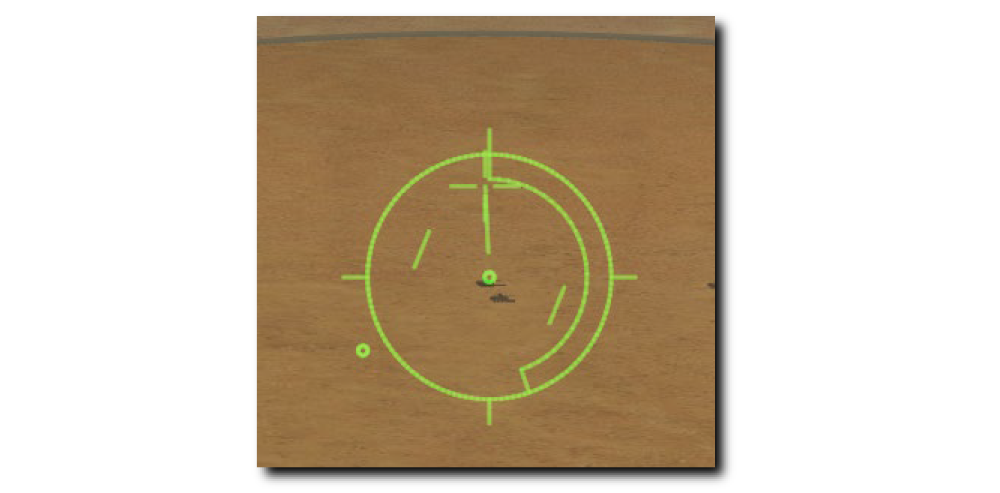
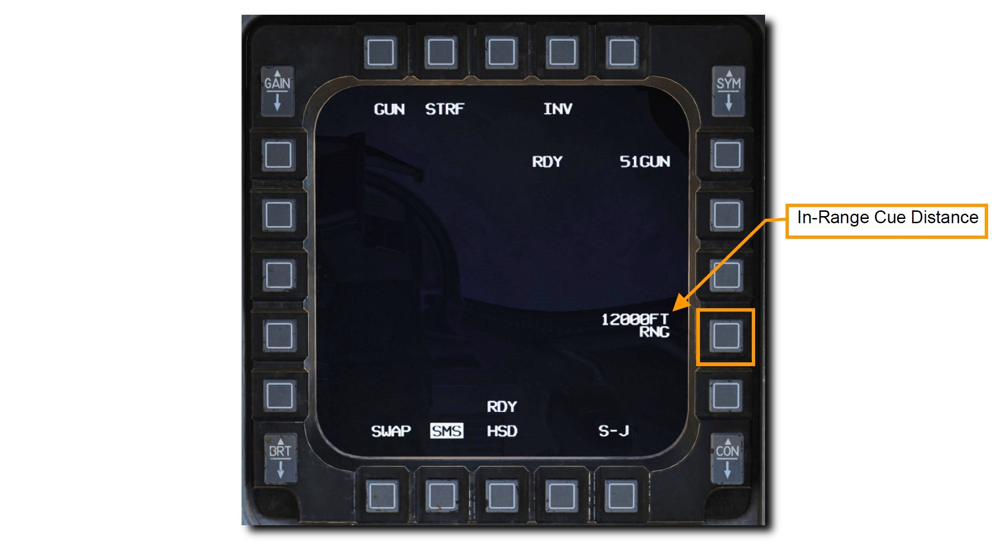
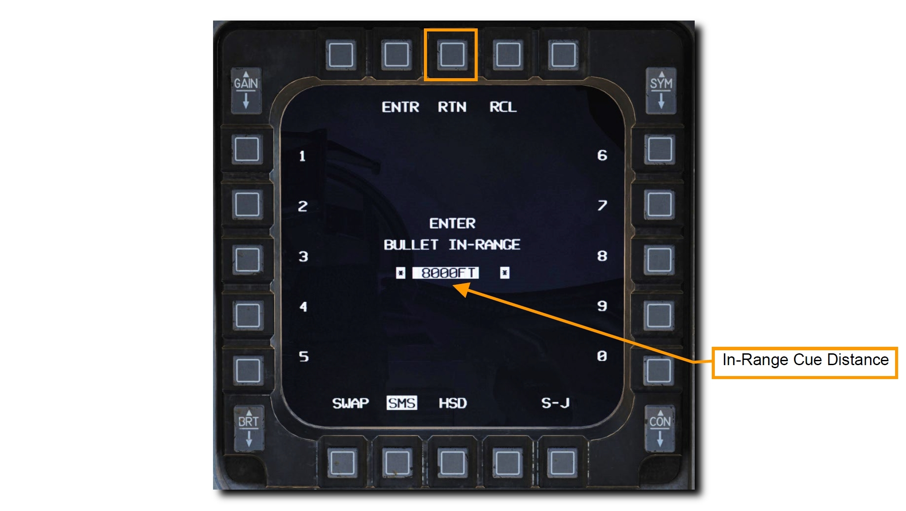
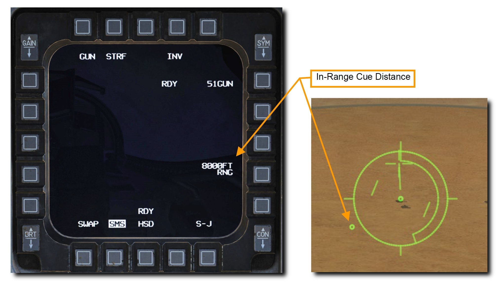

# 空対地機関砲

M61A1 20mm 自動機関砲システムは、パイロットに強力な武器能力とを提供します。
これは6本の銃身をもつガトリング砲で、航空機の左ストレーキに装備されています。
512 発の弾丸と、毎分 6,000 発の連射能力を備えています。

>**要約**
>
> 1. A-G マスターモードを選択
> 2. マスターアームスイッチを ARM に
> 3. レーザーによる測定が必要であれば、レーザーアームスイッチを ARM に
> 4. SMS ページで STRF サブモードを選択
> 5. 目標にピパーが重なるように操縦
> 6. トリガーを2段目まで引き、機関砲を発射

## Target Attack

A-G マスターモードを選択すると、右の MFD に SMS A-G ページが表示されます。
主兵装に応じて、SMS A-G ページに表示される内容は異なります。
以下の手順で、適切な設定と機関砲による地上攻撃を行います。

**1. GUN が表示されるまで MFD の OSB 1 を押して、STRF サブモードを選択します**

**2. HUD 上の STRF シンボルを確認します**

ストレイフレティクルは、空対地機関砲のデフォルトのサイトで、効果的な射撃のための照準情報を表示します。
レティクルの中心は、射程距離内において弾丸が着弾する予想地点を示しています。
このピパーを用いて、単に目標をピパーに重ねてトリガーを引きます。

HUD の右下には目標までの **Slant Range (見通し距離)**が数字で表示されています。
レティクルの内側には風の有無を表す **Ranging Reticle** があります。
Ranging Reticle の位置は、ピパー位置における地上までの見通し距離を表しています。
ストレイフレティクルの時計を4分割した方向はそれぞれ 3,000 フィートの見通し距離を表します。.

  - 12 時方向: 12,000 フィート
  - 9 時方向: 9,000 フィート
  - 6 時方向: 6,000 フィート
  - 3 時方向: 3,000 フィート

In-Range Cue の距離は MFD から設定することができ、目標への効果的な攻撃距離を確認できます。

**3. ピパーが標的に重なるように航空機を操縦します**

テクニックとして、ピパーを目標の手前に配置する方法があります。
こうすると、そのまま地面に沿うだけでピパーが目標に重なります。
目標までのスラントレンジ (傾斜距離) が縮むにつれて自然とこのようになります。

照準ポッドを装備している場合は、レーザー照射することにより投下精度を向上させることができます。
詳細は [レーザー照射](/f-16c/system/an-aaq-28/#laser-ranging) の項を参照してください。

**4. CCIP ピパーを目標に重ねて射程距離内に入ったら WPN REL ボタンを押して機関砲を発射します**

下図の例では、目標にピパーが重なっており、Ranging Reticle によってスラントレンジが約 5,500 フィートであると示されています。

スラントレンジは機関砲の有効性に大きく影響します。
機関砲から発射された弾丸は大きく散らばって速度も失われます。
散布界と速度の喪失が大きくなるにつれて、機関砲の精度と効果が減少します。
機関砲の有効射程は 2,500~7,000 フィートの間です。
装甲目標を攻撃するときは、装甲の薄い目標後部を攻撃すべきです。
攻撃は近いほど効果的です。

射撃するときは目標に囚われ過ぎないように注意してください。
目標ばかりを見ていると、他の脅威に気が付かなかったり、過度に接近するまで攻撃を継続してしまったりします。
APC 上部の機関砲の的にならないようにしてください!

最小射程距離に到達したら、斜め上方に旋回して敵の反撃から逃れます。
目標の近くに赤外線地対空ミサイルが配備されているなら同時にフレアを放出します。

## In-Range Cue Update: In-Range キューの変更

レティクル上に表示される In-Range キューの位置は SMS ページの In-Range Cue Distance 表示の隣の OSB から変更します。

左右の OSB で In-Range キュー距離の数値を入力して ENTR を押します。
誤った数値を入力した場合は RCL を押して修正するか、 RTN を押して設定を保存せずに SMS ページに戻ります。

SMS ページに戻ると入力した数値が表示されています。
HUD 上のキューも新たな距離の位置に表示されています。

