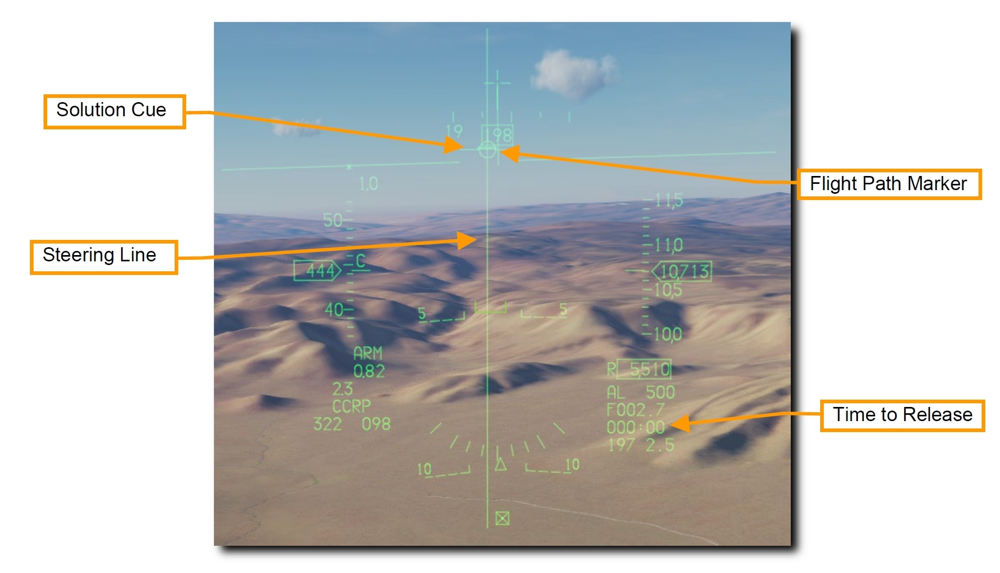

# レーザー誘導爆弾

レーザー誘導兵器の登場は、それまでの兵器の誘導性能とデリバリーを劇的に向上させました。
ガイダンスキットを取り付けることで、無誘導の汎用爆弾をレーザー誘導爆弾 (LGBs) として使うことができます。
キットはコンピュータ制御グループ (CCG) 、弾頭の前方に取り付けられた爆弾の操舵を可能にするカナード翼、後方に取り付けて揚力を発生させるウィング・アセンブリから構成されています。
レーザー誘導爆弾は、航空機との電気的な接続を必要とせずに操舵できる自由落下兵器です。
目標に照射された外部からのレーザーを探知、追跡できるセミアクティブ誘導システムを内蔵しています。
レーザーは爆弾を投下する航空機かその他の航空機、もしくは地上部隊によって照射されます。

レーザー誘導爆弾はすべて、コンピュータ制御グループ (CCG) 、信管と弾体で構成される弾頭、エアフォイルグループを備えています。
コンピュータは2組のカナード翼に操舵指令を送ります。
CCG の四分円には、爆弾の落下経路を変更するためのカナード翼が取り付けられています。
カナード翼は全遊式で "Bang-Bang Guidance" とも呼ばれます。

レーザー誘導爆弾の落下経路は Ballistic (弾道), Transition (遷移), Terminal Guidance (終末誘導) の3段階に分けられます。
バリスティックフェイズでは、爆弾を投下する瞬間の航空機の飛行姿勢による無誘導の曲線飛行を行います。
また、爆弾の機動性が終末誘導の速度に影響するため、投下姿勢がさらに重要になります。
したがって、バリスティックフェイズでの対気速度の減少は、機動性の喪失に比例します。
トランジションフェイズでは、爆弾は目標方向に向かって落下するように操舵します。
ターミナルガイダンスでは、目標の方向に落下するように常に爆弾を操舵し続けます。
目標位置に合わさると反射したレーザーが検知器に集中し、カナード翼がトレイルポジションに移行します。
これで爆弾は目標に向かって重力による弾道落下を行います。

### GBU-10 ペイブウェイ II

Guided Bomb Unit (GBU) 10 は、重量 2,562 ポンドで、Mk-84 汎用爆弾のレーザー誘導バージョンです。
先端に取り付けられたレーザーシーカーによって、設定されたレーザーコードに適するレーザーの反射を検知します。
投下後は、爆弾の後部に取り付けられたエアフォイルのフィンが展張し、爆弾をレーザー照射位置へと誘導します。
目標へのコース修正は一定した連続入力ではなく、"Bang-Bang Guidance" と呼ばれる一連の離散入力によって行われます。

GBU-10 はステーション3, 4, 6, 7に取り付けられる MAU-12 エジェクターラックにのみ懸架できます。

GBU-10 は、精密かつ強力な爆撃を必要とする、大型もしくは強化された目標への攻撃に適しています。
橋やバンカー、強化された指揮所などがそれに該当します。

### GBU-12 ペイブウェイ II

GBU-12 は Mk-82 汎用爆弾のレーザー誘導バージョンです。
元となる爆弾が異なること以外は GBU-10 と同様の特徴があります。

GBU-12 はステーション3, 4, 6, 7に取り付けられる MAU-12 エジェクターラックに1発懸架できます。
TER に取り付ける場合、主翼下に外部燃料タンクを搭載していれば搭載できるのは 2発のみです。
これは ["Slant Load"](/f-16c/term) と呼ばれます。

## 爆弾のシーカーのレーザーコード

それぞれのレーザー誘導爆弾のシーカーヘッドには特定のレーザーパルス繰り返し周波数 (PRF) コードを1つだけ設定できます。
これは兵装を搭載するウェポンロードクルーが地上で設定するもので、飛行中に変更することはできません。

レーザーコードはミッションエディターで設定できます。
下図の例では、それぞれの爆弾にレーザーコード 1564 が設定されています。

レーザーコードを設定するもう一つの方法はゲーム内のニーボードを使うことです。
**[RShift + K]** でニーボードを開き、**[]** キーでページをめくります。
**[RShift + RAlt + 9, 0, -]** で百の位以下のそれぞれの数値を変更します。

TGP から照射するレーザーのコードは、爆弾に設定されているものと一致している必要があります。
詳細は [DED レーザーページ](/f-16c/system/an-aaq-28/#lasr-ded-page-ded) を参照してください。

## SMS ページ

A-G SMS ページの設定は無誘導爆弾のものと同様です。
詳細は [無誘導/レーザー誘導爆弾 SMS ページ](../unguided-boms/#sms) を参照してください。

## レーザー誘導爆弾による CCRP 攻撃

連続算出投下点 (CCRP) は、コンピュータによって自動的に爆弾が投下されるデリバリーモードです。
降下による投下だけでなく、水平飛行中や上昇中でも投下が可能です。
レーザー誘導爆弾の投下手順は、照準ポッド (TGP) でレーザー照射を行うこと以外、無誘導爆弾の投下と同じです。 

このモードには Bombing Solution による目標の Designation Point (指示地点) が必要です。
指令操舵によって適切な爆弾投下地点へと誘導され、爆弾は目標に命中する適切なタイミングで自動投下されます。

TGP から照射するレーザーのコードは、爆弾に設定されているものと一致している必要があります。
詳細な手順は [無誘導/レーザー誘導爆弾 SMS ページ](../unguided-boms/#sms) と [DED レーザーページ](/f-16c/system/an-aaq-28/#lasr-ded-page-ded) を参照してください。

>**要約**
>
> 1. A-G マスターモードを選択
> 2. マスターアームスイッチを ARM に
> 3. レーザーアームスイッチを ARM に
> 4. MFD の A-G SMS ページから爆弾と適切な設定を選択
> 5. 適切なステアポイントを選択するか、TGP で目標をデジグネート
> 6. FPM をステアリングラインの中央に合わせる
> 7. WPN REL ボタンを長押しして算出された位置で爆弾を投下
> 8. 着弾 8~12 秒前にレーザーを照射

**1. HUD 上の CCRP シンボルを確認します**

火器管制システムは、デジグネートされた目標へ飛行できるように **Steering Line (SL)** を表示します。
SL に FPM が重なるように飛行し WPN REL ボタンを押し続けることで、時間と風を考慮した適切な位置で爆弾が投下されます。

**Solution Cue (ソリューションキュー)** は SL の頂点に表示されます。
キューは爆弾が投下される位置に近づくにつれて下がっていきます。

上図のように **Target Designator (TD)** が HUD の視野角外にある場合、ガンクロスから伸びる **Target Locator Line (TLL)** が目標までの方向を示しています。
ガンクロス横の数字は、ガンクロスと目標の角度差を10の位から表示します。

**2. 目標を捜索できるよう TGP を設定し、レーザーの照射を確認します**

TGP の A-G モードを選択し、目標の捕捉および爆弾の誘導のための設定をします。
CCRP モードが選択されていれば、TGP は選択中のステアポイントにスレーブします。

操縦桿の DMS 下を押して、TGP 画面に SOI を指定します。
SOI が指定された MFD には囲み表示が現れます。

スロットルの CURSOR/ENABLE コントロールで TGP のクロスヘアの位置を動かせます。
HUD を SOI にしてターゲットデジグネーターを動かすと TGP クロスヘアも同期します。

**3. 任意の目標の位置を特定し、デジグネートします**

CCRP モードの投下ソリューションを算出するにはまず、目標をデジグネートしなければなりません。
デジグネートは以下の2通りの手順で行います。

- **目標位置座標が入力されたステアポイントを選択します。**HUD 上のターゲットデジグネーターボックスがステアポイントの位置に現れます。CCRP モードが選択されていれば TGP はステアポイントにスレーブします。
- **照準ポッド (TGP) で目標位置を特定します。**TGP 画面に SOI があれば、操縦桿の TMS 下でデジグネートを解除します。そうすると、TGP の視点は HUD 中央付近のボアサイト位置に戻ります。目標が正面に見える位置に飛行するか、スルーして目標に重ねます。TMS 上を押してデジグネートします。すると、HUD 上のターゲットデジグネーターボックスがその位置に現れます。

目標の位置を更新するには、 HUD の TD ボックスをスルー (移動) するか、スロットルの **CURSOR/ENABLE** コントロールを使って TGP カーソルをスルーします。

TMS 上を押してエリアトラックモードにすると、目標にクロスヘアを固定します。
必要であればさらに TMS 上を押して、ポイントトラックモードにします。
ポイントトラックは移動目標にも対応しています。

爆弾投下前にレーザーを照射することで、さらに高精度の投下ソリューションを算出できます。
詳細は [レーザー照射](/f-16c/system/an-aaq-28/#laser-ranging) の項目を参照してください。

レーザー照射はどのカメラタイプのどのトラックモードでも可能です。
レーザーアームスイッチが ARM のとき、レーザーの状態が TGP ページ下部に **L** と表示されます。

レーザーは操縦桿のトリガーの1段目を引くと照射されます。
レーザー照射中は **L** が点滅します。

**4. CCRP 投下デリバリーを行います**

レーザー誘導爆弾の投下デリバリーは無誘導爆弾の CCRP モードと同じです。

ステアリングラインに沿うように FPM を維持し続けます。
こうすることで、標的が見えなくなっても航空機を適切な位置に保持することができます。

ソリューションキューは爆弾が投下される位置に近づくにつれ、ステアリングラインに沿って下がっていきます。
HUD 右側には投下までの所要時間が表示されています。

Pull-Up Anticipation Cue (引き起こし予想キュー) が FPM よりも上にいかないように注視します。
**Pull-Up Anticipation Cue (PUAC)** は、地面への墜落を避けるための引き起こし開始高度か、爆弾の信管が機能するために必要な高度のどちらか早いほうを視覚的に表示します。
航空機の高度が下がるにつれて FPM の方へ上がっていきます。
FPM が PUAC の下にある状態では、爆弾を投下しても信管が有効にならずに不発弾となります。

**5. WPN REL ボタンを押し続けます**

投下10秒前になってソリューションキューがステアリングライン上を下り始めたら、操縦桿の WPN REL ボタンを押し続けます。
こうすることで、コンピュータが自動で爆弾を投下するのを許可します。

ステアリングラインに沿うように FPM を維持し続けます。
こうすることで、標的が見えなくなっても航空機を適切な位置に保持することができます。

**6. Soution Cue が FPM を通過するまで WPN REL ボタンを押し続けます**

ソリューションキューが通過するまで FPM をステアリングライン上に維持します。
ソリューションキューが FPM を通過するときに爆弾が投下されます。

設定していたすべての爆弾の投下が完了するまで WPN REL ボタンを押し続けます。
投下が完了すると FPM が点滅します。

目標上空の飛行を避け、TGP のジンバルの回転を可能にするために、30~45° の旋回を行います。
TGP による目標の追跡を継続し、必要に応じて照準点の位置を更新します。

**7. TGP でレーザーを照射します**

着弾の 8~12 秒前になる前に操縦桿のトリガーを1段目まで引いて、目標にレーザーを照射します。
レーザー照射中は **L** が点滅します。
着弾の瞬間、爆発の赤外線エネルギーによって画面が不明瞭になります。

視野角を WIDE FOV (広域) にして、目標の損害状況を評価します。
必要に応じて再攻撃、もしくは離脱します。

