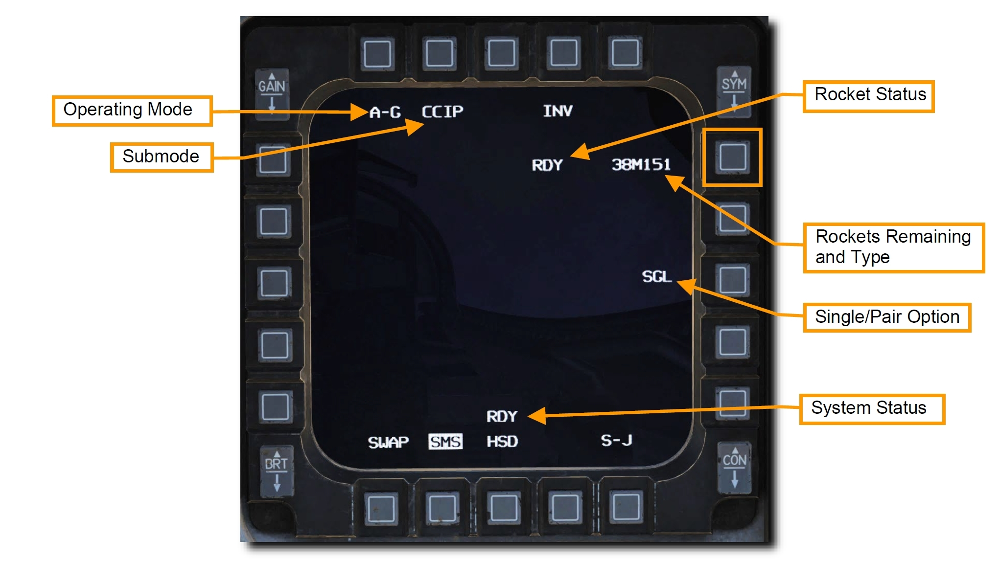
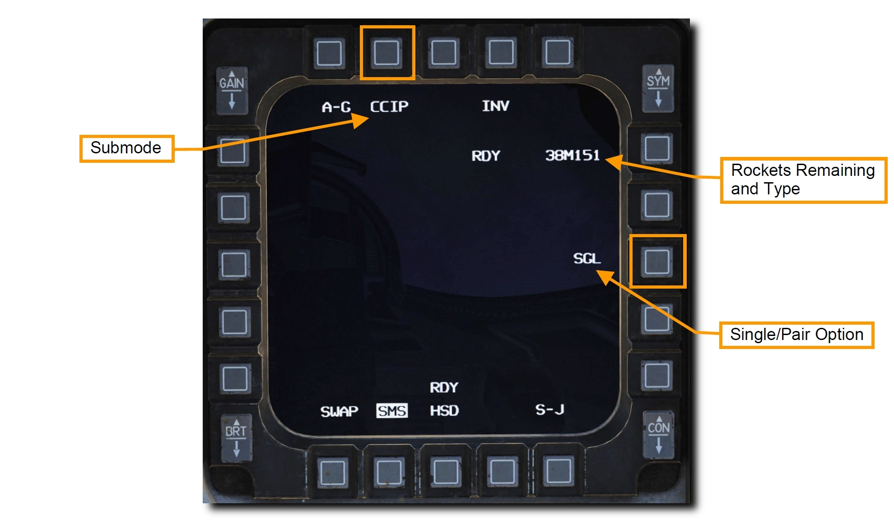
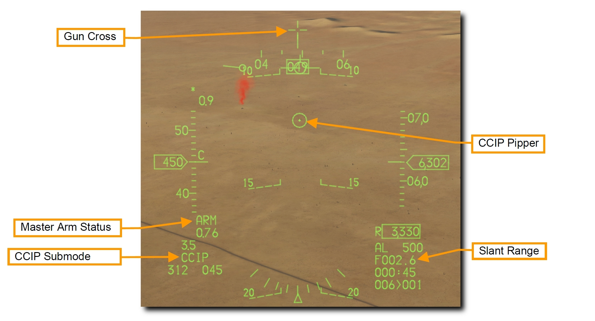
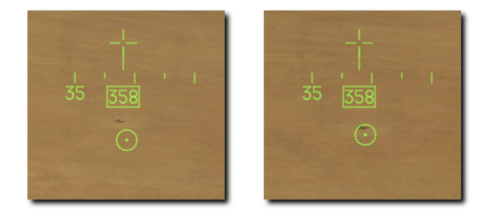
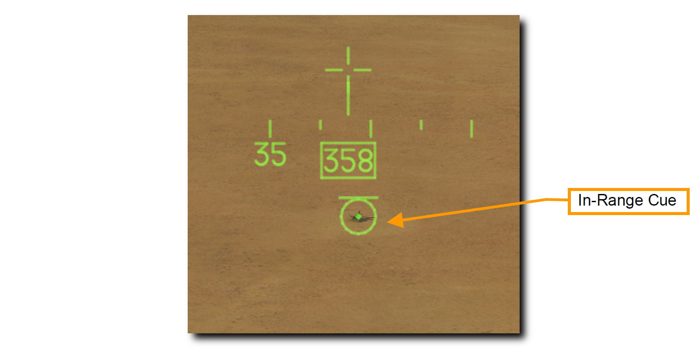

# ロケット

空対地ロケットは、20mm 機関砲よりも攻撃力がある面制圧に優れた兵器です。
弾頭には目的に合わせて、榴弾 (HE)、成型炸薬弾 (HEAT)、徹甲弾 (AP) などがあります。
また、地表の目標に対して独特な白煙とともに焼夷効果を発揮する白リン弾 (WP) も使用できます。

>**要約**
>
> 1. A-G マスターモードを選択
> 2. マスターアームスイッチを ARM に
> 3. レーザーによる測定が必要であれば、レーザーアームスイッチを ARM に
> 4. MFD の A-G SMS ページからロケットと適切な設定を選択
> 5. ピパーが標的に重なるように操縦
> 6. WPN REL ボタンを押してロケットを発射

## CCIP 攻撃

A-G マスターモードを選択すると、右の MFD に SMS A-G ページが表示されます。
主兵装に応じて、SMS A-G ページに表示される内容は異なります。
以下の手順で、適切な設定と CCIP モードによるロケット攻撃を行います。

**1. ロケットが表示されるまで MFD の OSB 6 を押して、ロケットを選択します**

**2. OSB 2 を押して CCIP モードを選択し、OSB 8 を押して Single/Pair 設定をします**

ロケットは、1発ずつ (SGL) か2発ずつ (PAIR) のどちらかで投下されます。
**SGL** が選択されていれば、ロケットは左右どちらかのステーションからのみ発射されます。
**PAIR** が選択されており、ステーション3と7に同じロケットが搭載されていれば、ロケットは両側のステーションから発射されます。

**3. HUD 上のロケット用の CCIP シンボルを確認します**

CCIP モードは目標を攻撃する上で最も直感的な手段です。
ピパーを標的に重ねてロケットを発射します。

CCIP ピパーの中心は、射程距離内においてロケットが着弾する予想地点を示しています。
HUD の右下には目標までの見通し距離が数字で表示されています。
目標との距離が、ロケットが最も効力を発揮する 8,000 フィート以内になると、CCIP ピパーの上部に **In-Range Cue (射程内キュー)** が表示されます。

**4. ピパーが標的に重なるように航空機を操縦します**

テクニックとして、ピパーを目標の手前に配置する方法があります。
こうすると、そのまま地面に沿うだけでピパーが目標に重なります。
目標までのスラントレンジ (傾斜距離) が縮むにつれて自然とこのようになります。
HUD 右下のスラントレンジを注視し、ピパー上部に In-Range キューが表示されるのを確認します。

照準ポッドを装備している場合は、レーザー照射することにより投下精度を向上させることができます。
詳細は [レーザー照射](/f-16c/system/an-aaq-28/#laser-ranging) の項を参照してください。

**5. CCIP ピパーを目標に重ねて射程距離内に入ったら WPN REL ボタンを押してロケットを発射します**

スラントレンジが 8,000 フィート以下になったら CCIP ピパーの上部に In-Range キューが表示されます。
ピパーが目標に重なり、キューが表示されていれば下図のようになります。

射撃するときは目標に囚われ過ぎないように注意してください。
目標ばかりを見ていると、他の脅威に気が付かなかったり、過度に接近するまで攻撃を継続してしまったりします。
APC 上部の機関砲の的にならないようにしてください!

最小射程距離に到達したら、斜め上方に旋回して敵の反撃から逃れます。
目標の近くに赤外線地対空ミサイルが配備されているなら同時にフレアを放出します。
