# 無誘導爆弾

- [General Purpose Bombs: 汎用爆弾](#general-purpose-bombs)
- [Cluster Bombs: クラスター爆弾](#cluster-bombs)
- [Training Bombs: 訓練用爆弾](#training-bombs)
- [無誘導/レーザー誘導爆弾 SMS ページ](#sms)
- [無誘導爆弾による CCIP 攻撃](#ccip)
- [無誘導爆弾による CCIP 攻撃 (Post-Designate)](#ccip-post-designate)
- [無誘導爆弾による CCRP 攻撃](#ccrp)

----

F-16 で運用できる無誘導爆弾は、汎用爆弾、クラスター爆弾、訓練用爆弾の3種類に分類されます。

## General Purpose Bombs: 汎用爆弾

### MK 82 LDGP

一般的な MK 82 は空気抵抗を受けにくい滑らかな弾体をもつ "Slick Bomb" で、Low Drag General Purpose (LDGP: 低抵抗汎用) 爆弾と呼ばれます。
爆弾には飛行安定性を確保するために4つのコニカルテールフィン (円錐状の安定翼) が取り付けられています。
破片による爆発効果を発揮するために、爆弾は薄い鉄製の外殻で覆われています。

MK 82 は Wing Weapons Pylon (WWP: 翼下兵装パイロン) に1発、もしくは Triple Ejector Rack (TER: 3連装エジェクターラック) に3発取り付けることができます。

MK 82 は、MK 82 AIR, GBU-12, GBU-38 などの爆弾の元となった爆弾です。

### MK 82 AIR

バリュートと呼ばれる、BSU-49/B 高抵抗尾部アセンブリを MK 82 に取り付けたバージョンです。
これにより、投下後は急激に減速しながら落下します。
高抵抗爆弾が減速することで、低高度で投下しても爆発の影響に巻き込まれることはありません。
パイロットは MK 82 AIR を高抵抗形態で投下するか、バリュートを開傘させずに "Slick Bomb" のような低抵抗形態で投下するかを選択できます。
低抵抗の場合はノーズヒューズ (先端信管) 、高抵抗の場合は ノーズ/テイル (先端/後端) かテイルヒューズ (後端信管) を SMS ページで選択します。

### MK 82 SE

MK 82 の "Snake Eye" バージョンは MK 82 AIR よりも古く、4方向に展開する MK-15 尾部アセンブリを使用して爆弾の落下を遅らせます。
パイロットは、投下の方法を高抵抗か抵抵抗から選べます。
低抵抗の場合はノーズヒューズ (先端信管) 、高抵抗の場合は ノーズ/テイル (先端/後端) かテイルヒューズ (後端信管) を SMS ページで選択します。

### MK 84 LDGP

MK 84 は MK 82 を大きくしたバージョンで、945 ポンドの H-6もしくはトリトナール高性能爆薬が詰め込まれた重量 2,039 ポンドの爆弾です。
非装甲目標や軽装甲目標はもちろんのこと、MK 84 は付近に着弾するだけで装甲目標に対して効果を発揮します。
MK 84 は TER ではなく WWP にしか搭載できません。

MK 84 は、F-16 が搭載できる GBU-10 や GBU-31 といった爆弾の元にもなりました。

## Cluster Bombs: クラスター爆弾

### CBU-87

CBU-87 は 950 ポンドの 複合効果弾薬 (CEM) が入った汎用クラスター爆弾です。
SUU-65 戦術弾薬ディスペンサーの中には 202 個の BLU-97/B 複合効果弾薬爆弾 (CEB) が入っており、非装甲目標や軽装甲目標に対して効果を発揮します。
爆弾の散布航路は、爆弾に取り付けられたダイヤルか SMS ページを通じて Height of Function (HOF: 散布高度) と RPM 回転設定で設定します。
一般的な散布面積は 200 x 400 メートルの範囲です。

CBU-87 は WWP に1発搭載できます。
翼下に外部燃料タンクを装備している場合は、安全制限により TER に2発までしか搭載できません。
これは一般的に "Slant Load" (傾斜荷重) と呼ばれます。

それぞれの BLU-97/B CEB は、成型炸薬と切れ目の入った鉄製ケースおよびジルコニウムリングで構成され、対装甲と対人への破片と焼夷効果を発揮します。
各 CEB は 300 個の破片を撒くように設計されています。
戦車などの装甲目標は通常、上部が軽装甲であるため、上方からのトップアタック攻撃が効果的です。

### CBU-97

CBU-97 は対装甲目標用に特化した センサー信管子爆弾を SUU-66B ディスペンサーに詰めた 1,000 ポンド級の爆弾です。
センサー信管兵器 (SFW) は10個の BLU-108/B 子爆弾と 40個のホッケーパック型の赤外線探知スキートで構成されています。

CBU-87 と同様、爆弾の散布航路は、爆弾に取り付けられたダイヤルか SMS ページを通じて Height of Function (HOF: 散布高度) で設定できます。
このディスペンサーには RPM 設定がありません。
搭載形態は CBU-87 と同じく、WWP に1発か TER に2発です。

## Training Bombs: 訓練用爆弾

### BDU-33

BDU-33 は大型の汎用爆弾の弾道を模した小型の訓練用爆弾です。
BDU-33 には小型のスモークチャージが内蔵され、着弾位置の特定に役立ちます。

## 無誘導/レーザー誘導爆弾 SMS ページ

すべての爆弾の A-G SMS ページ表示と誘導/無誘導爆弾の投下設定は類似しています。
最初に初期設定について触れ、CCIP と CCRP のモードの違いについては別項で紹介します。

>**要約**
>
> 1. A-G マスターモードを選択
> 2. MFD の A-G SMS ページから爆弾と適切な設定を選択

空対地マスターモードを選択すると、右の MFD に 空対地兵装の兵装管理ページ (SMS A-G) が表示されます。
主兵装に応じて SMS A-G ページの表示は異なります。
汎用爆弾を使用した CCIP の適切な攻撃手順は以下の通りです。

**1. 投下したい兵器が表示されるまで MFD の OSB 6 を押して投下兵装を選択します**

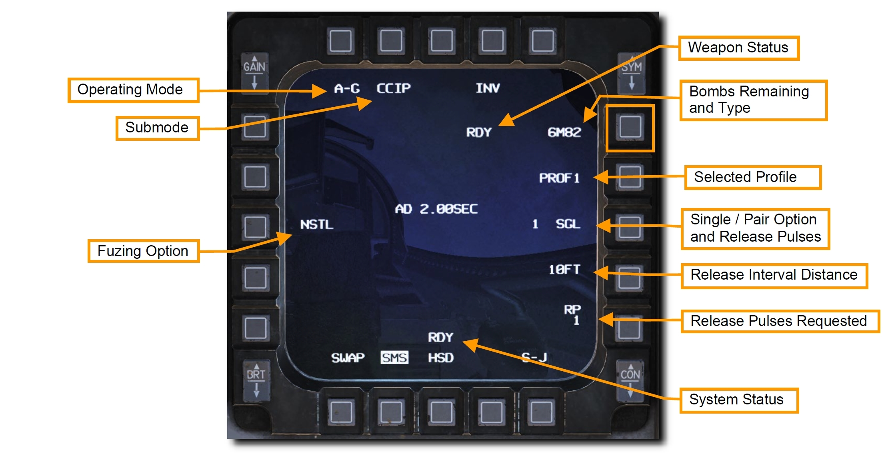

**2選択した兵装の投下プロファイルを選択します**

デフォルトでは2つの異なるプロファイルが設定されています。
プロファイルには、デリバリーモード、信管設定、投下数、着弾間隔、投下間隔が含まれます。
すでに攻撃プロファイルが希望するものであれば何も設定する必要はありません。
そうでない場合は、以下の手順に従ってプロファイルを設定します。

現在のプロファイルに隣接する OSB を押すと、**PROF 1** と **PROF 2** を切り替えられます。

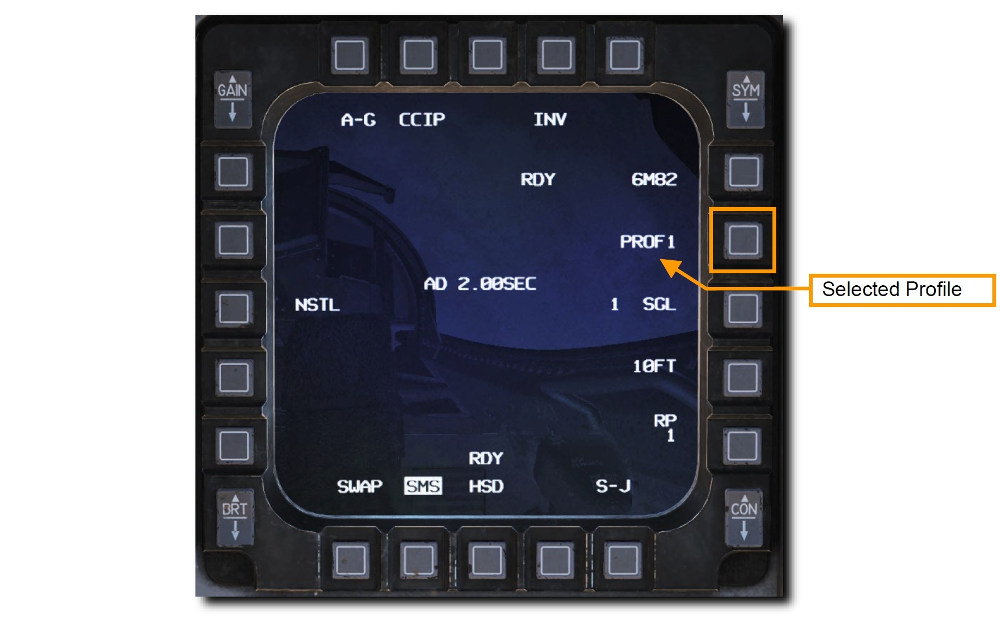

プロファイル選択中に変更したモードは自動で保存されます。
これらの手順は航空機の始動時にするべきですが、あとからでも変更できます。

**3. OSB 2 を押して適切な投下モードを選択します**

希望するサブモードでない場合は、OSB 2 を押して以下の中から選択します。

- **CCIP**: Continuously Computed Impact Point (連続算出命中点)
- **CCRP**: Continuously Computed Release Point (連続算出投下点)
- **DTOS**: Dive Toss (トス爆撃)
- **LADD**: Low Altitude Drogue Delivery (低高度開傘投下)
- **MAN**: Manual (手動)

!!! missing "Not Implemented in DCS"
    DTOS, LADD, MAN は早期版では未実装？

希望するサブモードの隣の OSB を押すと、サブモードが適用され SMS A-G ページに戻ります。

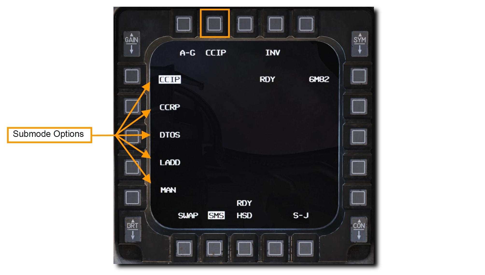

操縦桿の **MSL STEP** ボタンを押すことでも切り替えられます。

**4. OSB 18 を押して適切な信管を設定します**

一般的な爆弾には先端部と後端部の合わせて2つの信管があります。
遅延信管設定は、信管がどのように作動し、いつ爆発するかをパイロットが選択できるようにするためのものです。
着発信管にして破片による効果を発揮させる場合や、標的を貫通またはクレーターを形成させる目的で遅延信管する場合もあります。

OSB 18 を押すと、**NOSE (先端部)**, **TAIL (後端部)**, **NSTL (両方)** の信管設定を切り替えます。
特定の爆発効果が必要でない場合は、冗長性を確保するために NSTL にしておきます。

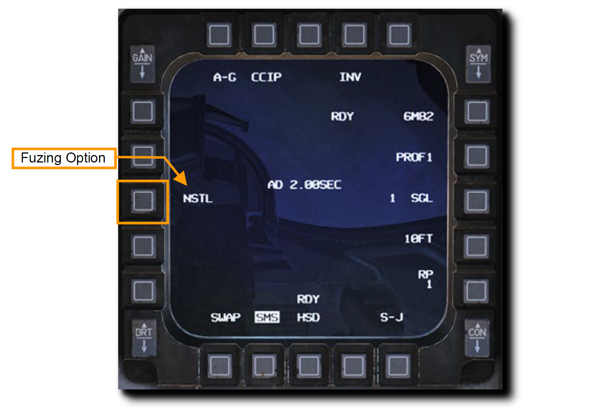

いくつかの爆弾は、投下後の挙動に対応した信管の設定が決められています。

MK 82 AIR/SE

- NSTL: 高抵抗設定時
- NOSE: 低抵抗設定時
- TAIL: 高抵抗設定時

CBU-87/97

- NSTL: SMS ページの設定で散布
- NOSE: 投下後すぐに散布
- TAIL: 不発弾 (散布しない)

**5. OSB 8 を押して Single/Pair 設定をします**

爆弾は、1発ずつ (SGL) か2発ずつ (PAIR) のどちらかで投下されます。
**SGL** が選択されていれば、爆弾は左右どちらかのステーションからのみ投下されます。
**PAIR** が選択されており、ステーション4と6、または3と7に同じ爆弾が搭載されていれば、爆弾は両側のステーションから投下されます。

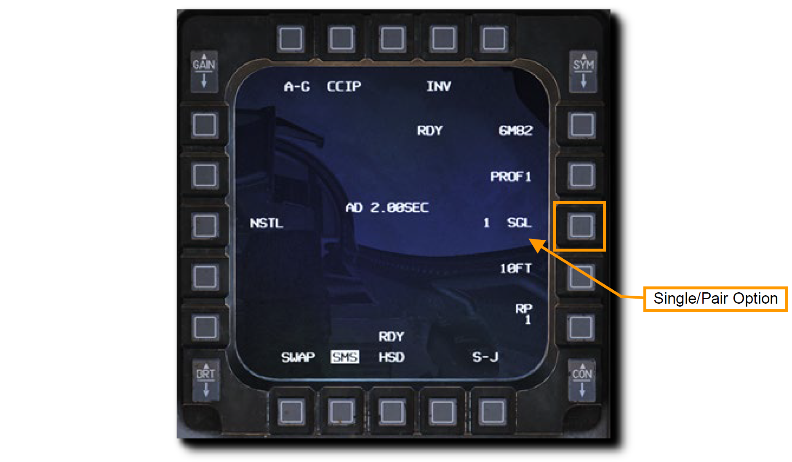

**6. 爆弾を1回以上の回数に分けて投下する場合は、OSB 9 を押して投下間隔を設定します**

投下間隔のタイミングは、兵装を投下する際に航空機が通過する地面の距離に応じて計算されます。
入力できる数値は 10~999 フィートの間です。
SGL もしくは PAIR で1回だけの投下の場合、この設定による影響はありません。

左右の OSB で数値を入力し、ENTR を押して変更を確定します。
誤った数値を入力した場合は RCL を押して修正するか、 RTN を押して設定を保存せずに SMS ページに戻ります。

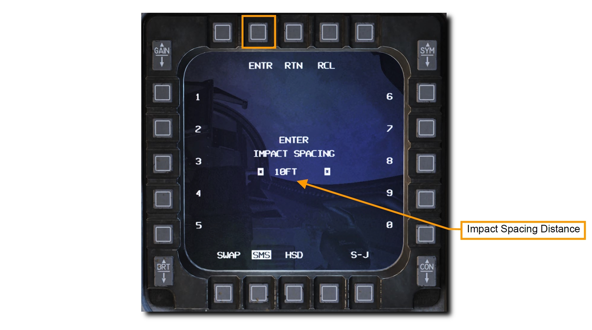

**7. 爆弾を1回以上の回数に分けて投下する場合は、OSB 10 を押して投下回数を設定します**

操縦桿の WPN REL ボタンが押されたときに兵装ステーションに送信されるリリースパルス (投下信号) の回数を設定できます。
例えば、1であった場合は一度に1回の SEL か PAIR の爆弾を投下し、4であれば一度に4回の SEL か PAIR の爆弾を投下します。
これらの設定は **"リップルリリース"** とも呼ばれます。

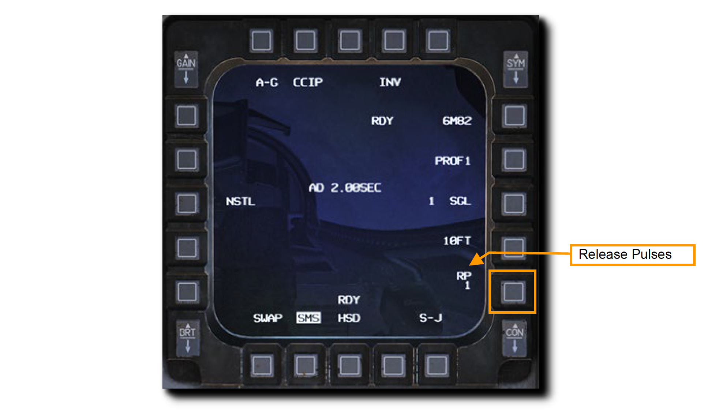

左右の OSB でリリースパルスの数値を入力し、ENTR を押して変更を確定します。
誤った数値を入力した場合は RCL を押して修正するか、 RTN を押して設定を保存せずに SMS ページに戻ります。

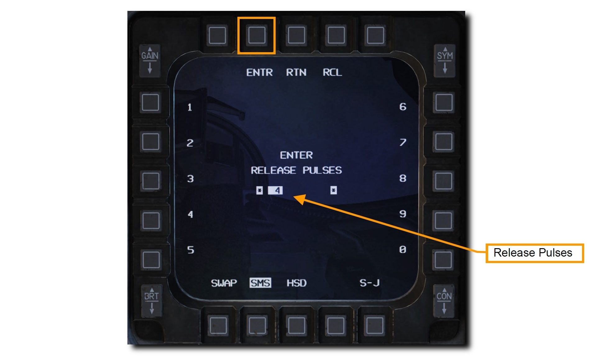

## 無誘導爆弾による CCIP 攻撃

連続算出命中点 (CCIP) は、投下点を見て手動で投下するデリバリーモードです。
HUD 上の CCIP ピパーによって兵装の着弾地点が継続的に表示されるため、高度な柔軟性を備えています。
投下のために目標をデジグネート (指定) する必要ありません。
ピパーを標的に重ねて爆弾を投下します。

>**要約**
>
> 1. A-G マスターモードを選択
> 2. マスターアームスイッチを ARM に
> 3. レーザー照射による測定をする場合はレーザーアームスイッチを ARM に
> 4. MFD の A-G SMS ページから爆弾と適切な設定を選択
> 5. ピパーが標的に重なるように飛行
> 6. WPN REL ボタンを押して兵装を投下

**1. HUD 上の CCIP シンボルを確認します**

HUD の視野角内に CCIP ピパーが表示されていない場合、**Time Delay Cue (TDC)** が **Bomb Fall Line (爆弾落下線)** 上に短い水平線として表示されます。
このような場合は、次の項で扱う **"Post-Designate CCIP"** テクニックを使用します。

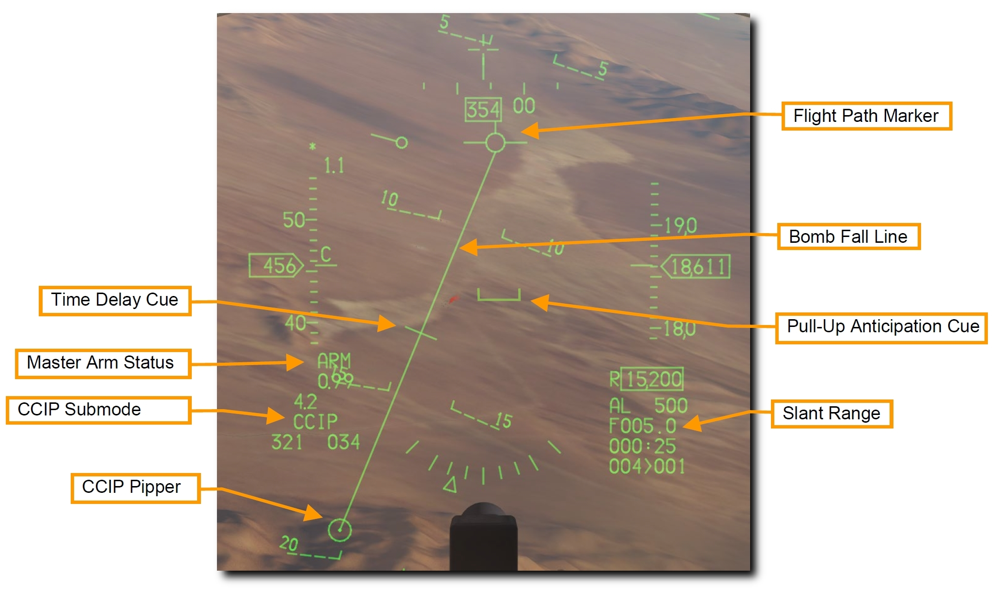

- **Time Delaty Cue (TDC)**: 
- **Master Arm Status**: マスターアームの状態
- **CCIP Submode**: CCIP サブモードであることを示すモード表示
- **CCIP Pipper**: CCIP ピパー。着弾地点。
- **Flight Path Marker**: フライトパスマーカー
- **Bomb Fall Line**: 爆弾落下線
- **Pull-Up Anticipation Cue (PUAC)**: 引き起こし予想キュー
- **Slant Range**: 傾斜距離 (三平方の定理でいう斜辺)

**2. ピパーが標的に重なるように航空機を操縦します**

Bomb Fall Line に TDC が表示されなくなったら、ピパーは HUD 視野角内に存在します。
ピパーはその時点で投下した爆弾の着弾地点です。

テクニックとして、FPM を標的の前方、ピパーを手前に配置する方法があります。
Bomb Fall Line がピパーに対して垂直かつ標的の真上を通るように飛行します。
標的までの傾斜距離が縮むにつれて自然とこのようになります。

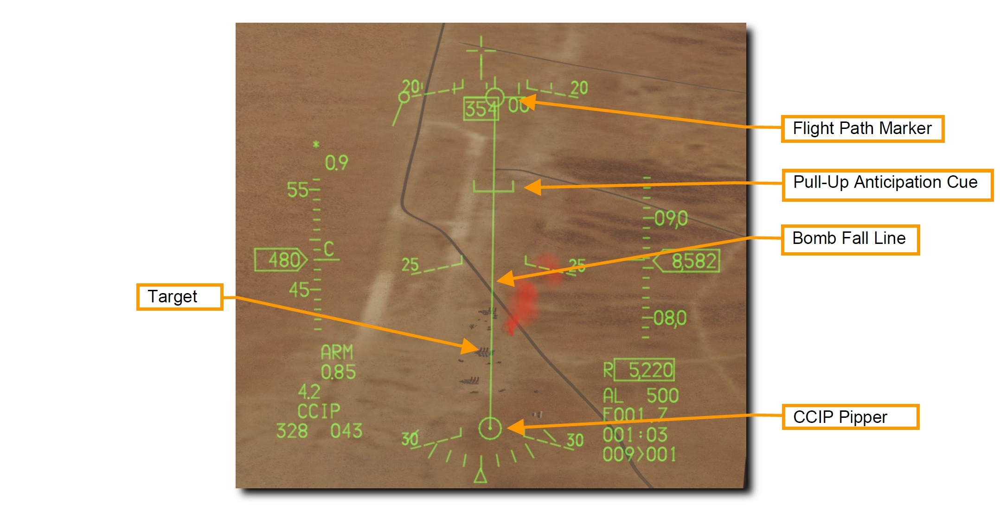

Pull-Up Anticipation Cue (引き起こし予想キュー) が FPM よりも上にいかないように注意します。
**Pull-Up Anticipation Cue (PUAC)** は、地面への墜落を避けるための引き起こし開始高度か、爆弾の信管が機能するために必要な高度のどちらか早いほうを視覚的に表示します。
航空機の高度が下がるにつれて FPM の方へ上がっていきます。
FPM が PUAC の下にある状態では、爆弾を投下しても信管が有効にならずに不発弾となります。

照準ポッドを装備している場合は、レーザー照射することにより投下精度を向上させることができます。
詳細はレーザー照射の項を参照してください。

**3. ピパーが標的と重なったら WPN REL ボタンを押して爆弾を投下します**

リップルリリースによる投下回数が1回以上である場合、ピパーは HUD の中心に "stick" (棒線) として表示されます。
設定していたすべての爆弾の投下が完了するまで WPN REL ボタンを押し続けます。
投下が完了すると FPM が点滅します。

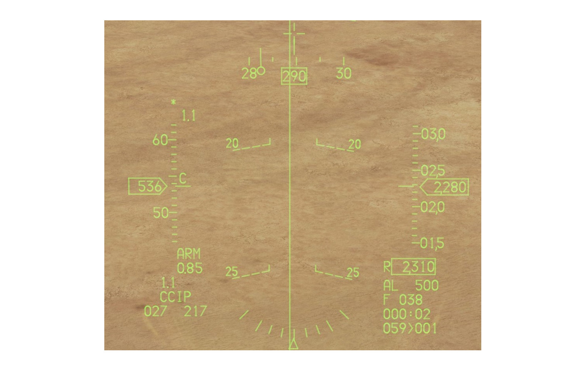

投下後は敵砲火と爆弾の破片に晒されないようにすぐさま退避機動をとります。

## 無誘導爆弾による CCIP 攻撃 (Post-Designate)

HUD の視野角内に標的が収まらない場合は、CCIP の追加機能を使用します。
高高度もしくは降下角度が浅い場合に、このような状況が発生します。

CCIP モードに入る手順は上記と同様です。
違いがあるのは WPN REL ボタンを押すときです。

**1. ピパーが標的に重なるように航空機を操縦します**

HUD の視野角内に CCIP ピパーが表示されておらず **Time Delay Cue (TDC)** が **Bomb Fall Line (爆弾落下線)** 上に短い水平線として表示されている間も、あなたはピパーが標的に重なるように維持し続けます。

WPN REL ボタンを押し続けて、ピパーと重なった標的の位置をデジグネート (指定) します。
残りの処理は火器管制コンピュータが行います。

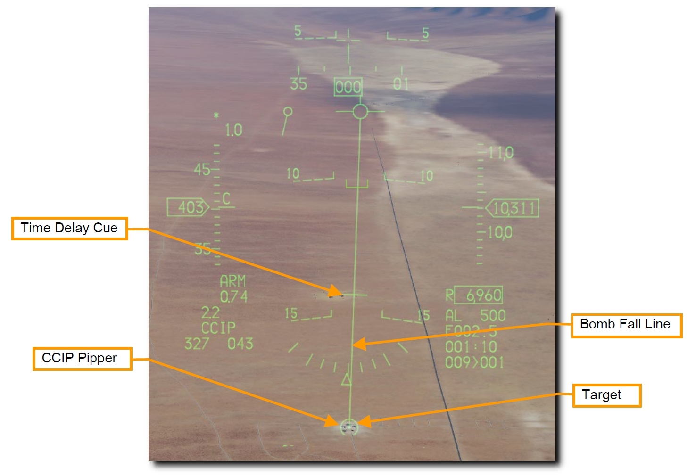

照準ポッドを装備している場合は、レーザー照射することにより投下精度を向上させることができます。
詳細はレーザー照射の項を参照してください。

**2. WPN REL ボタンを押し続けます**

CCRP デリバリーモードと同じ HUD 表示になります。
**Steering Line** に沿うように FPM を維持し続けます。
こうすることで、標的が見えなくなっても航空機を適切な位置に保持することができます。

Steering Line の頂点に **Solution Cue** が表示されます。
キューは爆弾が投下される位置に近づくにつれて下がっていきます。

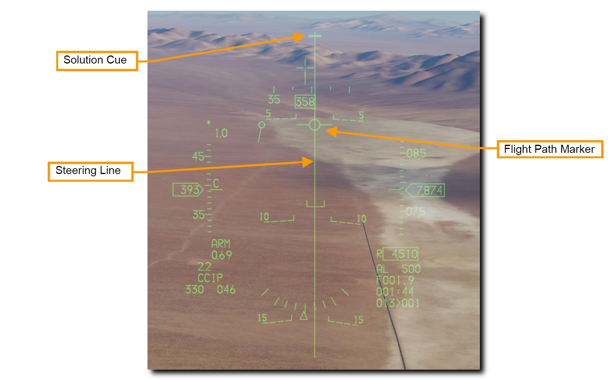

**3. Soution Cue が FPM を通過するまで WPN REL ボタンを押し続けます**

Solution Cue が通過するまで FPM を Steering Line 上に維持します。
Solution Cue が FPM を通過するときに爆弾が投下されます。

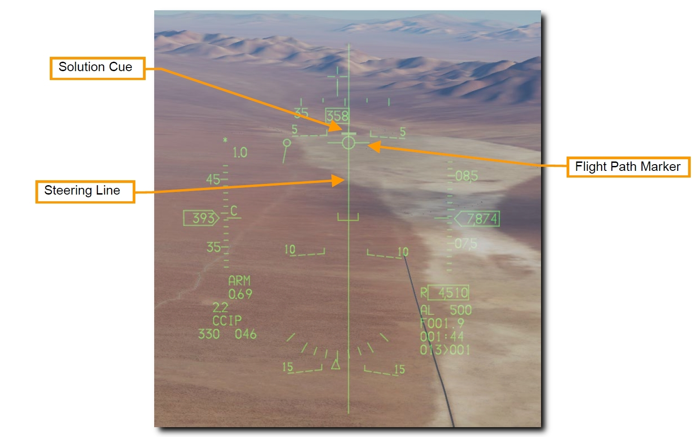

設定していたすべての爆弾の投下が完了するまで WPN REL ボタンを押し続けます。
投下が完了すると FPM が点滅します。
投下後は敵砲火と爆弾の破片に晒されないようにすぐさま退避機動をとります。

## 無誘導爆弾による CCRP 攻撃

連続算出投下点 (CCRP) は、コンピュータによって自動的に爆弾が投下されるデリバリーモードです。
降下による投下だけでなく、水平飛行中や上昇中でも投下が可能です。

このモードには Bombing Solution による目標の Designation Point (指示地点) が必要です。
指令操舵によって適切な爆弾投下地点へと誘導され、爆弾は目標に命中する適切なタイミングで自動投下されます。

>**要約**
>
> 1. A-G マスターモードを選択
> 2. マスターアームスイッチを ARM に
> 3. レーザー照射による測定をする場合はレーザーアームスイッチを ARM に
> 4. MFD の A-G SMS ページから爆弾と適切な設定を選択
> 5. 適切なステアポイント番号か TGP を使って標的を指定
> 6. Steering Line に FPM を合わせて飛行
> 7. 計算された地点で WPN REL ボタンを押して爆弾を投下

**1. HUD 上の CCRP シンボルを確認します**

火器管制システムは、デジグネートされた目標へ飛行できるように **Steering Line (SL)** を表示します。
SL に FPM が重なるように飛行し WPN REL ボタンを押し続けることで、時間と風を考慮した適切な位置で爆弾が投下されます。

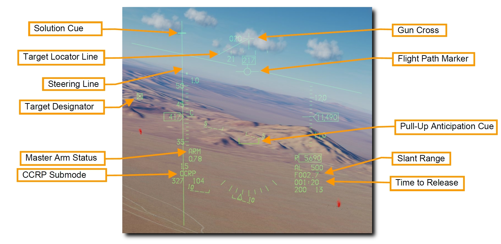

**Solution Cue (ソリューションキュー)** は SL の頂点に表示されます。
キューは爆弾が投下される位置に近づくにつれて下がっていきます。

上図のように **Target Designator (TD)** が HUD の視野角外にある場合、ガンクロスから伸びる **Target Locator Line (TLL)** が目標までの方向を示しています。
ガンクロス横の数字は、ガンクロスと目標の角度差を10の位から表示します。

**2. 任意の標的をデジグネートします**

CCRP モードで投下地点を算出するために、まずは目標をデジグネート (指定) しなければなりません。
デジグネートの方法は以下の通りです。

- 目標位置座標が入力されたステアポイントを選択します
- 照準ポッド (TGP) が装備されている場合、それを用いて目標をデジグネートします

目標の位置を更新するには、 HUD の TD ボックスをスルー (移動) するか、スロットルの **CURSOR/ENABLE** コントロールを使って TGP カーソルをスルーします。

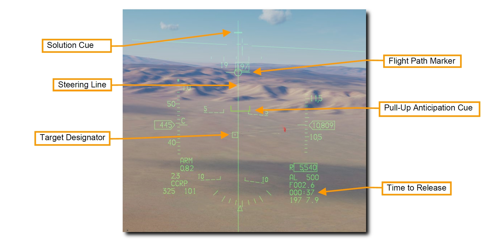

Pull-Up Anticipation Cue (引き起こし予想キュー) が FPM よりも上にいかないように注意します。
**Pull-Up Anticipation Cue (PUAC)** は、地面への墜落を避けるための引き起こし開始高度か、爆弾の信管が機能するために必要な高度のどちらか早いほうを視覚的に表示します。
航空機の高度が下がるにつれて FPM の方へ上がっていきます。
FPM が PUAC の下にある状態では、爆弾を投下しても信管が有効にならずに不発弾となります。

照準ポッドを装備している場合は、レーザー照射することにより投下精度を向上させることができます。
詳細はレーザー照射の項を参照してください。

**2. WPN REL ボタンを押し続けます**

**Steering Line** に沿うように FPM を維持し続けます。
こうすることで、標的が見えなくなっても航空機を適切な位置に保持することができます。

HUD 右下に投下までの所要時間が表示されます。

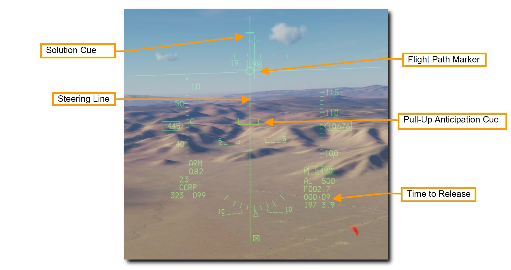

投下10秒前になってソリューションキューがステアリングライン上を下り始めたら、操縦桿の WPN REL ボタンを押し続けます。
こうすることで、コンピュータが自動で爆弾を投下するのを許可します。

**3. Soution Cue が FPM を通過するまで WPN REL ボタンを押し続けます**

Solution Cue が通過するまで FPM を Steering Line 上に維持します。
Solution Cue が FPM を通過するときに爆弾が投下されます。

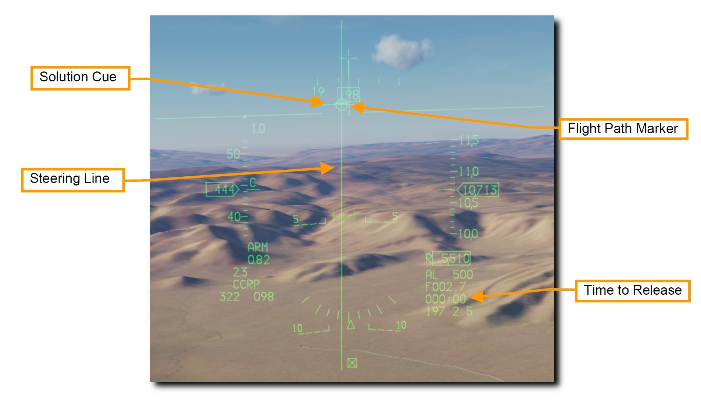

設定していたすべての爆弾の投下が完了するまで WPN REL ボタンを押し続けます。
投下が完了すると FPM が点滅します。
