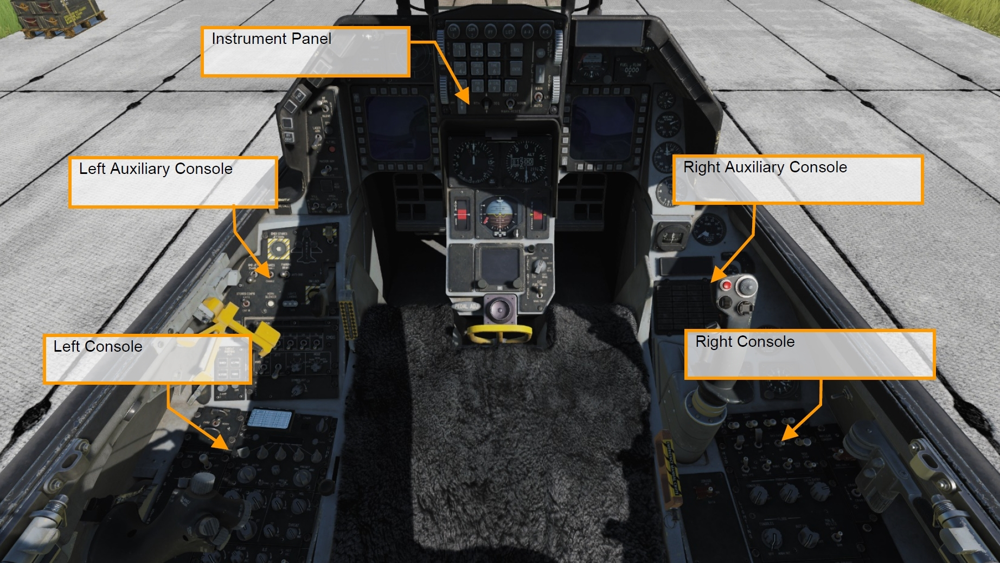
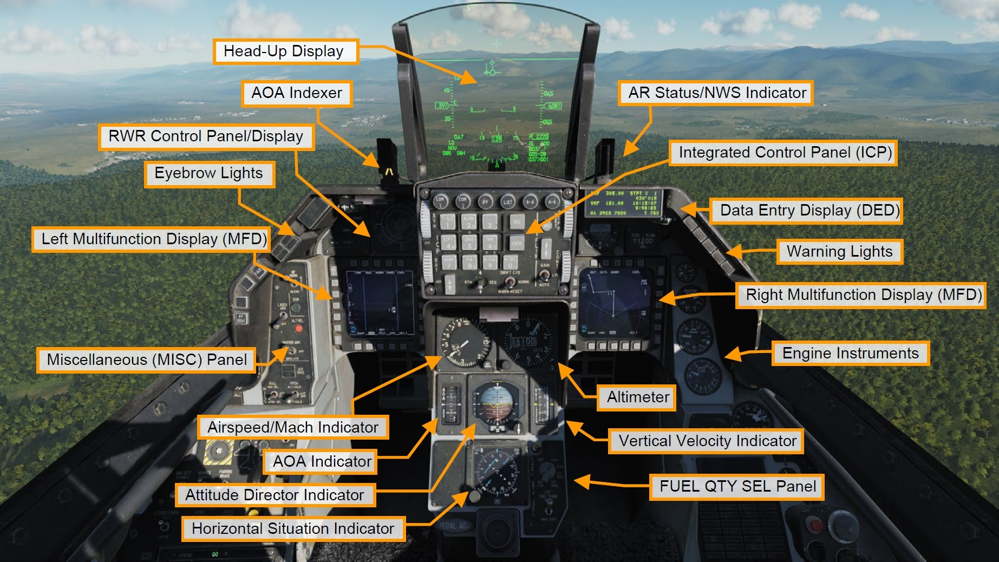
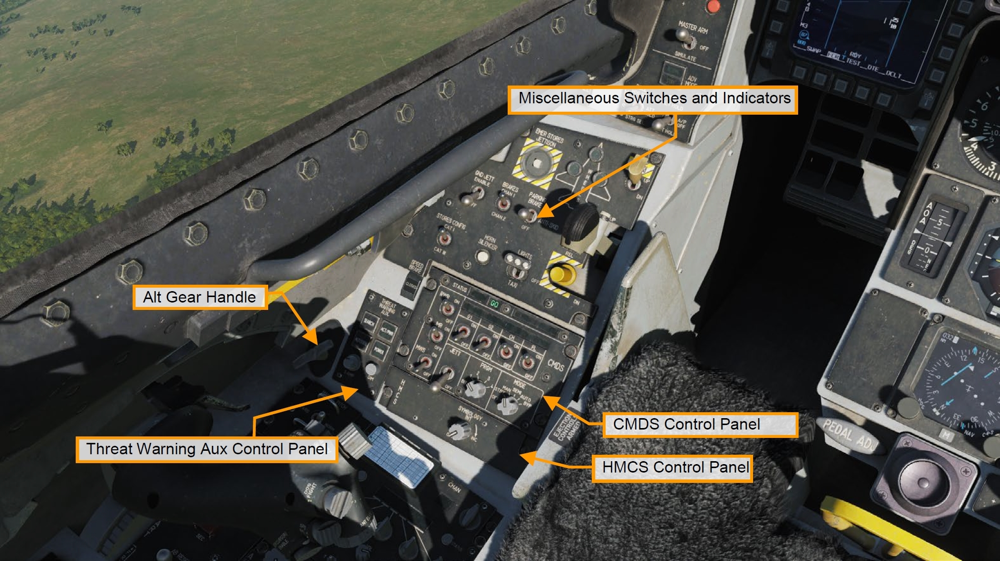
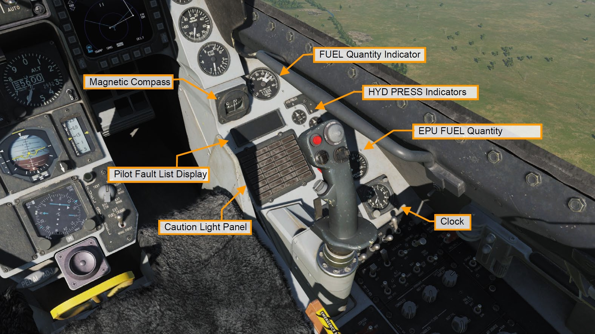
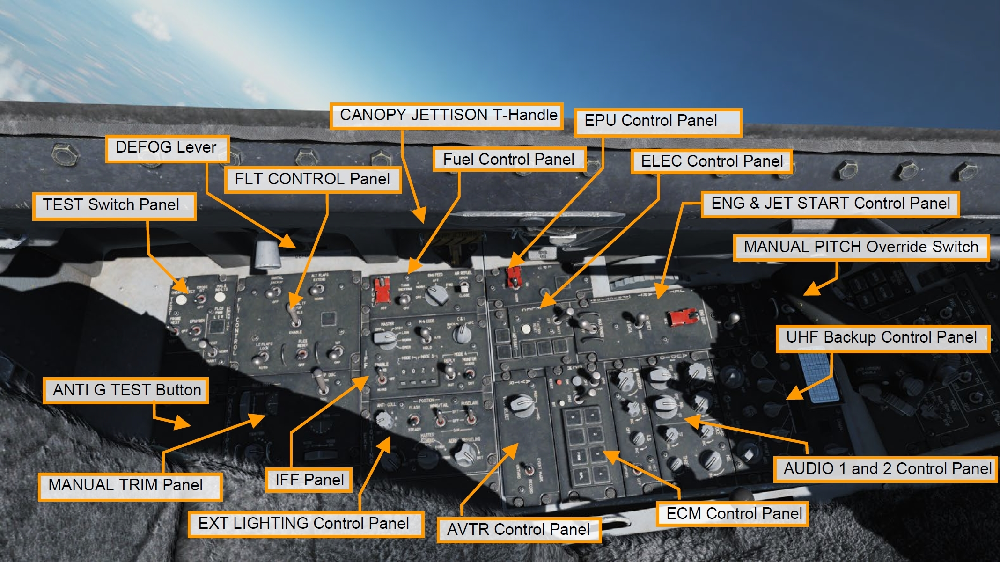
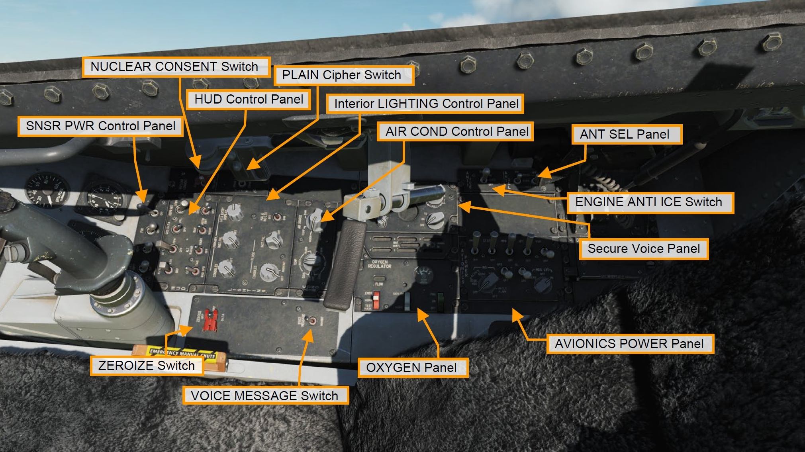

# コックピット解説

<!-- markdownlint-disable MD033 -->

コックピットは以下の5つの主要なエリアに分けられます。

- [Instrument Panel: 計器パネル](#instrument-panel)
- [Left Auxiliary Console: 左補助コンソール](#left-auxiliary-console)
- [Right Auxiliary Console: 右補助コンソール](#rifht-auxiliary-console)
- [Left Console: 左コンソール](#left-console)
- [Right Console: 右コンソール](#right-console)

## Instrument Panel: 計器パネル

### Head-Up Display (HUD): ヘッドアップディスプレイ

HUD には攻撃・航法・兵装・照準・着陸に関するシンボルが表示されます。
また、高度・速度・姿勢・方位などの航空機の飛行に必要なシンボルも表示されます。

 

### AoA Indexer: 迎え角表示器

迎え角 (AoA) 表示器には3つのライトがあります。
上のライトが赤く点灯している場合は、AoA 14° 以上でエネルギーを消耗しています。
中央の緑色のライトが点灯しているときは、AoA 11~13° の間で、最適な AoA を維持するオンスピード状態です。
下のライトが黄色に点灯していれば AoA は 11° 以下となり、エネルギーが蓄積している状態です。
これは同じ計器パネルの AoA ゲージと、ランディングギアを降ろしたときにHUDに表示される AoA ブラケットと連動しています。

着陸時には AoA 11~13° の間を維持します。
この AoA 表示器は、ランディングギアを出していない状態でも点灯します。

### AR Status/NWS Indicator: 空中給油/NWS 指示器

ノーズホイールステアリングが有効であれば、中央の NWS ライトが緑色に点灯します。
ラダーペダルを動かすことにより前脚を操作できます。

受油口が開いて空中給油ができるときは、上の RDY ライトが青く点灯します。
給油ブームが差し込まれると中央のライトが緑色に点灯します。
ブームが離れると下のライトが点灯します。

 

### Integrated Control Panel (ICP): 統合操作パネル

ICP は中央計器パネルの上部に配置されています。
これは CNI と呼ばれる、通信・航法・識別の要となるシステムです。

これについては[UFC](ufc.md)の項で説明します。

  

### Data Entry Display (DED): データ入力表示装置

DED は通信・航法・識別 (CNI) とウェポンデリバリーに関する情報を表示します。
DED の操作は ICP を通じて行います。

  

### RWR Prime Control Panel/Azimuth Display: レーダー警報受信機

ALR-56M は F-16 のレーダー警報受信機です。
自機を中心とした、360度のレーダー波をスコープに平面表示します。
スコープの左には脅威警報指示灯があります。

 

### Eyebrow Light

- **IFF Identification Light (敵味方識別灯)**: これを押すと敵味方識別が行われるか、AWACS に敵味方識別情報を要求します。
- **Fault Acknowledge Light (F-ACK)**: これを押すと Pilot Fault List Display (PFLD) の障害表示を消すことができます。
- **Master Caution Light (主警告灯)**: このライトは機体の故障や特殊な状況が発生した場合に Caution ライトと共に点灯し、押すことでリセットできます。

### Left and Right Multifunction Display (MFD): 多機能表示装置

MFD は5つずつ、4つのグループに分かれた20個の Optional Select Button (OSB) が囲むように配置されたフルカラーの CRT スクリーンです。
MFD の角にはディスプレイのゲイン、輝度、シンボルのコントラスト、輝度を変更するロッカースイッチがあります。

    

### Miscellaneous (MISC) Panel

- **Autopilot Roll and Pitch Switch (自動操縦ロール/ピッチスイッチ)**: ピッチとロールを自動で制御する2つのスイッチであります。ピッチスイッチを ALT HOLD にすると現在の高度を維持し、A/P OFF にするとオフになります。ATT HOLD にすると航空機は現在のピッチとロール姿勢を維持します。

    ロールスイッチを HDG SEL にすると、HSI でバグした方位を維持するように飛行します。
    ATT HOLD にすると現在のロールとピッチ姿勢を維持し、STRNG SEL にすると DED で選択したステアポイントに向かって自動操縦されます。
    両方のスイッチは相互に機能します。

- **ADV Mode Switch (ADV モードスイッチ)**: 地形追随レーダーを使った地形回避ボタンです。ブロック 50 バイパーでは機能しません。
- **Master Arm Switch (マスターアームスイッチ)**: 3ポジションスイッチで、OFF の場合は Emergency Jettison (緊急投棄) を除いて兵装の発射が制限されます。ARM と SIMULATE の場合、レーダーと兵装管理システム (SMS) は通常通り動作しますが、SIMULATE では兵装の発射は行われません。SIM モードでは兵装の発射はなされずに (緊急兵装投棄を除く) シンボルだけが表示され、主に訓練で使用します。
- **ALT Release Button (予備発射ボタン)**: オルトリリースボタンは、操縦桿に付いたウェポンリリースボタンが故障したときの予備です。
- **Laser Arm Switch (レーザーアームスイッチ)**: ターゲティングポッドが搭載されている場合、レーザーアームスイッチはレーザーを ARM します。
- **ECM Enable Light (ECM作動灯)**: ECM が送信されている場合、このライトが点灯します。
- **RF Switch (電波スイッチ)**: 航空機からの電波放出を制御する3ポジションスイッチであります。SILENT の場合は、レーダー・レーダー高度計・データリンク・TACAN・ECM を含む、航空機から放出されるすべての電波が遮断されます。QUIET モードの場合は、レーダー・データリンク・TACAN を除くすべての電波が遮断されます。

### Warning Lights: 警報灯

- **Engine and Engine Fire Warning Lights (エンジン/エンジン火災警報灯)**: 右 Eyebrow に配置されたライトは、すぐさま対処が必要な緊急用のライトです。エンジン警報灯は、RPM と FTIT 計が温度超過・フレームアウト・スタグネーションが起きたことを示したときに点灯します。すなわち、RPM が 60 % 未満もしくは FTIT が 1000 ℃ 以上のときです。エンジン火災警報灯はエンジンベイでの火災を検知したときに点灯します。
- **Hydraulic and Oil Pressure Warning Light (作動油/滑油圧力警報灯)**: 油圧が 30 秒以上にわたって 10 psi 未満のとき、もしくはAかBの油圧システムのどちらかが 1000 psi を下回ったときに点灯します。
- **FLCS and DBU Warning Lights (FCLS/DBU 警報灯)**: FLCS 警報灯は、FLCS プロセッサー、電力供給、入力信号、AOA、もしくはエアデータ入力の故障を検知したときに点灯します。また、前縁フラップが固定されているときか、BIT が失敗したときにも点灯します。DBU 警報灯は、FLCS デジタルバックアップが有効な場合に点灯します。
- **Takeoff and Landing Configuration Warning Lights (離着陸形態警報灯)**: このライトは、10,000 フィート以下でランディングギアが降りておらず、対気速度が 190 ノット以下で、降下率が 250 フィート毎分以上のときに点灯します。これはランディングギアの警報ホーンと連動しています。
- **Canopy and Oxygen Low Waring Lights (キャノピー/酸素残量低下警報灯)**: キャノピーが降りていない、もしくはロックされていないときに点灯します。酸素残量低下警報灯は酸素システムが5 psi 以下、もしくは BIT が失敗したときに点灯します。

### Engine Instruments: エンジン計器

- **Oil Pressure Indicator (滑油油圧計)**: エンジンにはエンジン本体とギアボックスの潤滑に使う油圧システムが内蔵されています。目盛りは 0~100 psi まであります。地上でのアイドル時には通常 15 psi あたりで、ミリタリー以上になると 60 psi を指します。
- **Engine Nozzle Position Indicator (エンジンノズル位置計)**: エンジンノズルは、ノズルとそれに連動して動くダイバージェントノズルの2つの要素から構成される可変ノズルです。ノズルの開閉は4つのアクチュエーターによって行われ、それをパーセンテージで確認できます。
- **Engine RPM Indicator (エンジン回転数計)**: RPM 計はエンジンオルタネーターから得られるエンジン回転数を 1~110 ％ の間で表示します。
- **FTIT Indicator (タービンファン内部温度計)**: Fan Turbine Inlet Temperature (FTIT) 計は、タービン内部の平均温度をセルシウス温度で表します。目盛りは 100 ℃ 刻みで、200~1200 ℃ まであります。

### Airspeed and Mach Indicator: 対気速度/マッハ計

対気速度/マッハ計はピトー管システムの空気圧を表示します。
計器の外側は 80~850 ノットまで計測できる対気速度計で、内側の小窓にはマッハ 0.5~2.2 まで測れるマッハ計があります。
赤色の三角は超過禁止速度 (VNE) を示しています。

 

### Altimeter: 高度計

1,000 フィートから 80,000 フィートまで計測できるサーボ気圧式の高度計です。
電波で計測するモードと、気圧で計測するモードがあります。
気圧モードの場合は PNEU フラッグがゲージに現れます。
右下のノブで高度計規正値を設定できます。
設定した規正値は右下の小窓に示されています。

 

### Angle of Attack Indicator: 迎え角 (AoA) 計

AoA 計は HUD の左にある AoA 表示器と同じ内容かつ、-32° から +32° までの範囲を表示します。
テープの色は AoA 表示器と適合しています。
中央にあるバーの位置が現在の AoA です。

     
  

### Attitude Director Indicator: 姿勢指示器

ADI は慣性航法装置 (INS) から得られる機体のピッチとロール姿勢を表します。
インジケーターには、1本の針の幅が 1 秒あたり 1 〜 1.2 度の回転速度に相当する回転速度針と、スリップインジケーターも含まれます。
ピッチトリムノブを使用して自機のシンボルに相当する球体を調整できます。

計器着陸装置 (ILS) が有効な場合、ローカライザーとグライドスロープバーが ADI に表示されます。

### Vertical Velocity Indicator: 昇降計

VVI は機体の上昇率と降下率を 6,000 フィート毎分の範囲で表示します。

     
    

### Horizontal Situation Indicator: 水平姿勢指示器

HSI は自機を中心とした平面図を表示します。
自機シンボルを囲むコンパスは INS によって動くため、磁北は常にラバーライン (上端の線の位置) で読まれます。
方位設定ノブでヘディングインジケーターを、コースノブでコースを設定できます。

 

### Fuel Quantity Select Panel: 燃料計表示選択パネル

Fuel Quantity Select パネルでは燃料計に何を表示させるか選択できます。

- **TEST**: 両方の針が 2,000 ポンドを指し、トータライザーは 6,000 ポンドを示します。 コーションライトパネルには FWD FUEL LOW と AFT FUEL LOW が点灯します。
- **NORM**: AL ポインターが後部左タンクと A-1 胴体タンクの残燃料を、FR ポインターが前部右リザーバータンクと F-1、F-2 タンクの残燃料を示します。
- **RSVR**: AL ポインターと FR ポインターがそれぞれ、後方と前方のリザーバータンクの燃料を示します。
- **INT WING**: AL ポインターと FR ポインターがそれぞれ、左右の主翼内タンクの燃料を示します。
- **EXT WING**: AL ポインターと FR ポインターがそれぞれ、左右の外部燃料タンクの燃料を示します。
- **EXT CTR**: FR ポインターが胴体下の外部燃料タンクの燃料を示します。
- **The External Fuel Transfer**: 外部タンクからの燃料流量を制御できます。NORM の場合はセンターラインタンクから先に消費し、WING FIRST の場合はウィングタンクから消費します。

## Left Auxiliary Console: 左補助コンソール

### Miscellaneous Switches and Indicators

- **EMER STORES JETTISON Button (緊急兵装投棄ボタン)**: すべての燃料タンク、懸架ラック、自由落下兵器を投棄します。
- **WHEELS Down Light (降着装置展開灯)**: 主脚と前脚の状態を示し、緑色の場合はギアが降りてロックされている状態です。ランディングギアが動作中はハンドルが赤く点灯しハンドルと対応した位置にあれば、そのライトはオフになります。
- **HOOK Switch (フックスイッチ)**: アレスティング装置がある滑走路で緊急着陸をするためのフックを展開できます。フックは一度展開すると、スイッチからでは完全に格納することができません。
- **ANTI-SKID Switch (アンチスキッドスイッチ)**: アンチスキッドもしくはパーキングブレーキをオンにできます。
- **LANDING TAXI LIGHTS Switch (着陸/滑走灯スイッチ)**: テイクオフ/ランディングライトもしくはタキシーライトをオンにできます。
- **DN LOCK REL Button (ダウンロック解除ボタン)**: 電磁ソレノイドが故障もしくは通電していない場合、スプリング動作ハンドルを機械的にアンロックします。ランディングギアによるすべての電気信号をオーバーライドします。(WoWを解除し、ギアに重量が掛かっていても上げられるようになる)
- **LG Handle (降着装置ハンドル)**: ハンドルを動かすと、電気スイッチが作動しランディングギアへ格納または展開の信号が送られます。ギアとドアが動作中もしくは正常にロックされていない場合、ハンドル内の警報灯が点灯します。また、この警報灯は、ギアが降りてロックされておらず、対気速度 190 ノット以下、高度 10,000 フィート以下、降下率 250 フィート毎分以上のすべての条件を満たす場合にも点灯します。
- **SPEED BRAKE Position Indicator (スピードブレーキ位置表示器)**: 閉鎖・開放・電源なしの3つのスピードブレーキの状態を示します。スピードブレーキが閉じているときはインジケータは CLOSED を表示し、開いているときは9つのドットが、電源が入っていないときはストライプが表示されます。
- **STORES CONFIG Switch (兵装形態スイッチ)**: 兵装に応じて CAT I か CAT III に設定します。通常、CAT I は空対空ロードアウトで、CAT III は翼下に重たい空対地兵装や燃料タンクを装備しているときに使用します。CAT III のとき、FCLS は離陸制限を厳しくするために AOA と onset rate を制限します。
- **HORN SILENCER Button (警告ホーン停止ボタン)**: 対気速度 190 ノット以下、高度 10,000 フィート以下で、後縁フラップが作動しランディングギアが正常に降りていないときに鳴る警告ホーンを停止することができます。通常はランディングギアの展開を促すための警報ですが、10,000 フィート MSL 以下でドッグファイトをしている際にも鳴ることがあります。
- **GND JETT ENABLE Switch (地上投棄実行スイッチ)**: OFF であれば地上にいるとき (WoW: ランディングギアが展開し重量が掛かっている状態) の緊急兵装投棄と、ランディングギアが展開しているときのセレクティブジェティソンと兵装の通常投下を制限します。ENABLE の場合、ギアの展開や WoW に関係なく兵装を投棄または投下できます。これは航空機の兵装システムチェックのメンテナンスのために使用します。
- **BRAKES Channel Switch (ブレーキチャンネルスイッチ)**: チャンネル 1 、2 のどちらでもペダルブレーキを有効にできますが、通常はチャンネル 1 のままにしておきます。

### CMDS Control Panel: 対抗手段放出装置パネル

対抗手段の操作と表示はこのパネルから行えます。
パネルからチャフ/フレアの放出プログラムとジャマーを選択し、HOTAS から実行できます。

   

### HMCS Control Panel: ヘルメット装着式照準システム制御パネル

ヘルメットバイザーに飛行と兵装照準情報を投影させることができます。
ノブで電源のオンオフ、輝度を調整できます。

### Threat Warning Aux Control Panel: 脅威警報補助制御パネル

RWR の電源と管理の操作を行えます。

     
  

### ALT GEAR Handle: 予備降着装置ハンドル

油圧もしくはメインランディングギアハンドルが故障した場合に、代わりに降着装置を展開させることができます。

     

## Right Auxiliary Console: 右補助コンソール

### Magnetic Compass: 方位磁針

磁北を基準とした自機の機首方位を示す自己完結型の方位磁針です。

    

### Fuel Quantity Indicator: 燃料計

燃料計の小窓には数字で残燃料の合計値が、2本の針がそれぞれ後部と左、前部と右のタンクを示します。
2本の針の間隔は燃料の不均衡を表しており、これが広がると針の根本に赤い表示が現れます。
このような場合は FUEL パネルにある ENG FEED スイッチを使って不均衡を解消します。

 

### Hydraulic Pressure Indicators for System A and B: 油圧計

油圧システム A と B の油圧を示します。
通常、2,850~3,250 PSI の値を示します。

    

### Pilot Fault List Display: パイロット障害リスト表示装置

PFLD はフライトコントロールシステム (FLCS) が検知した障害を表示します。
表示される内容には警報レベルと警告レベルがあります。
警報レベルは FLCS と連動しており、警報内容に括弧がつきます。
警告レベルではエンジンとアビオニクスなどの FLCS 以外の要素と連動しています。
PFLD にアイテムが表示された場合、対応する Caution ライトと MASTER CAUTION ライトが点灯します。
障害表示をクリアするには **F-ACK** を押します。

### Caution Light Panel: 警告灯パネル

Caution ライトパネルには検出された障害と、対応した複数のライトがあります。

      

### EPU Fuel Quantity Indicator: EPU 燃料計

EPU (非常用電源装置) 燃料計は残りのヒドラジンの量をパーセンテージで表示します。
100 % の場合、EPU は約5分から10分間稼働できます。

  

### CABIN PRESS ALT gauge: コックピット内気圧高度計

コックピット内の気圧高度を 0 フィートから 50,000 フィートまで表示します。

   

### Clock: 時計

最大60分の経過時間を表示できる8日間の手巻き時計です。

    

## Left Console: 左コンソール

### Test Switch Panel: テストスイッチパネル

TEST パネルには以下の操作と表示を含みます。

- **Fire and Overheat Detection (FIRE & OHEAT DETECT) Test Button (火災/過熱検知テストボタン)**: オーバーヒート検出システムのテストを行います。これを押すと Caution ライトの OVERHEAT と、右 Eyebrow ライトの ENG FIRE が点灯します。これにより MASTER CAUTION ライトも点灯します。
- **PROBE HEAT Switch(ピトー管加熱スイッチ)**: オンにするとデータプローブを加熱します。TEST に倒すと、テストが良好に完了したあとに Caution ライトの PROBE HEAT が点滅します。
- **On-Board Oxygen Generation System (OBOGS) BIT Switch (機上酸素発生装置テストスイッチ)**: BIT にすると、右 Eyebrow ライトの OXY LOW が点灯します。
- **Emergency Power Unit / Generator (EPU/GEN) Test Switch (非常用電源装置/発電機テストスイッチ)**: エンジン起動後の EPU のテストができます。
- **MAL & IND LTS Test Button (故障/指示灯テストボタン)**: 警報ライトと警告ライト、音声メッセージのテストができます。
- **FLCS PWR TEST Switch (FLCS電力テストスイッチ)**: ABCD 4つのフライトコントロールチャンネルライトのテストができます。TEST に倒すと、MAIN PWR スイッチが BATT に設定されたときに FLCS への電力出力を確認します。

### FLT Control Panel: 操縦系統制御パネル

F-16 の操縦系統の手動制御パネルです。
バイパーの FLCS は高度に自動化されているため、通常は何も設定する必要はありません。

- **Digital Buck Up Switch (デジタルバックアップスイッチ)**: FLCS のバックアップソフトウェアを選択します。オンの場合、右 Eyebrow ライトに DBU ON 、HUD に WARNING が表示されます。
- **ALT FLAPS Switch (フラップ代替スイッチ)**: 後縁フラップを自動制御ではなく手動で展開させます。非対称フラップ設定でフラップが故障した場合に使用します。
- **MANUAL TF FLY UP Switch (手動地形追随飛行スイッチ)**: 地形追随レーダー用ですが、ブロック 50 バイパーでは使用しません。
- **LE FLAPS Switch (前縁フラップスイッチ)** : 前縁フラップを手動または自動で制御します。これにより、前縁フラップを規定通りに動かしたり、所定の位置に固定することができます。片方の前縁フラップが故障し、両方を同じように動作させる必要がある場合は手動設定を使用します。
- **FLCS RESET Switch (FLCS リセットスイッチ)**: FLCS の警報とライト、サーボアクチュエーター及び FLCS の電気部分の故障をリセットします。
- **FLCS BIT Switch (FLCS テストスイッチ)**: 地上にいる (WoW) ときに自己診断テスト (BIT) を行います。BIT にすると、操縦翼面の動作テストが行われます。スイッチは BIT 位置に45秒間保持され、緑色の RUN ライトが点灯します。完了するとライトは消灯し、スイッチは中央位置にスナップバックします。BIT 中に問題が発生すると赤色の FAIL ライトが点灯し、PFLD に障害の内容が表示されます。

### Manual Trim Panel: 手動トリムパネル

F-16 の自動トリムは優秀なため、通常の飛行においては設定する必要ありませんが、操縦桿のトリムスイッチから操作することができます。

- 左上にはロールトリムインジケーターと操作するホイールがあります
- 右下にはピッチトリムインジケーターと操作するホイールがあります
- 左下にはヨートリムを操作するダイヤルがあります
- Trim Autopilot Disconnect (TRM/ AP DISC) スイッチは、操縦桿のトリムスイッチが故障した場合に、そのトリムスイッチと自動操縦モードを無効にできます

### Fuel Control Panel: 燃料制御パネル

FUEL パネルで燃料システムの制御ができます。

- **FUEL MASTER Switch (燃料マスタースイッチ)**: ガードされており、燃料のシャットオフバルブの開閉ができます。通常はオン位置でガードしておきます。
- **TANK INERTING Switch (タンク不活性化スイッチ)**: 不揮発性ハロンガスを燃料タンクに送り込むことで内圧を低下させ、戦闘ダメージなどの緊急時の火災リスクを低減させます。
- **ENG FEED Knob (エンジン送油ノブ)**: 燃料ポンプをオンまたはオフにすることで、搭載燃料の重心を中央に保つ. ダイヤルを回すと燃料バランスの調整を手動か自動に変更できます。燃料の不均衡は燃料計の針の開き具合で確認できます。AFT もしくは FWD にすることで、クロスフィードの燃料タンクポンプを選択できます。これにより燃料の重心位置の手動調整が可能になります。NORM では燃料システムが自動で調整し、OFF では燃料ポンプが止まります。
- **AIR REFUEL Switch (空中給油スイッチ)**: 機体の背部にある空中給油用の扉を開閉できます。

### IFF Control Panel: 敵味方識別装置制御パネル

通信・航法・識別 (CNI) の機能と IFF の主要な機能のいくつかを制御できます。

   

### EXT Lighting Control Panel: 機外照明制御パネル

航空機に取り付けられているすべての機外灯を制御します。

- **ANTI-COLL Knob (衝突防止灯ノブ)**: OFF ポジションと、点滅パターンの異なる7つのモード (1、2、3、4、A、B、C) があります。
- **FLASH STEADY Switch (位置灯スイッチ)**: 点滅と点灯が選択できる位置灯のスイッチです。
- **WING/TAIL and FUSELAGE Switch (衝突防止灯スイッチ)**: 翼端灯と胴体の衝突防止灯を制御する、全灯・消灯・微灯の3ポジションスイッチです。
- **FORM Knob (編隊灯ノブ)**: 編隊灯の輝度を調整します。
- **MASTER COVERT Knob (可視不可視ノブ)**: 外部灯火の可視・不可視の切り替えノブです。不可視 (CONVERT) はナイトビジョン用です。
- **AERIAL REFUELING Knob (空中給油ノブ)**: 夜間に空中給油オペレーターが給油口を視認しやすくするために、給油口を照らすライトの輝度を調整します。

### EPU Control Panel: 非常用電源装置制御パネル

EPU は、ヒドラジン駆動の自己完結型ユニットで、約10~15分間、緊急用の油圧と電力を供給できます。
主にエンジンが停止した場合に使用し、EPU は油圧および電気システムに電力を供給します。

- **EPU Switch (EPU スイッチ)**: ガード付きで、NORM であれば両方の油圧システムや MAIN/STBY ジェネレーターの両方が喪失するなどの条件を満たした場合に自動的に作動します。ON にして手動で作動させることもできます。EPU が稼働してタービンが正常に動作していれば、緑色の EPU 動作ライトが点灯します。
- **HYDRAZN AIR Light (稼働ソースライト)**: ヒドラジンを使用してタービンを稼働させている場合は HYDRAZN が点灯し、空気のみで作動している場合は AIR が点灯します。

### ELEC Control Panel: 電力制御パネル

航空機に必要な電力を制御できます。

- **MAIN PWR Switch (主電源スイッチ)**: 電気システムに接続する主電源を、外部電源もしくは主発電機から選択できます。BATT はバッテリーをバッテリーバスに接続し、OFF では電源を無効にします。航空機を始動するときは、まず BATT でテストを行い、その後 MAIN PWR に接続してエンジンを始動します。
- **ELEC CAUTION RESET Button (電気警告リセットボタン)**: 電気システムの Caution ライトを消し、主発電機と予備発電機を再起動します。
- **MAIN GEN Light (主発電機ライト)**: 外部もしくは主発電機の電源が入っていない場合に点灯します。
- **STBY GEN Light (予備発電機ライト)**: 予備発電機が使用できない場合に点灯します。
- **EPU GEN Light (EPU 発電機ライト)**: EPU は動作しているが、両方の非常用バスに電力を供給していない場合に点灯します。
- **EPU PMG Light (EPU 磁気発電機ライト)**: EPU は動作しているが、すべての FLCS の末端まで動作させるには PMG からの電力が足りない場合に点灯します。
- **Aircraft Battery Indicator Light (航空機搭載バッテリー指示灯)**: **FAIL** ライトは飛行中でバッテリーが 20 ボルト未満、もしくは地上でバッテリー障害があるときに点灯します。**TO FLCS** ライトが点灯していれば、飛行中に1つ以上の FLCS ブランチが 25 ボルト未満、もしくは地上でバッテリーの電力が1つ以上の FLCS ブランチに接続されています。**FLCS RLY** は、1つ以上の FLCS ブランチが 20 ボルト未満か、バッテリーに接続されていない場合に点灯します。

### ECM Control Panel: 電子対抗手段制御パネル

ECM 装備が搭載されている場合にECM を制御し、状態を表示します。

 

### AVTR Control Panel: 飛行録画制御パネル

Airborne Video Tape Recorder (AVTR) は HUD と MFD、もしくは HMD と MFD 画面の録画ができます。

 

### ENG & JET Start Control Panel: エンジンジェット始動制御パネル

GE-129 エンジンの始動とその他の制御を行います。

- **JET FUEL START Switch (JSF 始動スイッチ)**: OFF、START1、START2 の3ポジションがあります。これらは、1つまたは2つのジェット燃料始動装置のアキュムレータを使用して油圧始動モーターを駆動させます。JP8 燃料を使う場合は START2 にセットします。
- **JSF RUN Light (JSF 稼働灯)**: JSF 始動 30 秒以内に点灯します。
- **ENG CONT Switch (エンジン制御スイッチ)**: **PRI** (プライマリ) モードと **SEC** (セカンダリ) モードがあるガード付きスイッチです。エンジンのデジタル電子制御に障害が発生しない限り、通常は PRI にします。故障が発生した場合は SEC を選択するか、エンジンが停止後の再起動のために PRI を選択しなおします。SEC ではアフターバーナーが使用できないことに注意します。また、SEC では Caution パネルの SEC が点灯し、アイドル時の推力が増加します。
- **MAX POWER Switch (最大推力スイッチ)**: GE-129 エンジンでは使用しません。

### UHF Backup Control Panel: UHF 予備無線機制御パネル

無線のほとんどの機能は計器パネルの ICP と DED を介して操作しますが、バックアップ UHF 無線パネルでも同様に操作できます。
バッテリー電源から使える唯一の無線機なので、エンジン始動前に使用する必要があります。
アクセスドアの右にはチャンネルを設定するノブがあります。
A-10Cに精通している人にとっては慣れ親しんだ無線機でもあります。

パネルの中央には周波数を設定するダイヤルと表示窓があります。
下部には、無線機の電源およびモードを選択する機能ノブ、トーンシグナルボタン、音量ノブ、そしてマニュアル・プリセット・緊急周波数 (243.0) を選択するモード選択ノブがあります。

### Audio 1 Control Panel: 音量制御パネル 1

COMM 1 と COMM 2 両方の無線機と、それぞれをスケルチ OFF、スケルチ ON、緊急周波数にするモードノブがあります。
パネルの右側には、保安音声用の SECURE VOICE ノブ、サイドワインダーのシーカー音量を調節する MSL Tone ノブ、脅威警報用の THREAT Tone ノブ、(実機では動作しない) TF Tone ノブがあります。

### Audio 2 Control Panel: 音量制御パネル 2

地上クルーおよび空中給油のブームオペレーターとの会話に用いるインターコム音量を調節する INTERCOM ノブ、戦術航法装置 (TACAN) のコード再生音量を調節する TACAN ノブ、計器着陸装置 (ILS) のローカライザー認識シグナルの ILS Power ノブ、そして HOT MIC スイッチがあります。

### Manual Pitch Override Switch: ピッチ手動オーバーライドスイッチ

MANUAL PITCH スイッチを OVRD にすると、ディープストール時にスタビライザーの権限を上書きすることにより、機首をより大きく下げることができます。
これで増速して失速時でも飛行制御が可能になります。
パイロットがシートストラップから逆さまにぶら下がっていてもしっかりと握ることができるように、スイッチの両側にガードがついています。

### Canopy Jettison Handle: キャノピー投棄ハンドル

緊急事態に限り使用します。
座席射出ハンドルを引いてもキャノピーが正常に分離せずに射出を妨げている場合に使います。

 

### De-Fog Lever: 防曇レバー

前後どちらかに動かすとキャノピーの曇りを取り除くことができます。

## Right Console: 右コンソール

### Sensor Power Control Panel: センサー電源制御パネル

インテーク下にある左右のチンポッド、火器管制レーダー (FCR) 、レーダー高度計の電源を入れることができます。

### HUD Remote Control Panel: HUD 制御パネル

HUD の表示内容を管理します。

詳細は[HUD](hud.md) を参照．

 

### Interior Lighting Control Panel: 機内照明制御パネル

コックピット計器の照明を調節できます。
ナイトビジョンゴーグルのために、照明のほとんどは緑色になっています。
PRIMARY CONSOLES ノブは左右コンソール、PRIMARY INST PNL ノブは計器パネルと補助コンソールパネル用です。
PRIMARY DATA ENTRY DISPLAY ノブは、DED と PFLD の輝度を調節します。

MAL&IND LTS スイッチは、AoA 表示器、AR/NWS 指示器、DED、ECM 制御パネル、左右 MFD、PFLD、RWR の輝度を全灯か微灯に設定します。

FLOOD CONSOLE ノブは左右コンソールの投光照明を、FLOOD INST PNL ノブは計器パネルの投光照明を調節します。

### Air Cond Control Panel: エアコン制御パネル

コックピット温度とエンジンの抽気設定が行えます。
TEMP ノブはシミュレーションでは機能しないが、AIR SOURCE ノブは機能します。
OFF はすべてのエンジン抽気バルブを閉じ、NORM は環境制御システム (ECS) を自動制御にします。
DUMP はコックピットの内圧と外圧を均等にし、RAM は抽気バルブを閉じて内圧を下げます。

### Secure Voice Panel: 秘話装置パネル

UHF 無線機及び VHF 無線機と組み合わせて使用し、暗号化通信を可能にします。

       

### Voice Message Switch: 音声メッセージスイッチ

音声メッセージの無効化ができます。

    

### Oxygen Panel: 酸素パネル

酸素マスクの酸素流量を調節します。
SUPPLY レバーは OFF と ON に加えて、G に対する補助呼吸 (PBG) 設定があります。
Diluter レバーは酸素の割合を通常 (NORM) と 100 % から選択できます。
EMERGENCY レバーは、非常時のための EMERGENCY、通常時の NORM、テスト用の TEST MASK があります。
パネル上部には酸素システムの圧力計があります。

### Engine Anti Ice Switch: エンジン防氷スイッチ

プローブとエンジンを熱して凍結を防ぎます。
ON は手動で有効、AUTO は凍結を検知した場合のみ自動でオンになります。
OFF はシステムを無効にします。

### ANT SEL Panel: アンテナ選択パネル

IFF と UHF 無線機のアンテナを、上部 (UPPER) アンテナ、通常 (NORM) 、下部 (LOWER) アンテナのいずれかにします。

### Avionics Power Panel: アビオニクス電源パネル

航空機に搭載している電子機器の電源を入れます。

- **MMC**: モジュラーミッションコンピュータの電源を入れます。
- **ST STA**: 兵装ステーションの電源を入れます。
- **MFD**: 左右の多機能表示装置の電源を入れます。
- **UFC**: アップフロントコントロール (ICP と DED) の電源を入れます。
- **MAP**: ブロック 50 バイパーでは使用しません。
- **GPS**: 全地球測位システム (GPS) の電源を入れます。
- **DL**: データリンクの電源を入れます。
- **INS**: ノブには、OFF、機体の位置を保存しておく STOR HDG、通常の起動に用いる NORM、INS を実際に用いる NAV、飛行中にアラインする IN FLT ALIGN、安定した飛行を続けることで GPS を用いて INS を更新する ATT オプションがあります。
- **MIDS**: 多機能情報伝達システムの ON、OFF と、データを抹消する ZERO があります。

### Zeroize Switch: 暗号抹消スイッチ

緊急時において、暗号化通信や GPS キーを含むすべての機密情報を抹消します。

  
