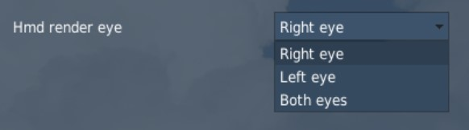

# HMCS

ヘルメット装着式照準システム (HMCS) は, フライトヘルメットのバイザーに機体と兵装の情報を常に表示させる追加の改修キットである.
ヘルメットマウンッテドディスプレイ (HMD) とも称される.

また, センサーや搭載兵器をヘルメットの視点に合わせてスレーブ (追従) させることができる.
これは, AIM-9X ハイオフボアサイト短距離ミサイルと組み合わせると絶大な効果を発揮する.
ヘルメットは, センサーと搭載兵器を最大 80° のオフボアサイト (非砲口照準) までスレーブできる.

HMD の電源は, 左補助コンソールの HMD 制御ノブから入れる.
**OFF** 位置にあるノブを **INC** (増加) へ時計回りに回すと, HMD が起動する.
続けて INC に回し続けると, HMD の輝度が増加する.

HMD のシンボルは右目のみで見える.
VR を使用したときに違和感があれば, DCS: World オプションの F-16C Special Tab から変更できる.

HMCS を用いたウェポンデリバリーは以下の項で扱う.

- AIM-9M/X HMCS ミサイルボアサイト運用
- AIM-9M/X HMCS レーダーボアサイト運用

## Non-Designated Mode: 非指定モード

HMCS の基本機能は Non-Designated モードで投影される.
HMD のシンボルのほとんどは HUD と似ているため, HUD の延長として扱われる.
以下のシンボルはすべての HMCS モードにおいて機能する.

- **Acceleration (G 加速度)**: 現在の G 表示
- **Airspeed (速度)**: HUD の速度表示の写し
- **Master Arm Status (マスターアームの状態)**: マスターアームスイッチの位置が OFF, ARM, SIM のいずれかで表される
- **Master Mode (マスターモード)**: 現在のマスターモード
- **Bearing/Range to Bullseye (ブルズアイまでの方位/距離)**: 自機からブルズアイまでの方位と距離
- **Altitude (高度)**: HUD の気圧高度表示の写し
- **Dynamic Aiming Cross (ダイナミック照準クロス)**: HMD が空対空モードのとき, 照準クロスのには HMD の視角に応じた3通りの位置がある
    - HMD の見通し線が水平線より低い場合, エイミングクロスは HMD の中央に表示される
    - HMD の見通し線が水平線より 0~30° 高い場合, エイミングクロスは HMD の速度表示と高度表示の中間に表示される
    - HMD の見通し線が水平線より 30° 以上高い場合, エイミングクロスは HMD の方位表示に重ねて表示される
- **Distance to Steerpoint/Steerpoint Number (ステアポイントまでの距離/番号)**: 選択中のステアポイントと距離 (海里)
- **Helmet heading (ヘルメット方位)**: ヘルメットが向いている方位の数字表示
