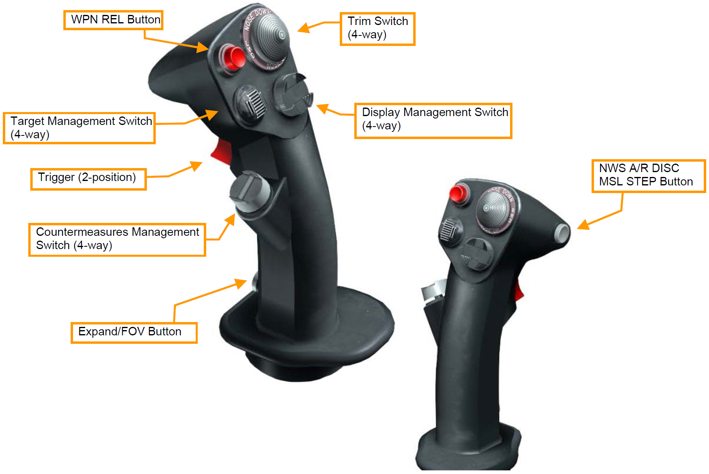
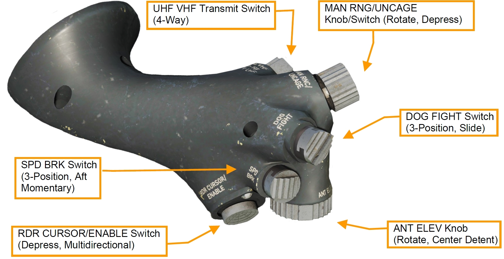
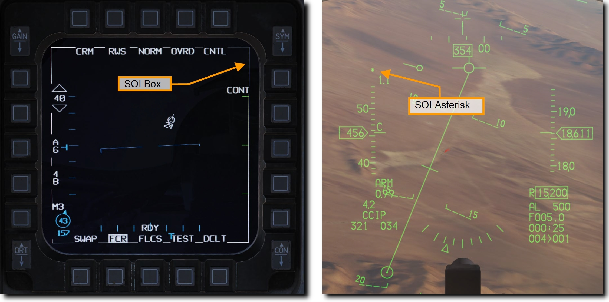

# HOTAS

<!-- markdownlint-disable MD033 -->

ハンズオン・スロットル & スティック (HOTAS) とも呼ばれるハンズオン・コントロールにより、操縦桿やスロットルから手を離すことなく主要システムを操作できます。
操縦桿とスロットルに配置されたスイッチで、火器管制システムや兵装管理機能のハンズオン・インターフェースを可能にします。
スイッチの中には、マスターモード、兵装デリバリーモード、SOI の状況に応じて機能が変化する多目的なスイッチもあります。

- [Stick: 操縦桿](./#stick)
- [Throttle: スロットル](./#throttle)
- [Sensor of Interest (SOI)](./#sensor-of-interest-soi)

## Stick: 操縦桿

操縦桿の主な機能は、ピッチとロールの指示を与えて航空機を機動させることです。
前や後ろに倒すと航空機の水平尾翼が動いてピッチを操作し、横方向の入力はフラッペロンと水平尾翼によるロールをもたらします。

F-16 の操縦桿にはいくつものボタンとハットスイッチが付いており、手を離さずに様々な機能を遠隔操作することが可能です。

- **WPN REL Button (兵装発射ボタン)**: 押し続けることで爆弾・ロケット・対地ミサイルなどの対地兵装と対空ミサイルを発射します。
- **Trigger Switch (トリガースイッチ)**: 第一段階の位置まで引くと目標指示ポッドのレーザーを照射し、さらに第二段階まで引くと (選択されていれば) 機関砲を発射します。
- **NWS A/R DISC MSL STEP Button (NWS/空中給油切断/ミサイルステップボタン)**: このボタンの機能は航空機の状態によって変化します。
    - **Nose-Wheel Steering (前輪操向)**: 地上で短押しすると前輪の左右操向を有効化します。もう一度押すと無効化します。
    - **A/R Disconnect (空中給油切断)**: 空中で AIR REFUEL スイッチが OPEN 位置にあるときに押すと、給油ブームのラッチを解除します。
    - **Missile Step (ミサイルステップ)**: 空中で EO もしくは空対空モードが選択されているときに押すと、ミサイルの搭載ステーション選択を切り替えます。空対地モードのときには CCRP、CCIP、DTOS を切り替えます。空対空モードで長押しするとミサイルの種類を切り替えます。
- **TRIM Button (トリムボタン)**: 前後の入力でそれぞれ機首下げと機首上げに対応します。左に押すと左主翼が下がり、右に倒すと右主翼が下がります。
- **Display Management Switch (DMS: ディスプレイ・マネジメントスイッチ)**: DMS は操作するセンサーの選択 (SOI) に使用します。

| ボタン    | HUD        | レーダー        | 目標指示ポッド  | 兵装            |
| -------- | ---------- | --------------- | ------------- | --------------- |
| 前 短押し |            | HUD 選択        | HUD を選択     | HUD 選択        |
| 〃 長押し |            |                |                |                |
| 後 短押し | MFD を選択 | 選択 MFD 入替え  | 選択 MFD 入替え | 選択 MFD 入替え |
| 〃 長押し |            |                |                |                |
| 左 短押し |            | 左 MFD 次ページ | 左 MFD 次ページ | 左 MFD 次ページ |
| 〃 長押し |            |                |                |                |
| 右 短押し |            | 右 MFD 次ページ | 右 MFD 次ページ | 右 MFD 次ページ |
| 〃 長押し |            |                |                |                |

- **Target Management Switch (TMS: ターゲット・マネジメントスイッチ)**: TMS はレーダー、AGM-65 マーベリックミサイル、目標指示ポッドの目標指示とデータの管理を行います。

| ボタン    | HUD                  | レーダー                   | 目標指示ポッド       | 兵装           | HSD      |
| -------- | -------------------- | -------------------------- | ------------------- | ------------- | -------- |
| 前 短押し | DTOS/EO視覚的目標指示 | RWS スポットライト/ACM BORE | ポイント トラック | トラック       | 目標指示 |
| 〃 長押し |                      |                            |                     |               |          |
| 後 短押し | 目標選択解除          | 目標選択解除                |                     | 目標選択解除   | ドロップ |
| 〃 長押し |                      |                            |                     |               |         |
| 左 短押し |                      | 全目標敵味方識別            | Polarity Swap?      | Polarity Swap |          |
| 〃 長押し |                      | 選択目標敵味方識別          |                     |               |          |
| 右 短押し |                      | TMS バグ切替え/ACM 切替え   | エリア トラック  |               |          |
| 〃 長押し |                      | TWS/RWS 切替え             |                     |               |          |

- **Countermeasures Management Switch (CMS: カウンターメジャー・マネジメントスイッチ)**:  CMS はチャフやフレアなどの対抗手段と、ECM の動作を制御します。

| 方向 | 機能                               |
| ---- | ---------------------------------- |
| 前   | 選択したマニュアルプログラムを放出 |
| 後   | SEMI で放出 / AUTO モード有効化    |
| 左   | 機能なし                           |
| 右   | AUTO モード無効化                  |

- **Expand/FOV Button (拡大/視野角変更ボタン)**: 押すごとに選択中のセンサーやシステムの視野角を切り替えます。
- **Paddle Switch (パドルスイッチ)**: 押している間、自動操縦を中断します。(図では表記無し)

## Throttle: スロットル

エンジン出力の調整は左コンソール上部に取り付けられたスロットルで行います。
スロットルにはオフ、アイドル、ミリタリー、アフターバーナーのディテント (戻り止め) があります。
オフ位置では燃焼と燃料流入が止まります。
アイドル位置は地上及び空中でのエンジンスタートに使用され、最小限の推力が得られます。
アイドルからミリタリーまでの間の動きは、そのままエンジン推力に反映されます。
ミリタリー位置よりも前方ではアフターバーナーが点火されます。

スロットルはシステムの操作に使うスイッチも備えています。
操縦桿と同様、スロットルの HOTAS 機能は状況や航空機の動作モードに応じた様々な機能を実現します。
それぞれの機能の詳細については別項目で紹介します。

- **UHF VHF Transmit Switch (無線送信スイッチ)**: 前に倒すと UHF 無線、後ろに倒すと VHF 無線を送信します。右に短く (0.5秒以下) 倒すとレーダー画面のデータリンク情報をフィルターします。左に短く倒すとデータリンクで提供された目標表示のオンオフができます。
- **MAN RNG/UNCAGE Contol (マニュアル距離/アンケージスイッチノブ)**: このスイッチの機能は航空機のマスターモードや選択中のシステムによって変化します。ノブを回転させると目標指示ポッド画面の拡大率を変更します。AIM-9 や AGM-65 のシーカーをアンケージ (= 開放) するにはスイッチを押し込みます。
- **Dogfight/Missile Override (DOGFIGHT) Switch (ドッグファイト/ミサイルオーバーライドスイッチ)**: 緊急兵装投棄を除く、すべてのモードを中断して上書きする権限のある3ポジションスイッチであります。スイッチを中央位置に戻すと最後に選択されていたマスターモードに戻ります。
    - ドッグファイト (後): 空対空モードに切り替わり、ミサイル運用に加えて20mm 機関砲発射のシンボルを HUD に表示します。
    - ミサイルオーバーライド (前): 空対空モードに切り替わりミサイル発射のみを有効にします。
- **ANT ELEV Knob (アンテナ仰角ノブ)**: レーダーアンテナの仰角を手動で調整します。
- **CURSOR/ENABLE Control (カーソル/有効化スイッチ)**: レーダーカーソルもしくは目標指示ポッドなどのカメラを操作します。空対空モードで押し込むと AIM-9 と AIM-120 の BORE/SLAVE (シーカーの挙動) を切り替えます。空対地モードで押し込むと AGM-65 の PRE/VIS/BORE オプションを切り替えます。
- **スピードブレーキスイッチ**: 後ろに引くとスピードブレーキが開きはじめます。前に倒すと畳みます。

## Sensor of Interest (SOI)

SOI を指定して HOTAS で操作するセンサーやディスプレイを選択します。
場合によっては選択された SOI やマスターモードに関係なく、同じスイッチによって同一の機能が適用されます。
スイッチの機能の詳細は別項目で紹介します。

現在選択中の SOI は、MFD の囲み表示か HUD 上のアスタリスク表示で確認できます。

SOI の変更はディスプレイ・マネジメントスイッチ (DMS) で行います。
SOI を指定するための基本的な機能は以下の通りです。

- **DMS 前**: 空対地モードの場合に SOI を HUD にします。
- **DMS 後**: HUD から優先度の高い MFD に SOI を変更します。もう一度押すと MFD 間で SOI を切り替えます。

    
