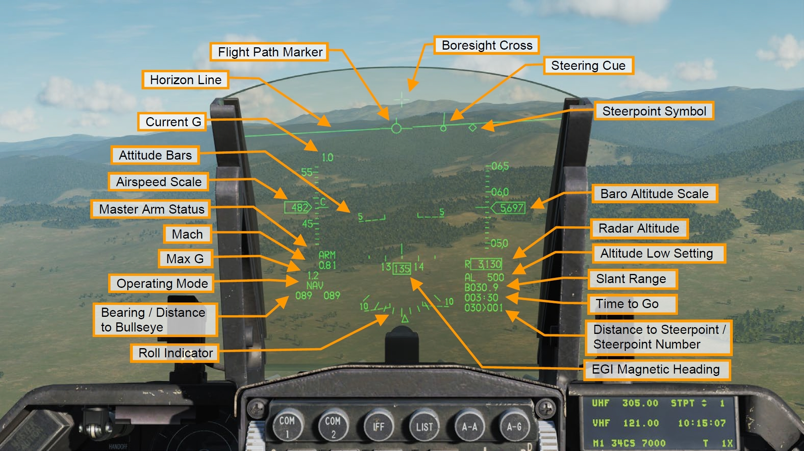
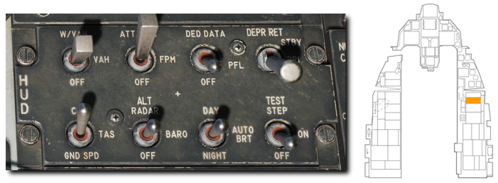

# HUD

ヘッドアップディスプレイ (HUD) は、兵装やセンサーの情報や航空機の飛行姿勢などの様々な情報を投影する最も重要な計器のひとつです。
このガイドの後半では、それぞれの兵器やセンサー固有の HUD 表示について紹介しますが、HUD にはどの状態であっても常に表示される共通の情報があります。

- Flight Path Marker (フライトパスマーカー)
- Horizon Line (水平線)
- Current G (現在の G)
- Attitude Bars (姿勢表示バー)
- Airspeed Scale (対気速度計)
- Master Arm Status (マスターアームの状態)
- Mach (マッハ速度)
- Max G (最大 G)
- Operating Mode (動作モード)
- Bearing/Distance to Bullseye (ブルズアイまでの方位/距離)
- Roll Indicator (バンク計)
- Boresight Cross (ボアサイトクロス)
- Steering Cue (操舵キュー)
- Steerpoint Symbol (ステアポイントシンボル)
- Baro Altitude Scale (気圧高度計)
- Slant Range (直線距離)
- Time to Go (ステアポイントまでの所要時間)
- Distance to Steerpoint/Steerpoint Number (ステアポイントまでの距離/番号)
- EGI Magnetic Heading (EGI の磁気方位)

すべての情報は、目線レベルの視野角に取り付けられた複合ガラスに投影されます。
シンボルの焦点は、航空機の飛行経路に沿った外の視界の無限遠に合わせられます。
右コンソールの HUD 制御パネルから HUD の設定ができます。

加えて、HUD 制御パネルは投影するシンボルを設定できます。
HUD データは、選択中のマスターモードおよびサブモードの関数として表示されます。
HUD の表示表面の視野角は、幅 30°、高さ 20° です。

## HUD Remote Control Panel: HUD 制御パネル

名前の示す通り、HUD に投影する情報を制御できます。
パネルには8個のスイッチがあります。

- **Scale Switch (目盛りスイッチ)**: **VV/VAH** であれば、昇降計、速度計、高度計、方位計が表示されます。 **VAH** にすると、昇降計以外のすべての目盛りが表示されます。**OFF** にすると数字表記以外のすべての目盛りが非表示になります。
- **Flightpath Marker Switch (フライトパスマーカースイッチ)**: **ATT/FPM** にすると、フライトパスマーカーと姿勢表示バーの両方が表示されます。**FPM** にするとフライトパスマーカーのみが表示され、**OFF** にすると両方が非表示になります。
- **DED Data Switch (DED データスイッチ)**: DED か PFLD のデータを HUD 上にも投影します。**OFF** にすると表示されません。
- **Depressible Reticle Switch (降下レティクルスイッチ)**: プライマリおよびセカンダリにすることで HUD に降下レティクルを表示させます。**STBY** にすると HUD のすべてのシンボルが非表示となり、予備レティクルのみが表示されます。**PRI** にすると HUD の表示はそのままに、プライマリレティクルが表示されます。**OFF** にすると、どちらも表示されません。
- **Velocity Switch (速度計スイッチ)**: 表示される速度を、**CAS** (較正対気速度)、**TAS** (真対気速度)、**GND SPD** (対地速度) から選択できます。HUD には選択中の表示速度を表すアルファベットが表示されます。
- **Altitude Switch (高度計スイッチ)**: 表示される高度を、**RDR ALT** (レーダー高度計)、**BARO** (気圧高度計)、**OFF** (自動) から選択できます。自動にした場合、対地高度 1,500 フィート以下ではレーダー高度計が、以上では気圧高度計の数値が表示されます。
- **Brightness Control Switch (輝度調節スイッチ)**: HUD の輝度を **DAY** (昼間)、**NIGHT** (夜間) のデフォルト設定か、それらを基準に自動で調節する **AUTO BRT** から選択できます。
- **Test Switch (テストスイッチ)**: **ON** にするとテストパターンを、**TEST STEP** にすると視野角/視線のに合わせた座席の高さに調節するためのハッシュマークが表示されます。

!!! missing "Not Implemented in DCS"
    レティクルスイッチ、テストスイッチは早期版では未実装？
