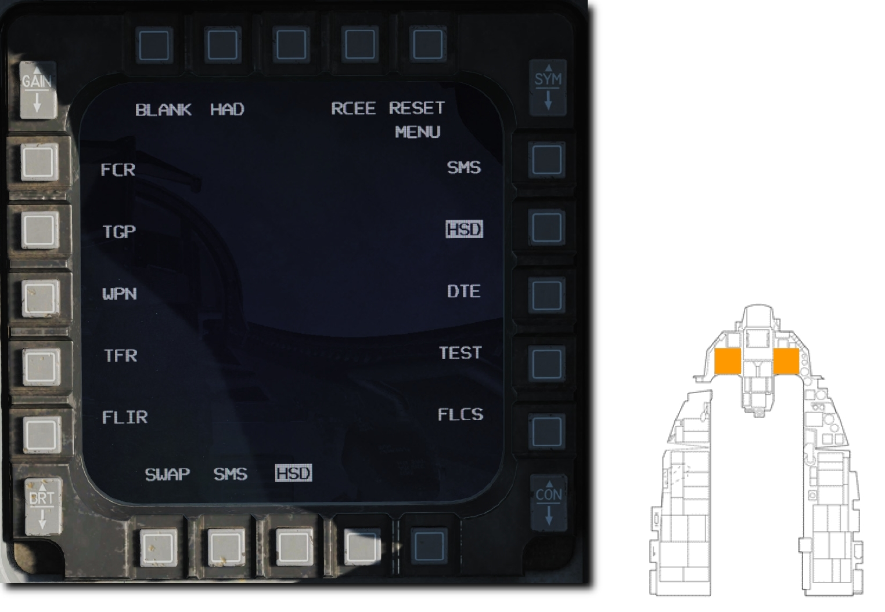
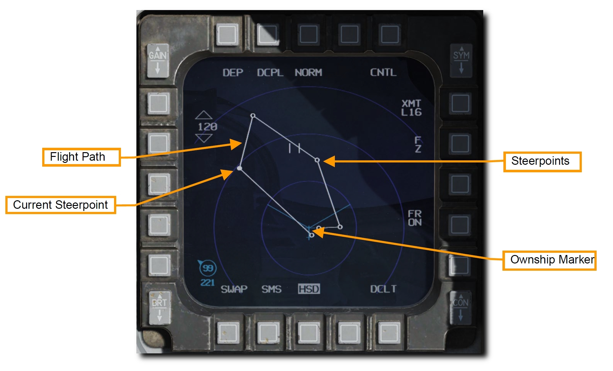
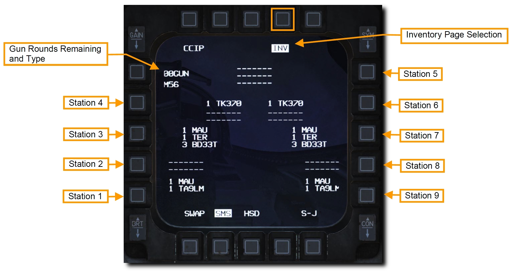
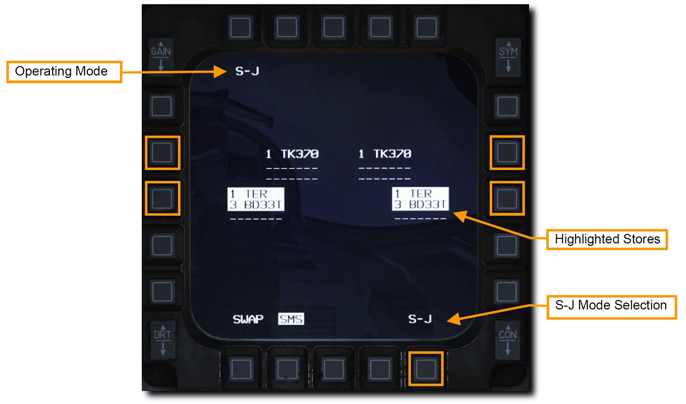

# MFD

左右2つのカラー多機能表示装置 (MFD) は、以下のシステムの映像やデータを表示します。

- Fire Control Radar (火器管制レーダー)
- Targeting Pod (照準ポッド)
- AGM-65 Weapon Video (AGM-65 シーカー画像)
- [Stores Management Set (兵装管理セット)](#stores-management-set-sms)
- [Horizontal Situation Display (水平状況表示)](#horizontal-situation-display-hsd)
- Data Transfer Equipment (データ転送装備)
- Test (テスト)
- Flight Controls (操縦系統)

システムはそれぞれの MFD スクリーンの周囲に配置された **Option Select Button** (OSB: オプション選択ボタン) によって操作されます。
それぞれの OSB を押すと、隣り合う文字の機能やサブページを切り替えられます。

## Horizontal Situation Display (HSD): 水平状況表示

HSD は、自機、現在のステアポイント、有効なフライトプラン、距離範囲円などのシンボルを含む、現在の戦術状況を水平表示します。

事前に判明した脅威の位置、搭載センサーからの情報、Link 16 データリンクを介した戦術情報も同時に表示されます。
詳細は Link 16 の項目で扱います。

## Stores Management Set (SMS): 兵装管理セット

MFD の SMS ページとそのサブページは、現在のロードアウトの状態と形態を確認できます。
選択された兵装の種類に応じた異なるオプションが利用できます。
インベントリページでは、それぞれのステーションに搭載された懸架物の表示と、それぞれの設定が行えます。
Selective Jettison (選択兵装投棄) ページでは、選択した兵装を安全に投棄できます。

兵装の通常使用に関する SMS ページの機能は以下の項で紹介します。

- 空対空機関砲 SMS ページ
- AIM-9 SMS ページ
- AIM-120 SMS ページ
- 空対地機関砲 SMS ページ
- 爆弾 SMS ページ
- ロケット SMS ページ

### Inventory Page: インベントリページ

搭載した懸架物の確認と設定の変更は **INV** に隣接する OSB を押して行えます。
このページでは、左下のステーション1から、右下のステーション9までが表示されます。
機関砲の弾種と残弾数はページの左上に表示されます。

### Selective Jettison (S-J) Page: 選択兵装投棄ページ

このページは、選択した兵装を安全に投棄できます。
投棄可能なすべての兵装を投棄してしまう緊急兵装投棄よりも柔軟に投棄が行えます。

S-J ページには MFD 右下にある **S-J** に隣接する OSB からアクセスします。
画面には投棄可能な兵装が表示され、選択できます。
それぞれの兵装の隣の OSB を押してハイライトされると投棄可能になります。

TER-9 ラックに搭載された兵装のように、1つのステーションに2つ以上の投棄可能な兵装を懸架している場合は、OSB を1回押すとラックに搭載された兵装のみが、もう一度押すと兵装とラックの両方を選択できます。

ハイライトされた兵装は、操縦桿の **WPN REL Button** を押すと投棄されます。

