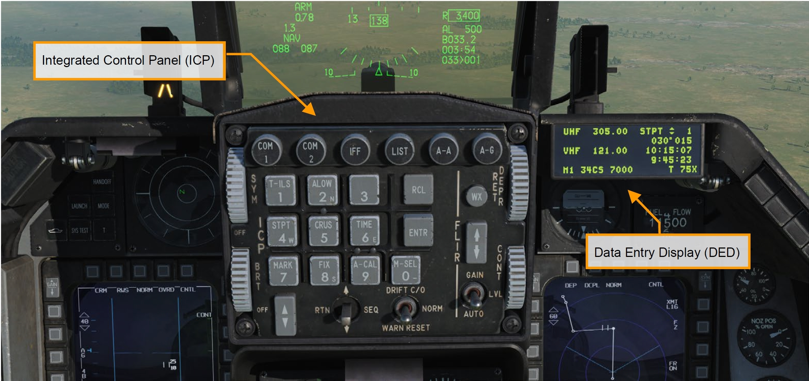
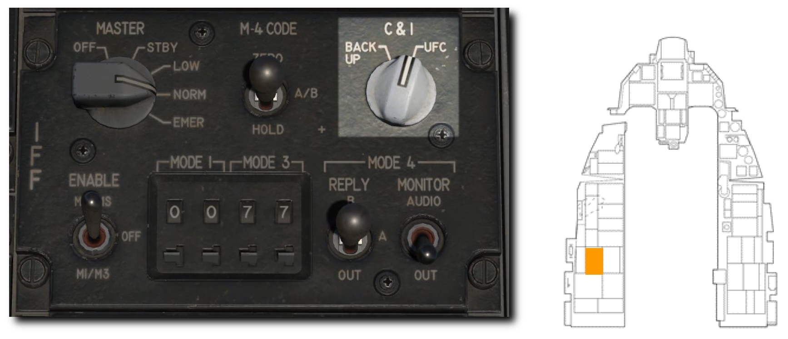
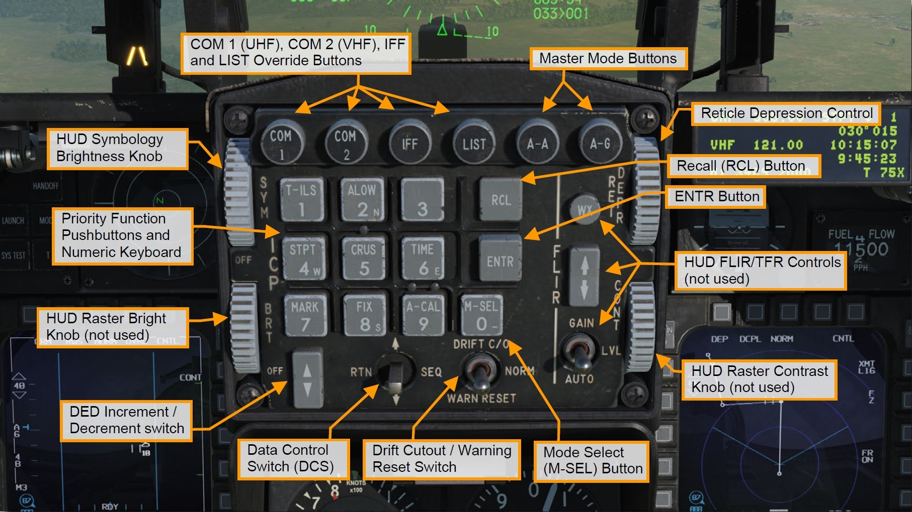
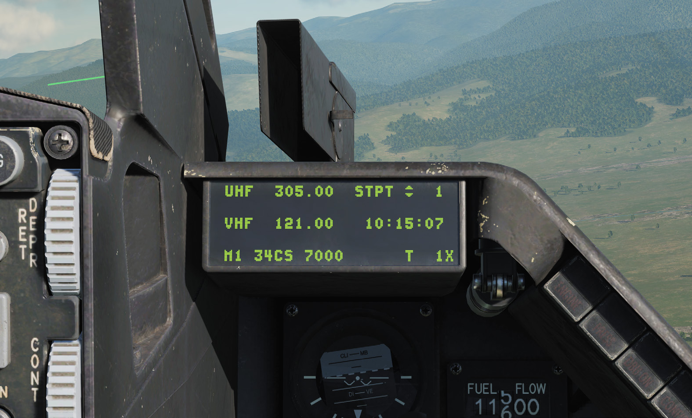
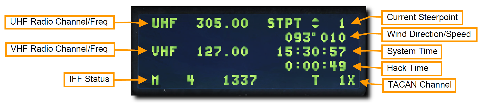

# UFC

アップフロント操作パネル (UFC) は, 統合操作パネル (ICP) とデータ入力表示装置 (DED) で構成される.
これらの装置は, 航法, 無線通信, 火器管制システムのモードとデータへの素早いアクセスを可能にする.
これらの機能のほとんどは, この ICP を操作することによって行われるが, 電源や音量調節などの頻繁には使わない機能は, コンソールパネルから操作できる.

データは ICP を通じて, DED に表示される.

UFC の通常操作は, IFF 制御パネルにある **C&I ノブ**が **UFC** 位置にあるときに行うことができる.
これにより, 航法と通信に加えて, IFF の主要機能が UFC から操作できる.
UFC が故障したときは, **BACKUP** 位置にすることでコックピットパネルから IFF と無線を代替操作できる.

## Integrated Control Panel (ICP): 統合操作パネル

ICP はマスターモードの選択, 通信機能・航法・識別 (CNI) の操作, ウェポンデリバリーに関するデータ入力, HUD の電源と画像強度の制御ができる.

- **Master Mode Buttons (マスターモードボタン)**: これらのボタンを押すと, 空対空もしくは空対地マスターモードに移行できる. たった1つのボタン操作で航空機のシステムとディスプレイ表示を選択したモードへと切り替える. 同じボタンを2度目に押したときは以前のモードに戻る.
- **Override Buttons (オーバーライドボタン)**: 4つのオーバーライドボタンで優先度の高いシステム操作へと素早くアクセスできる. 現在の DED ページに, 押したボタンに対応する DED ページを上書き表示する. 同じボタンを2度目に押したときは以前のモードに戻る.
    - **COM 1** は主要無線である UHF ページを選択する
    - **COM 2** は補助無線である VHF ページを選択する
    - **IFF** は IFF (敵味方識別) ページを選択する
    - **LIST** は対応するキーボードを押して選択する使用頻度の低いページ群を表示する
- **Priority Function Buttons (主要機能ボタン)**: 9までの数字が書かれたボタンの1つを押すと, 頻繁に使うであろう対応するページが表示される.キーボードはデータの入力や変更にも用いられる.
- **Data Control Switch (DCS: データ操作スイッチ)**: DED ページのアスタリスク表示を動かすことで, 隣接するデータ入力欄, CNI ページの風力データ切替え, 他のページから CNI ページへ復帰することができる.
- **DED Increment/Decrtement Switch (DED インクリメント/デクリメントスイッチ)**: DED ページで選択された入力欄の数値を加算もしくは減算できる. DED 表示の加算/減算できる数値には, 隣に上下矢印が表示されている. DCS を用いてこれらの数値欄を切り替えられる.
- **Mode Select (M-SEL) Button (モード選択ボタン)**: いくつかのページにおけるモードを切り替えるために使用する.
- **Enter (ENTR) Button (入力ボタン)**: キーボードで入力した数値を確定する.
- **Recall (RCL) Button (復元ボタン)**: Backspace キーのように, 1回押すごとに入力した数値の最後の文字を消去する. もう一度押すと, 元の数値を復元する.
- **Symbology Brightness (SYM) Knob (シンボル輝度ノブ)**: 回すことで HUD の電源および輝度を調節する.
- **Reticle Depression (RET DEPR) Control (レティクル降下コントロール)**: HUD に表示されるレティクルを上げ下げする. 0~260 ミリラジアンの範囲で調節できる.
- **Drift Cutout (DRFT C/O)/Warn Reset (WARN RESET) Switch (ドリフト遮断/警報停止スイッチ)**: HUD 上で点滅する警報の停止および, 横風や横滑り時の FPM (フライトパスマーカー) とピッチラインが逸脱しないように中心に移動させる.

## Data Entry Display (DED): データ入力表示装置

DED は, 通信・航法・識別 (CNI) システムのデータを数値で表示する.
ページの切替えと操作は, 上記の ICP によって行う.

### CNI ページ

CNI ページには, UHF と VHF 無線のチャンネルと周波数, ステアポイント, システム時間, IFF の状態, TACAN チャンネルが表示される.
**DCS スイッチ**を **SEQ** に倒すと, 風力データのオンオフができる.
Time ページで任務に使うハックタイムを有効にすると, システム時間の下に表示される.
CNI ページは起動時の初期ページとして表示され, **DCS** を **RTN** に倒すことでいつでもアクセスできる.

