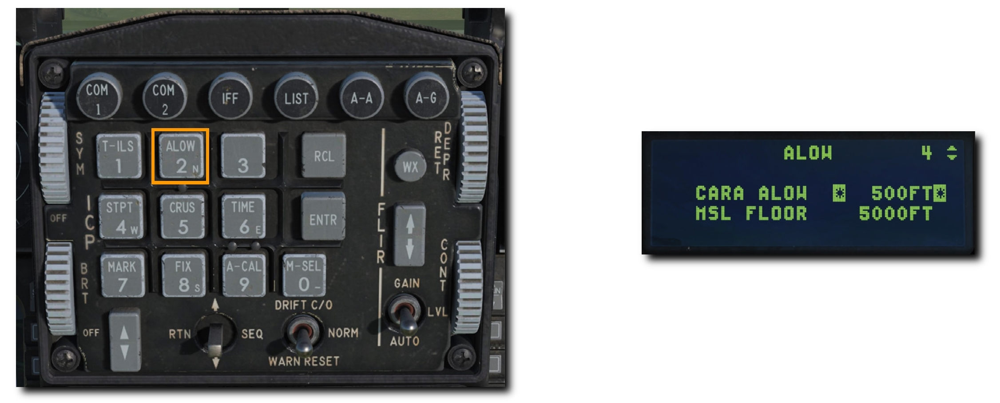
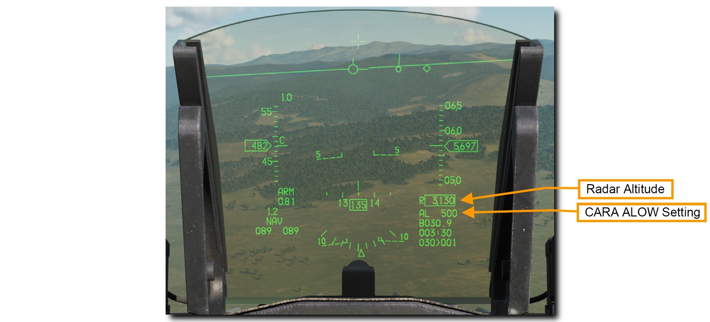
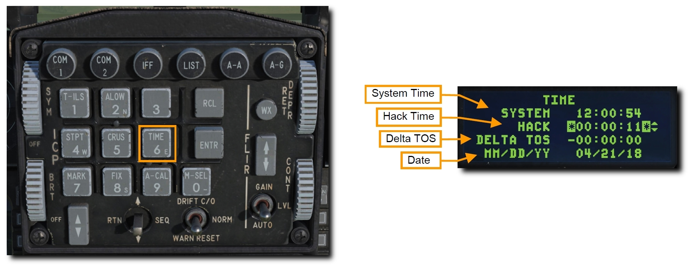

# UFC

アップフロント操作パネル (UFC) は、統合操作パネル (ICP) とデータ入力表示装置 (DED) で構成されます。
これらの装置は、航法、無線通信、火器管制システムのモードとデータへの素早いアクセスを可能にします。
これらの機能のほとんどはこの ICP を操作することによって行われますが、電源や音量調節などの頻繁には使わない機能は、コンソールパネルから操作できます。

データは ICP を通じて DED に表示されます。

UFC の通常操作は、IFF 制御パネルにある **C&I ノブ**が **UFC** 位置にあるときに行うことができます。
これにより航法と通信に加えて、IFF の主要機能が UFC から操作できます。
UFC が故障したときは、**BACKUP** 位置にすることでコックピットパネルから IFF と無線を代替操作できます。

## Integrated Control Panel (ICP): 統合操作パネル

ICP はマスターモードの選択、通信機能・航法・識別 (CNI) の操作、ウェポンデリバリーに関するデータ入力、HUD の電源と画像強度の制御ができます。

- **Master Mode Buttons (マスターモードボタン)**: これらのボタンを押すと、空対空もしくは空対地マスターモードに移行できます。たった1つのボタン操作で航空機のシステムとディスプレイ表示を選択したモードへと切り替えます。同じボタンを2度目に押したときは以前のモードに戻ります。
- **Override Buttons (オーバーライドボタン)**: 4つのオーバーライドボタンで優先度の高いシステム操作へと素早くアクセスできます。現在の DED ページに押したボタンに対応する DED ページを上書き表示します。同じボタンを2度目に押したときは以前のモードに戻ります。
    - **COM 1** は主要無線である UHF ページを選択します
    - **COM 2** は補助無線である VHF ページを選択します
    - **IFF** は IFF (敵味方識別) ページを選択します
    - **LIST** は対応するキーボードを押して選択する使用頻度の低いページ群を表示します
- **Priority Function Buttons (主要機能ボタン)**: 9までの数字が書かれたボタンの1つを押すと、頻繁に使うであろう対応するページが表示されます。キーボードはデータの入力や変更にも用いられます。
- **Data Control Switch (DCS: データ操作スイッチ)**: DED ページのアスタリスク表示を動かすことで、隣接するデータ入力欄、CNI ページの風力データ切替え、他のページから CNI ページへ復帰することができます。
- **DED Increment/Decrtement Switch (DED インクリメント/デクリメントスイッチ)**: DED ページで選択された入力欄の数値を加算もしくは減算できます。DED 表示の加算/減算できる数値には、隣に上下矢印が表示されています。DCS を用いてこれらの数値欄を切り替えられます。
- **Mode Select (M-SEL) Button (モード選択ボタン)**: いくつかのページにおけるモードを切り替えるために使用します。
- **Enter (ENTR) Button (入力ボタン)**: キーボードで入力した数値を確定します。
- **Recall (RCL) Button (復元ボタン)**: Backspace キーのように、1回押すごとに入力した数値の最後の文字を消去します。もう一度押すと、元の数値を復元します。
- **Symbology Brightness (SYM) Knob (シンボル輝度ノブ)**: 回すことで HUD の電源および輝度を調節します。
- **Reticle Depression (RET DEPR) Control (レティクル降下コントロール)**: HUD に表示されるレティクルを上げ下げします。0~260 ミリラジアンの範囲で調節できます。
- **Drift Cutout (DRFT C/O)/Warn Reset (WARN RESET) Switch (ドリフト遮断/警報停止スイッチ)**: HUD 上で点滅する警報の停止および、横風や横滑り時の FPM (フライトパスマーカー) とピッチラインが逸脱しないように中心に移動させます。

## Data Entry Display (DED): データ入力表示装置

DED は、通信・航法・識別 (CNI) システムのデータを数値で表示します。
ページの切替えと操作は、上記の ICP によって行います。

### CNI ページ

CNI ページには UHF と VHF 無線のチャンネルと周波数、ステアポイント、システム時間、IFF の状態、TACAN チャンネルが表示されます。
**DCS スイッチ**を **SEQ** に倒すと、風力データのオンオフができます。
Time ページで任務に使うハックタイムを有効にすると、システム時間の下に表示されます。
CNI ページは起動時の初期ページとして表示され、**DCS** を **RTN** に倒すことでいつでもアクセスできます。

### ALOW ページ

このページでは、音声メッセージユニット (VMU) による"ALTITUDE - ALTITUDE" という警告音声が再生される高度を設定できます。
ICP の **ALOW** Priority Function Button (主要機能ボタン) を押してアクセスします。

- **CARA ALOW**: CALA ALOW で設定した高度を下回ると、VMU によって "ALTITUDE - ALTITUDE" 警告音声が再生されます。HUD の AL の数値も同じく点滅します。この音声は**レーダー高度計**を基準にしているため、それが有効でないと機能しません。

    新たな高度を入力するには、**DCS スイッチ**を使ってアスタリスク表示を **CARA ALOW** に合わせます。
    ICP のキーパッドで新たな高度を入力し ENTR を押します。
    新しい設定は HUD でも確認できます。

- **MSL FLOOR**: MSL FLOOR で設定した高度を下回った場合も、VMU による "ALTITUDE - ALTITUDE" 警告音声が再生されます。こちらの音声は**気圧高度計**を基準にしています。

    新たな高度を入力するには、**DCS スイッチ**を使ってアスタリスク表示を **MSL FLOOR** に合わせます。
    ICP のキーパッドで新たな高度を入力し ENTR を押します。

どちらの警告音声も、ランディングギア展開時には無効になります。

### TIME ページ

このページには、航空機のアビオニクスシステムで利用する現在の日付と時間が表示されます。
ICP の **Time** Priority Function Button (主要機能ボタン) を押してアクセスします。

- **System Time (システム時間)**: 航空機の航法システムで利用する時間です。システム時間は、GPS データに基づいてアビオニクスシステムに自動的に入力されるので、手動で入力する必要はありません。もし新たなシステム時間を入力したい場合は、**DCS スイッチ**を使ってアスタリスク表示をシステム時間の項に合わせます。ICP のキーパッドで新たな時間を入力し、ENTR で確定します。
- **Hack Time**: システム時間とは別の時間で、タイムハックが可能になります。例えば、ローカルタイムや事前に打合せした時間のバックアップタイムとして利用したり、低高度航法のストップウォッチとして利用できます。

    新しい時間を入力するには、**DCS スイッチ**を使ってアスタリスク表示をハックタイムの項に合わせます。
    ICP のキーパッドで時間を入力し、ENTR で確定します。
    ハックタイムは CNI ページにも表示されます。

    インクリメントスイッチを押すとタイマーが開始され、もう一度押すと止まります。
    デクリメントスイッチを押すと、タイマーが 0 に戻ります。

- **Delta Time on Station (TOS)**: これにより、すべてのステアポイントの **Time on Station (到着予想時刻)** を更新することができます。例えば、ストライクパッケージ内の全航空機の目標到達時刻を変更するのに便利です。TOS は、DED の DELTA TOS の項目から更新できます。入力される時間は、すべてのステアポイントの TOS 時間に加算もしくは減算されます。入力可能な数値は -23:59:59 から 23:59:59 の間です。
- **Date**: MM/DD/YY フォーマットで新しい日付を入力できます。
