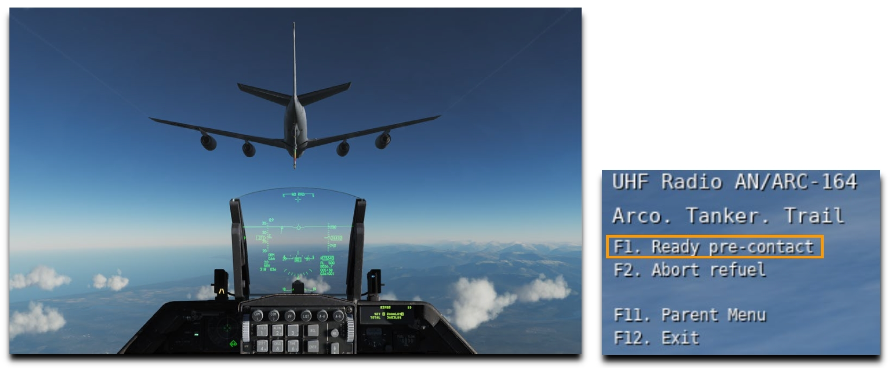
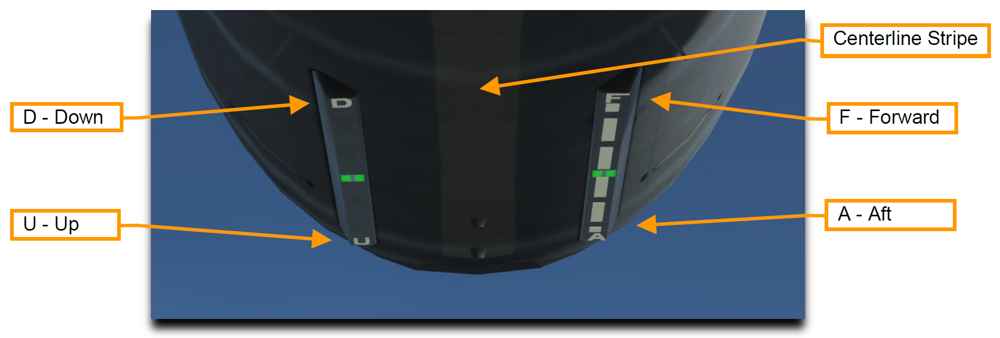

# 空中給油

目的地へ辿り着き安全に基地へ帰還するために、ミッションによっては空中給油による燃料補給が必要になるかもしれません。
そこまでの燃料が不要であっても、作戦地域において低高度、高速離脱、アフターバーナーの使用などの選択肢がとれるように燃料を補充することが望ましいです。

空中給油機の位置はミッションブリーフィングかミッションプランナー画面で確認できます。
空中給油機は合流地点を示すための TACAN を装備しています。
位置が分からない場合は、最寄りの空中給油機までの方向を AWACS に問い合わせることができます。

空中給油機に接近する前に、無線メニューから給油要請を通知します。

給油機は現在の高度と速度を返答し、あなたのプリコンタクト (給油を準備する) 位置への進入を許可します。
そのまま TACAN かレーダーを用いて合流地点まで飛行を続けてください。

空中給油機へのアプローチを開始する前に、以下の手順で航空機を安全な状態にしてください。

### 1. MASTER ARM スイッチを OFF に

### 2. LASER ARM スイッチを OFF に

### 3. 電波放出を OFF/STBY に

ECM、レーダー、レーダー高度計から発せられる電波は空中給油機とその乗員を危険に晒します。
合流するためにそれらを使わなくてはならない場合でも、プリコンタクト位置へ接近する前にはオフにしておきます。

**RF スイッチ** でこれらのシステムを制御できます。
**SILENT** にすると、レーダー、レーダー高度計、データリンク、TACAN、ECM を含む航空機から発信されるすべての電波放出を無効にします。
**QUIET** にすると、レーダー、TACAN、データリンクは送信されますが、それ以外の電波放出を無効にします。

以下の手順で、航空機を空中給油を受けるための状態にします。

### 4. AIR REFUEL スイッチを OPEN に

外部燃料タンクを装備している場合は、減圧して給油を可能にするために、給油の 3~5 分前には行ってください。

操縦系統は航空機の操縦性を確保するために、離着陸設定と同様になります。

 

### 5. AR 指示器の RDY 点灯を確認

      

### 6. HOT MIC/CIPHER スイッチを HOT MIC に

空中給油機のブームオペレーターと直接通信を可能にします。

    

### 7. 機外照明を適切に設定

夜間であれば、位置灯を DIM か STEADY に、衝突防止灯を OFF にします。

    

### 8. DED BINGO ページを注視

ICP の LIST ページを開き、2 を押して DED に BINGO ページを表示させます。
航空機に搭載されている燃料の合計値が表示されます。
これにより、燃料計を頭を下げて見ることなく、給油状況が確認できます。

プリコンタクト位置である給油機のブームの後方についたら、給油準備が完了したことを伝えます。

ブームオペレーターがコンタクト位置への進入を許可します。
操縦桿をスムーズかつ繊細に入力し、スロットルをほんの少しだけ上げます。
機体が動き始める出力になるまでしばらく待ちます。

ブームがキャノピーのすぐ左もしくは右、かつ頭上から 2~3 フィート離れた位置に移動します。
これは、給油機に対して適切な高さにいるか確認する最初の手順です。
ゆっくりと前進を続け、給油機の下部に描かれた黄色い縦線に機体を合わせます。

航空機のキャノピー後部に取り付けられた給油口にオペレーターがブームを差せるように給油機との間隔を維持します。
給油機の下部にある指示灯はブームとの接続を維持できる制限範囲を示しています。

このライトは現在の位置ではなく、受油側の進行方向を表す指示灯です。
つまり、D, U, F, A の方向へ進めという意味です。
ライトが D に向かって点灯する場合は機体を降下させ、U に向かって点灯する場合は機体を上昇させます。
A に向かって点灯するならば機体を後退させ、F に向かって点灯すれば機体を前進させます。

接続が確立されたらオペレーターが "Contact" に続いて "You are taking fuel" と知らせます。
HUD の隣にある AR/NWS 指示器が点灯します。
DED の BINGO ページか燃料計を注視します。

特に最初の何回かのうちは、途中で意図せずに接続が解除されてしまうでしょう。
もしそうなった場合は、プリコンタクト位置まで戻ってもう一度やり直します。

給油が完了したら以下のことを行います。

### 1. 操縦桿の A/R DISC ボタンを押す

ブームのラッチを解除します。
HUD 横の DISC ライトが点灯するのを確認します。

    

### 2. AIR REFUEL スイッチを CLOSE に

      

### 3. AR 指示灯のすべての消灯を確認

オペレーターとの通信も切断されます。

    

### 4. 燃料計を確認

給油後の送油と燃料バランスを確認します。

    

### 5. 電波放出を任意に調節

給油前に **RF スイッチ**で停止した電波放出を元に戻します。

    

### 6. MASTER ARM スイッチを任意に調節

### 7. LASER ARM スイッチを任意に調節

### 8. 機外照明を適切に設定

       
