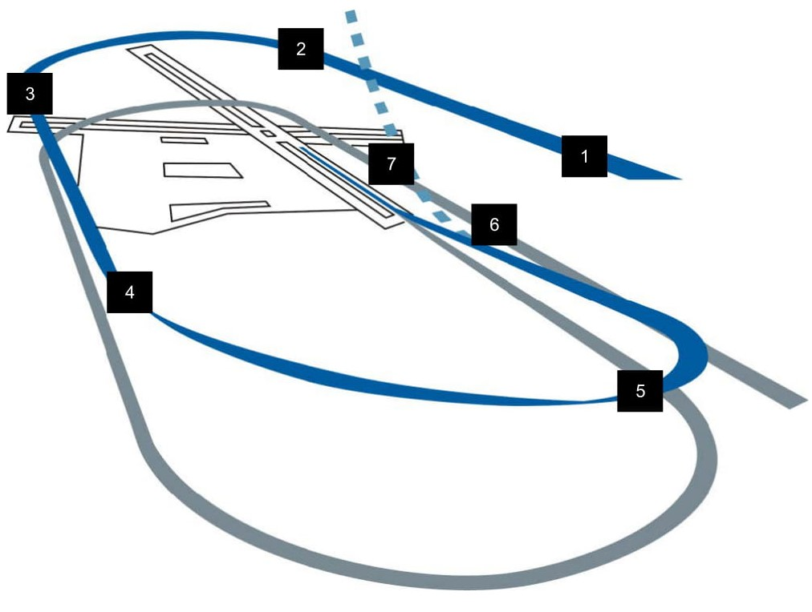

# 基本操縦

<!-- markdownlint-disable MD033 -->

- [Before Takeoff: 離陸前点検](#before-takeoff)
- [Takeoff: 離陸](#takeoff)
- [Crosswind Takeoff: 横風離陸](#crosswind-takeoff)
- [Normal Flight: 通常飛行](#normal-flight)
- [Descent/Before Landing: 着陸前降下](#descentbefore-landing)
- [Landing: 着陸](#landing)
- [Crosswind Landing: 横風離陸](#crosswind-landing)
- [After Landing: 着陸後](#after-landing)

## Before Takeoff: 離陸前点検

滑走路に進入する前に最後のチェックをしなければなりません。
空港によっては、誘導路のトラフィックを妨げないために一時的に駐機するアーム/デアームエリアがあります。
無い場合は誘導路でチェックを行うことになるでしょう。

### **1. PROBE HEAT スイッチを PROBE HEAT に**

もし凍結の恐れがあるならば、少なくとも離陸の2分前には行うべきです。
着氷する環境でなければ、離陸の直前に行うことでプローブの過熱損傷を防止します。

  

### 2. ALT FLAPS スイッチが NORM であるのを確認

      

### 3. トリムの確認

ピッチ/ヨートリムを中央位置にします。
ロールトリムは左右の懸架物に応じて設定します。

これが最後のトリムの確認です。
間違った設定になっていないか確認します。

 

### 4. ENG CONT スイッチが PRI であるのを確認

スイッチが PRI でガードされていることを確認します。

    

### **5. キャノピーが正常に閉じているのを確認**

正常にロックされ、CANOPY 警報灯が点いていないことを確認します。

    

### **6. STORES CONFIG スイッチを適切に設定**

通常は以下のように設定します。

- CAT I: 外部燃料タンク無しの空対空兵装
- CAT III: 空対地兵装もしくは外部燃料タンクを主翼に装備したロードアウト

 

### 7. スピードブレーキの格納を確認

      

### 8. IFF を設定して確認

      

### 9. 外部燃料タンクからの送油を確認

外部燃料タンクから先に消費されるため、エンジン始動時より残量が減っているはずです。
内部燃料タンクの燃料は満載であるべきです。

燃料タンクを3本装備している場合は、胴体下のセンターラインタンクから消費されます。
この手順であるべての燃料タンクが加圧され、正常に供給できるのを確認します。

### **10. FUEL QTY SEL ノブを NORM**

FUEL QTY SEL ノブを NORM にすることで、自動前方燃料送油システム、トラップドフューエル警報、BINGO 燃料警報が正常に作動するようになります。

  

### 11. 操縦桿とペダルを動かす

### 12. 油圧計の圧力を確認

通常は 15~65 PSI を指しているはずです。

    

### **13. すべての警報灯と警告灯を確認**

警報と警告が何も表示されていないことを確認します。(SEAT NOT ARMED を除く)

   

### 14. (装備していれば) TGP のカメラを格納する

MFD の TGP コントロールページの STBY を押して、TGP のカメラを内側に向けます。

物との接触による損傷を防ぐために、離陸と着陸前に行います。

 

### **15. 射出座席レバーを Arm する**

ハンドルを下げることで、射出ハンドルを引いたときに射出座席が機能するようになります。
地上で誤って射出してしまわないよう最後に行います。

  

## Takeoff: 離陸

滑走路に正対してラインアップしたら、あなたは最終滑走点検を行うことになります。

### 1. ペダルブレーキを踏み続ける

### 2. パーキングブレーキの無効を確認

      

### 3. スロットルを RPM 90 % まで上げる

通常は以下のような動作になります。

- **HYD/OIL PRESS** 警報灯 消灯
- 油圧 **25~65 PSI** (RPM に従って増加します)
- **FTIT 935 ℃** 以下
- **HYD PRESS A & B** (油圧計) **2,850~3,250 PSI**

### 4. ペダルブレーキを離す

### 5. スロットルを適切な位置まで前進

滑走し始めて 5~15 秒以内に RPM と FTIT が安定するはずです。
規定範囲内の加速とエンジン数値になっていることを確認します。

    

### 6. 70 ノットに達したら NWS を無効化

操縦桿をやさしく引いて、離陸姿勢 (ピッチ角 8~12°) をとります。
機首を上げるのは、ミリタリー推力の場合であれば離陸速度より約 10 ノット遅い速度、アフターバーナーであれば約 15 ノット遅い速度に達したときです。

  

| 機体重量 (ポンド)   | 20,000 | 24,000 | 28,000 | 32,000 | 36,000 | 40,000 | 44,000 |
| ------------------- | ------ | ------ | ------ | ------ | ------ | ------ | ------ |
| 離陸速度 (対気速度) | 128    | 142    | 156    | 168    | 178    | 188    | 198    |

離陸は操縦桿に弱い圧力をかけて行います。
操縦桿を引くのが早すぎると、離陸に必要な速度が得られていないために操縦不能を引き起こしたり、離陸に必要な滑走距離が伸びたりする可能性があります。

正の上昇率を確立できたらランディングギアを上げます。
ギアと同時に後縁フラップが収納されますが、揚力が失われると滑走路に接触して擦ってしまうかもしれません。

速度が 300 ノットに達する前にはランディングギアを格納するべきです。
速度が速すぎると配線や他のコンポーネントが外れたり、ランディングギアのドアに構造的な損傷を引き起こしてしまう可能性があります。

## Crosswind Takeoff: 横風離陸

横風のある離陸では、航空機が風向きに向いてしまい風上側の主翼を持ち上げてしまいます。
この対策として、操縦桿を少しだけ風の方向に倒して両翼を同じ角度に保ちます。
また、滑走路の中心を真っ直ぐ滑走するためにラダーを少し入れます。

引き起こしの最中は、風に対して適切なクラブ角を取るようにラダーを滑らかに動かします。
離陸の際に適切なクラブ角であれば、フライトパスマーカー (FPM) が滑走路に真っ直ぐ落ちていくはずです。

## Normal Flight: 通常飛行

一度離陸すれば、飛行中の特別な手順はありません。
自身の航空機システムと基本操縦に関する理解を信じ、ミッションを何事もなく達成できるように機体を操縦します。

### 飛行中のチェック

航空機のシステム、エンジン計器、コックピット与圧、酸素流量計、その他のシステムを頻繁に確認します。
FUEL QTY SEL ノブを回して外部と内部のそれぞれの燃料タンクが適切に送油しているかを確認し、燃料計の2つのポインターの合計とトータライザーの数値が一致していること、燃料分配が正しく行われているのかを確認します。

### 航空機のトリム

F-16 のフライトコントロールシステムは非常に優秀ですが、状況によっては手動でトリムを取る必要もあります。
トリムが有効でないと航空機が勝手にピッチ、ロール、ヨー方向に動いていきます。(ロールが最も一般的です)

操縦桿のトリムボタンは、操縦桿を新たな中央位置に固定するために使います。
例えば、航空機が上昇するならトリムを機首下げ方向に入力して真っ直ぐ飛行するようにします。
これにより、水平飛行を維持するために操縦桿を倒し続ける必要が無くなります。

トリムが必要になる最も一般的な状況は、兵装を消費して左右の懸架物が非対称になったときです。
例えば主翼左側の爆弾のみを投下し右側には残っている場合、重たい側の主翼が沈んで右ロールを引き起こします。
このような場合に左トリムを入れることで、操縦桿を倒すことなく水平を保てるようになります。

 

## Descent/Before Landing: 着陸前降下

あなたは着陸に備えて航空機の点検を行います。

### 1. 燃料量/燃料流量/バランスの確認

      

### 2. 着陸灯の点灯

      

### 3. 高度計の確認と調節

高度計と HUD の高度表示の数値が一致していることを確認します。

高度計の ELEC と PNEU モードのそれぞれの数値の差が±75 フィート以内かつ、既知の高度との誤差が ±75 フィート以内であることを確認します。

 

### 4. 機体姿勢の確認

ADI、HUD、SAI が同期していることを確認します。

     

### 5. ANTI ICE スイッチを適切に

      

### 6. TGP カメラを格納

MFD の TGP コントロールページの **STBY** を押して、TGP のカメラを内側に向けます。

物との接触による損傷を防ぐために、離陸と着陸前に行います。

 

## Landing: 着陸

ソーティー終了後のあなたを待ち受けているのは最難関技能のひとつ...着陸です。

1. **イニシャルアプローチ**: 対地高度 (AGL) **1,500 フィート**、対気速度 (KCAS) **300 ノット**で着陸滑走路に対して正対します。
2. **オーバーヘッドブレイク**: スロットル **80 % RPM**でスピードブレーキを開き、接地予定地点の真上で左右どちらかに旋回します。 バンク角約 **70°** で**3~4 G** 旋回を行います。HUD の水平線にフライトパスマーカー (FPM) を合わせて水平旋回を維持します。
3. **ダウンウィンドレグ**: 着陸滑走路方位と反対方向にあるダウンウィンドに対して、対気速度 **200~220 ノット**、対地高度 **1,500 フィート**で到達するようにロールアウトします。ランディングギアを展開して緑色のランディングギアダウンライトが3つとも点灯していることを確認します。ベースターンでの対気速度が過剰にならないように減速しながら、**AoA 11°** を維持するようにトリムを入れます。
4. **ベースターン**: 旋回終了地点をアビームしたらベースターンを開始します。コックピットから見て、航空機の翼端が滑走路端に重なる位置が旋回を開始する地点です。AoA 11° を維持しながら **8~10°** の機首下げ角で旋回します。
5. **ファイナルターン**: スロットルで対気速度を、操縦桿で 8~10° の下げ角にしながら AoA 11° を維持したまま旋回します。最終進路で旋回を完了したら、適切なグライドパスを維持するために機首を上げます。目標とするロールアウト位置は、接地地点から**1マイル**、対地高度 **300 フィート**の地点です。AoA 11° のまま、FPM を滑走路末端に合わせてピッチ角 **2.5°** で適切なグライドパスを維持します。
6. **ショートファイナル**: 滑走路のプライマリサーフェスが始まる手前であるオーバーランエリアを越えたら、FPM を 300~500 m 前方に移動させます。降下率を抑えるために操縦桿を軽く引いて、水平飛行にならない程度にフレアをします。スロットルをアイドル位置まで引き、最大 **AoA 13°** でタッチダウンします。AoA 15° 以上で着陸するとスピードブレーキやエンジンノズルを滑走路に擦る可能性があるため、過剰な操作をしないように操縦桿は軽く引きます。
7. **ロールアウト**: 対気速度が約 **100 ノット**に減速するまではスピードブレーキを全開にして、最大 13° の機首上げ姿勢を維持します。減速したら操縦桿を戻して前輪を接地させます。ブレーキ効果を最大にするために、スピードブレーキは全開で操縦桿はいっぱいに引きます。

    航空機を減速させるために中くらいから強めにペダルブレーキを掛けます。

    滑走路からの逸脱を防ぐ早めの使用を除き、**30 ノット**以下まで減速したら **NWS** (前輪操作) を有効にします。

## Crosswind Landing: 横風着陸

横風が吹くなかでの着陸では、タッチダウン中にクラブ角をとれるように左右の主翼を水平に保たなければなりません。

接地の瞬間、滑走路に正対するようラダーを使います。
接地後、航空機は風向きに沿って機首を曲げようとするため、ラダーか反対方向のブレーキを入れて動きを補完しなければなりません。
主翼を水平に維持するために、風向きに対して操縦桿を少しだけ入力する必要もあるでしょう。

上記のように着陸手順を行うが、80 ノット以下か航空機の操作ができるようになるまではスピードブレーキを開いておきます。

NWS が有効なときに強くラダーペダルを踏むと、急激なヨーを引き起こすかもしれません。
可能であれば NWS を有効にする前にラダーは中央位置に戻しておきます。

## After Landing: 着陸後

航空機が安全に地上に戻ってきたら、次はシャットダウンのためにシステムの電源を切っていきます。
これらの作業は、滑走路を出て誘導路の滑走中に行うこともあります。
場合によってはアーム/デアームエリアで行うこともあります。

### 1. PROBE HEAT スイッチを OFF

気流による冷却が無い状態でプローブヒートを続けると装置が故障する場合があります。

   

### 2. ECM の電源を OFF

      

### 3. スピードブレーキを閉じる

      

### 4. 射出座席の安全レバーを上げる

意図しない射出を防ぐために着陸後は射出座席の安全装置を掛けます。
地上で非常事態が発生したときは、そのまま地上に降りる方が望ましいです。

  

### 5. IFF MASTER ノブを STBY に

      

### 6. 着陸/滑走灯を任意に

      

### 7. 兵装関連のスイッチを切る

**MASTER ARM** スイッチと **LASER ARM** スイッチを OFF にします。
地上クルーが航空機に近づいてくる前に行うべきです。

    

### 8. アビオニクスの電源を切る

データの記録や INS のアラインを保存したい場合は、駐機位置で停止した後に行います。

    
