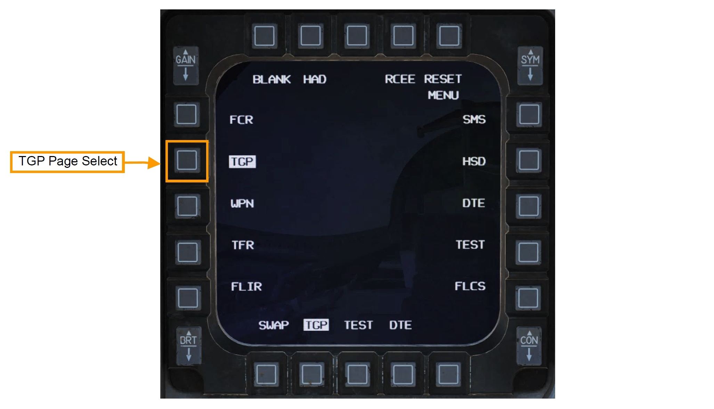
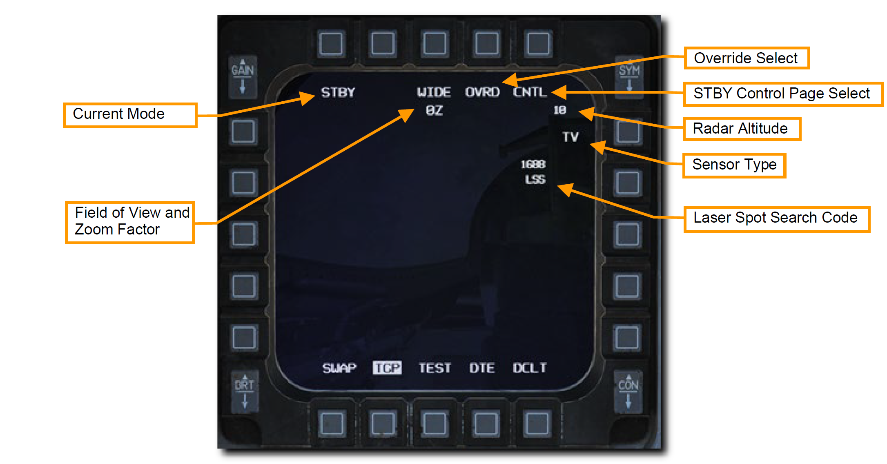
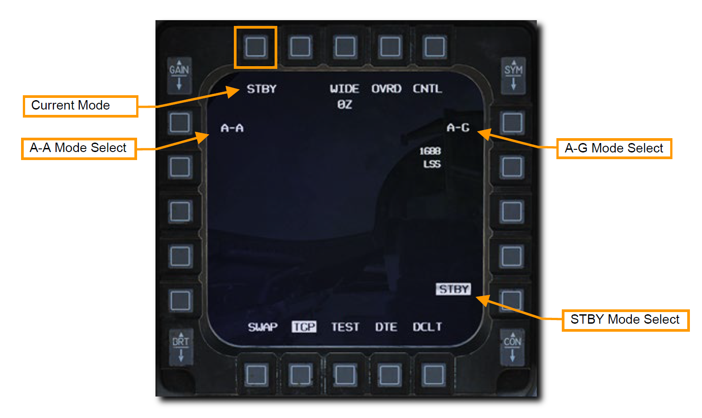
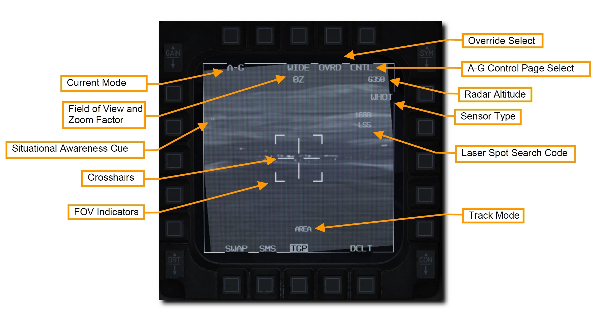
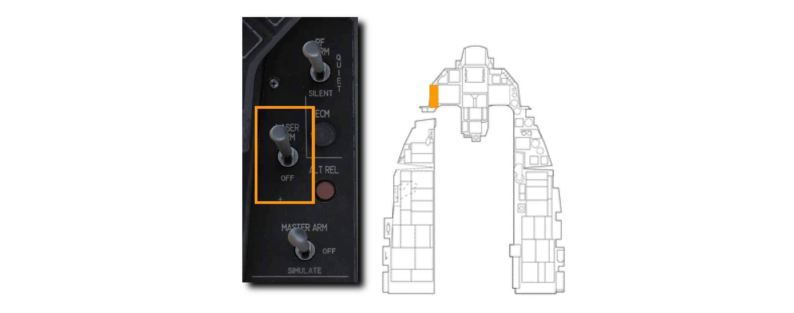
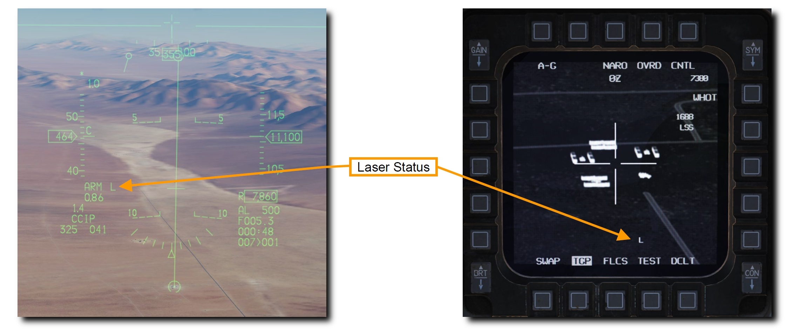
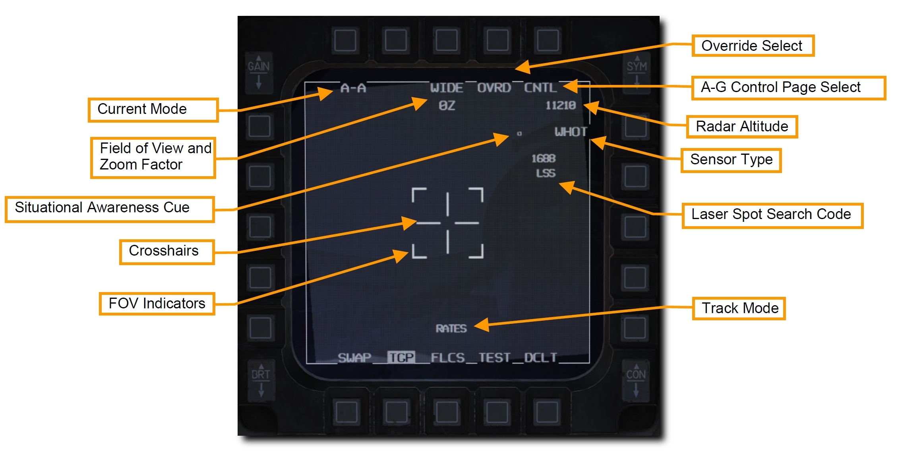
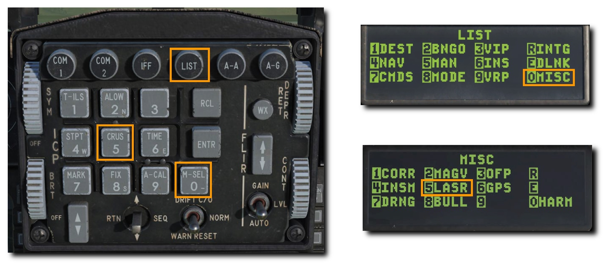
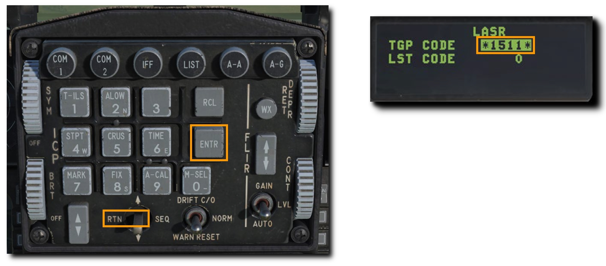

# AN/AAQ-28 LITENING POD

照準ポッドは監視、追跡、目標指示などの機能を昼夜を問わず実現します。
テレビによく似た CCD 映像と、前方監視赤外線 (FLIR) の2つの映像モードおよび、それぞれに Black Hot と White Hot サブモードがあります。

TGP の主要機能とサブモードは以下の通りです。

- [Stanby (STBY) Mode: スタンバイモード](#standby-stby-mode)
- [Air-to-Ground (A-G) Mode: 空対地モード](#air-to-ground-a-g-mode)
    - Slave (Ground)
    - AREA Track
    - POINT Track
    - INR Track
    - Laser Spot Search (LSS)
- [Air-to-Air (A-A) Mode: 空対空モード](#air-to-air-a-a-mode)
    - Slave (Body)
    - POINT Track
    - RATE Track
- HUD Mode

各モードには、TGP の設定を行うコントロールページもあります。

照射するレーザーコードの変更は [LASR DED Page: DED レーザーページ](#lasr-ded-page-ded) から行います。

## TGP の起動

TGP のすべての機能をつかうにはアビオニクス電源パネルの以下のスイッチをオンにしなければなりません。

- MMC スイッチ: MMC
- ST STA スイッチ: ST STA
- MFD スイッチ: MFD
- UFC スイッチ: UFC
- EGI/INS ノブ: NORM

TGP の電源はセンサー制御パネルから行います。

- RIGHT HDPT スイッチ: RIGHT HDPT

TGP ページを開くには、MFD メニューの TGP を押します。

TGP の起動が開始されると、上部の "NOT TIMED OUT" の文字とともにスタンバイページが表示されます。
TGP の自動で開始される自己診断テストと FLIR センサーの冷却には時間を要します。

"FLIR HOT" メッセージは "NOT TIMED OUT" として、白文字とその半分の高さの黒背景に表示されます。
メッセージは3分後に消え、映像とともにスタンバイモードページが選択されます。

## Standby (STBY) Mode: スタンバイモード

このモードは TGP を起動すると最初に選択されます。
"NOT TIMED OUT" メッセージは表示されてから3分後に消え、STBY CNTL ページか他の2つのモードのいずれかを選択することでスタンバイモードを終了できます。

表示されている OSB の機能は以下の通りです。

- **Current Mode (現在のモード)**: 現在選択中の TGP のモードです。
- **Field of View (視野角)**: OSB を押すことで Narrow Field of View (NFOV: 狭域視野角) と Wide Field of View (WFOV: 広域視野角) を切り替えます。TGP の CCD と FLIR センサーそれぞれの視野角の範囲は異なります。
    - FLIR の視野角
        - WFOV: 4° x 4°
        - NFOV: 1° x 1°
    - CCD の視野角
        - WFOV: 3.5° x 3.5°
        - NFOV: 1° x 1°
- **Zoom Factor (拡大率)**: FOV 設定に加えて、スロットルの MAN RNG コントロールを使って拡大率を調節できます。範囲は 0Z (拡大なし) から 9Z (最大拡大率) の間です。選択中の FOV における 0Z と 9Z では物体は2倍に拡大されて見えます。
- **OVRD Select (オーバーライドセレクト)**: OVRD OSB を押すとスタンバイモードを現在のモードに上書き表示させます。もう一度押すと元のモードに戻ります。
- **STBY Control Page Select (スタンバイコントロールページセレクト)**: OSB を押すとスタンバイコントロールページに移行します。詳細な機能については後述します。
- **Radar Altitude (レーダー高度計)**: 現在のレーダー高度が表示されます。
- **Sensor Type (センサーの種類)**: 現在の TGP の映像モードを右角に表示しています。選択できる種類は以下の3つです。
    - **WHOT**: 他より高い温度域を明色で示す FLIR (赤外線) カメラ映像です。
    - **BHOT**: 他より高い温度域を暗色で示す FLIR (赤外線) カメラ映像です。
    - **TV**: CCD カメラが捉えた映像です。これは昼間で用いる光学カメラです。
- **Laser Spot Search Code (レーザー探知コード)**: Laser Spot Search (LSS: レーザー探知) モードのときに TGP が捜索するレーザーの繰り返し周波数 (PRF) です。

!!! missing "Not Implemented in DCS"
    STBY CTRL ページは早期版では未実装

### Mode Selecion: モード選択

STBY に隣接する OSB 1 を押すとモードを変更できます。
マスターモードに応じて以下のモードが選択されます。

- **STBY Mode Select (スタンバイモード)**: スタンバイモードを選択します。
- **A-G Mode Select (空対地モード)**: 空対空モードを選択します。
- **A-A Mode Select (空対空モード)**: 空対空モードを選択します。

## Air-to-Ground (A-G) Mode: 空対地モード

空対地モードが選択されると、TGP は自機の前方より 150 ミル下方を指向します。
表示されている機能は以下の通りです。

- **Current Mode (現在のモード)**: 現在選択中の TGP のモードです。
- **Field of View (視野角)**: OSB を押すことで Narrow Field of View (NFOV: 狭域視野角) と Wide Field of View (WFOV: 広域視野角) を切り替えます。TGP の CCD と FLIR センサーそれぞれの視野角の範囲は異なります。
    - FLIR の視野角
        - WFOV: 4° x 4°
        - NFOV: 1° x 1°
    - CCD の視野角
        - WFOV: 3.5° x 3.5°
        - NFOV: 1° x 1°
- **Zoom Factor (拡大率)**: FOV 設定に加えて、スロットルの MAN RNG コントロールを使って拡大率を調節できます。範囲は **0Z** (拡大なし) から **9Z** (最大拡大率) の間です。選択中の FOV における 0Z と 9Z では物体は2倍に拡大されて見えます。
- **Crosshairs (クロスヘア)**: 目標指示とレーザー照射に用いる照準線です。
- **FOV Indicators (FOV インジケーター)**: WIDE FOV のとき、NARO FOV にしたときに拡大される範囲が4つの括弧として表示されます。
- **OVRD Select (オーバーライドセレクト)**: OVRD OSB を押すとスタンバイモードを現在のモードに上書き表示させます。もう一度押すと元のモードに戻ります。
- **A-G Control Page Select (空対地コントロールページセレクト)**: OSB を押すと空対地コントロールページに移行します。
- - **Radar Altitude (レーダー高度計)**: 現在のレーダー高度が表示されます。
- **Sensor Type (センサーの種類)**: 現在の TGP の映像モードを右角に表示しています。選択できる種類は以下の3つです。
    - **WHOT**: 他より高い温度域を明色で示す FLIR (赤外線) カメラ映像です。
    - **BHOT**: 他より高い温度域を暗色で示す FLIR (赤外線) カメラ映像です。
    - **TV**: CCD カメラが捉えた映像です。これは昼間で用いる光学カメラです。
- **Laser Spot Search Code (レーザー探知コード)**: Laser Spot Search (LSS: レーザー探知) モードのときに TGP が捜索するレーザーの繰り返し周波数 (PRF) です。
- **Track Mode (追跡モード)**: TGP が追跡モードで稼働しているとき、以下のような選択中のモードを示します。
    - **AREA (エリア)**: TGP は特定のオブジェクトではなく空間的な景色に対して固定されます。カメラが自機と被って AREA トラックが維持できない場合 TGP は INR モードに移行し、被らない位置に移動すれば再度 AREA トラックに戻ります。
    - **POINT (ポイント)**: 操縦桿の TMS 上を押すことで、TGP は特定のオブジェクトか標的に対して固定されます。移動標的に対しても追跡を継続できます。POINT トラックモードのとき、追跡しているオブジェクトが四角で囲まれます。オブジェクトをバウンド (オブジェクトうまく認識できないときにカメラを少しだけ動かして認識を促すこと) する必要はなく、四角形はオブジェクトに合わせて拡大されることない固定の大きさです。カメラが自機と被って AREA トラックが維持できない場合 TGP は INR モードに移行し、被らない位置に移動すれば再度 AREA トラックに戻ります。
    - **INR (イナーシャル)**: Inertial Rate (INR: 慣性速度) モードでは、TGP は地表のリファレンスポイント (参照点) を保持し続けます。
- **Situational Awareness Cue (状況認識キュー)**: SA キューは、航空機の縦軸でもあるポッドの正面方向を基準軸とした TGP の現在の照準線を表します。キューは小さな正方形で示され、画面内を移動します。

!!! missing "Not Implemented in DCS"
    A-G CTRL ページは早期版では未実装

TGP を利用したウェポンデリバリーは空対地戦闘の項目を参照してください。

### Laser Ranging: レーザー照射

TGP の重要な機能のひとつが、レーザー照射による標的までのスラントレンジ (傾斜距離: 三平方の定理でいう斜辺) の計測です。
レーザーが照射されている間は、その反射波から目標までの精密な距離を測定できます。
火器管制コンピュータが距離情報を受け取ると目標の高度が算出され、射撃精度を大幅に向上させることができます。

これらの効果はレーザー誘導爆弾だけでなく、どの爆弾のどのデリバリーモードにも適用されます。
TGP はこの機能を実行するために、機関砲・ロケット・爆弾の CCIP デリバリーで使われるピパーや CCRP や DTOS デリバリーで使われるターゲットデジグネーター (TD) に自動的にスレーブ (追従) します。

各兵装のデリバリーモードについては空対地戦闘の項目を参照してください。

レーザーによる測定をするにはレーザーアームスイッチを ARM にします。
OFF 位置であればレーザーは照射されません。

レーザーアームスイッチが ARM のとき、レーザーの状態が HUD と TGP ページに **L** と表示されます。

レーザーは操縦桿のトリガーの1段目を引くと照射されます。
レーザー照射中は **L** が点滅します。
トリガーを離すと照射が止まります。

## Air-to-Air (A-A) Mode: 空対空モード

A-A マスターモードが選択されると、TGP はレーダーで追跡している目標を自動的に捉えます。
空中目標をレーダーで追跡していない場合は、真正面の -3° 下方に向きます。

スロットルの CURSOR スイッチで TGP のクロスヘアを動かすことができます。
スルーしているとき TGP のカメラは空間上に固定されます。
目標を追跡していないスルーモードのときは、画面上に "RATES" と表示されます。
スルー後はクロスヘアが半分の大きさに縮小します。

有効な目標が4つの括弧で囲まれた NARO FOV の範囲を通過すると、TGP がその目標を追跡しようとします。
この目標には **+** の十字が重ねて表示されます。
目標が NARO FOV の範囲外にいれば + は表示されません。

操縦桿の TMS 上を短押しするとクロスヘアの中央に目標が固定され、目標の大きさに合わせたボックスが現れます。
このモードのとき、画面には "POINT" と表示されます。
ポイントトラックモードを終了するには、INR トラックにして RATES モードに戻ります。

!!! missing "Not Implemented in DCS"
    レーダー追跡目標へのスレーブは早期版では未実装？

表示されている機能は以下の通りです。

- **Current Mode (現在のモード)**: 現在選択中の TGP のモードです。
- **Field of View (視野角)**: OSB を押すことで Narrow Field of View (NFOV: 狭域視野角) と Wide Field of View (WFOV: 広域視野角) を切り替えます。TGP の CCD と FLIR センサーそれぞれの視野角の範囲は異なります。
    - FLIR の視野角
        - WFOV: 4° x 4°
        - NFOV: 1° x 1°
    - CCD の視野角
        - WFOV: 3.5° x 3.5°
        - NFOV: 1° x 1°
- **Zoom Factor (拡大率)**: FOV 設定に加えて、スロットルの MAN RNG コントロールを使って拡大率を調節できます。範囲は **0Z** (拡大なし) から **9Z** (最大拡大率) の間です。選択中の FOV における 0Z と 9Z では物体は2倍に拡大されて見えます。
- **Crosshairs (クロスヘア)**: 目標指示とレーザー照射に用いる照準線です。
- **FOV Indicators (FOV インジケーター)**: WIDE FOV のとき、NARO FOV にしたときに拡大される範囲が4つの括弧として表示されます。
- **OVRD Select (オーバーライドセレクト)**: OVRD OSB を押すとスタンバイモードを現在のモードに上書き表示させます。もう一度押すと元のモードに戻ります。
- **A-A Control Page Select (空対地コントロールページセレクト)**: OSB を押すと空対地コントロールページに移行します。
- - **Radar Altitude (レーダー高度計)**: 現在のレーダー高度が表示されます。
- **Sensor Type (センサーの種類)**: 現在の TGP の映像モードを右角に表示しています。選択できる種類は以下の3つです。
    - **WHOT**: 他より高い温度域を明色で示す FLIR (赤外線) カメラ映像です。
    - **BHOT**: 他より高い温度域を暗色で示す FLIR (赤外線) カメラ映像です。
    - **TV**: CCD カメラが捉えた映像です。これは昼間で用いる光学カメラです。
- **Laser Spot Search Code (レーザー探知コード)**: Laser Spot Search (LSS: レーザー探知) モードのときに TGP が捜索するレーザーの繰り返し周波数 (PRF) です。
- **Track Mode (追跡モード)**: TGP が追跡モードで稼働しているとき、以下のような選択中のモードを示します。
    - **RATES (エリア)**: 空対空モードでのスルーが行われていないとき、TGP は自動で RATES モードになります。
    - **POINT (ポイント)**: 空対地モードと同様にオブジェクトに追従します。このモードはレーダーロックした目標に対しても使用できます。
- **Situational Awareness Cue (状況認識キュー)**: SA キューは、航空機の縦軸でもあるポッドの正面方向を基準軸とした TGP の現在の照準線を表します。キューは小さな正方形で示され、画面内を移動します。

!!! missing "Not Implemented in DCS"
    A-A CTRL ページは早期版では未実装

TGP を利用したウェポンデリバリーは空対空戦闘の項目を参照してください。

## LASR DED Page: DED レーザーページ

TGP の目標指示と LST (レーザー捜索) に使うレーザーコードは DED の LASR ページから設定できます。

1. LIST ページでキーボードの 0 を押して MISC ページを開きます。
2. キーボードの 5 を押して LASR ページを開きます。

3. TGP から照射されるレーザーコードか、レーザー捜索モードで使う LST コードを入力して ENTR を押します。

TGP は設定した新たなコードのレーザーを照射します。
また、新たな LST コードでのレーザー捜索が行えます。
DCS スイッチを RTN の方向に倒して CNI ページに戻ります

TGP から照射するレーザーのコードは、爆弾に設定されているものと一致している必要があります。
詳細な手順は [爆弾のレーザーコード](/f-16c/ag/laser-guided-boms/#_2) の項目を参照してください。

