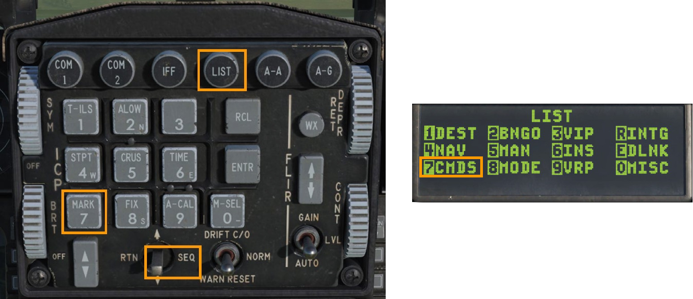
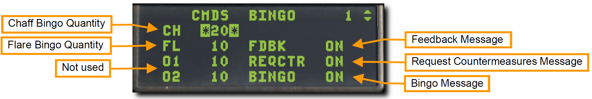
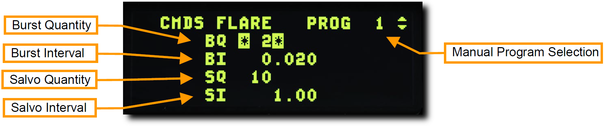

# 対抗手段

<!-- markdownlint-disable MD033 -->

## Countermeasures Dispensing Set (CMDS): 対抗手段放出セット

チャフやフレアなどの対抗手段 (Countermeasures) の選択と放出は、コックピットパネル、HOTAS コントロール、DED から行えます。

### CMDS 制御パネル

CMDS パネルは左補助コンソールにあります。
このシステムは追跡レーダー、空対空ミサイルや地対空ミサイルから航空機を防御します。
防御はチャフかフレアの放出によって行われます。

 

- **STATUS ディスプレイ**: 左のディスプレイに CMDS の状態を GO か NO GO で表示します。SEMI または AUTO モードでカウンターメジャーを放出するのに手動操作が必要な場合は、右のディスプレイに DISPENSE READY が表示されます。
- **RWR/JMR ソーススイッチ**: これらは RWR や ECM ジャマーの電源ではありません。SEMI または AUTO モードでカウンターメジャーを放出するときに RWR や ECM のデータを利用するために使います。
- **MWS スイッチ**: このミサイル警報装置はブロック 50 バイパーには搭載されていません。
- **JETT スイッチ**: JETT にするとカウンターメジャーを投棄します。このスイッチは CMDS の電源がオフになっていても機能します。
- **Quantity Indications**: それぞれの種類のカウンターメジャーの残量を表示します。DED で設定した残量レベル (BINGO) になると LO が表示されます。システムが故障した際のメッセージも表示されます。
- **CH/FL スイッチ**: チャフとフレアの放出を有効化します。
- **PRGM ノブ**: 操縦桿の CMS を前に倒したときに放出される4つの事前設定プログラムの1つを選択します。
- **MODE ノブ**: CMS の動作モードを選択します。
    - **MAN**: 操縦桿の CMS 前を押すと選択した事前設定プログラムを放出します。
    - **SEMI**: 航空機のシステムが脅威に応じた放出プログラムを選択します。操縦桿の CMS を後ろに倒して放出します。
    - **AUTO**: 航空機のシステムが脅威に応じた放出プログラムを選択し、放出も自動で行われます。操縦桿の CMS を後ろに倒すことでも放出できます。CMS 右を押すと放出を中断します。
    - **BYPASS**: 故障により他のモードが機能しないときに、カウンターメジャーを手動で放出できるようにします。

!!! missing "Not Implemented in DCS"
    SEMI, AUTO モードは早期版では未実装 ?

### HOTAS

操縦桿にはカウンターメジャーを制御する4方向スイッチがあります。

- **中立**: 何も放出されない OFF ポジションです。
- **前**: CMDS パネルの PRGM ノブで選択した事前設定プログラムを放出します。
- **後**: MODE ノブで SEMI を選択したときに選択したプログラムを放出します。MODE ノブが AUTO の場合、AUTO モードを有効化します。
- **左**: 機能なし
- **右**: AUTO モードを無効化します。

### CMDS DED ページ

UFC で CMDS にアクセスするには、ICP の LIST ページで 7 を押します。
DCS スイッチを右に倒して SEQ にするとページを切り替えられます。

CH (チャフ) と FL (フレア) の BINGO 残量 (CMDS に LO と警告される下限残量) は最初のページに表示されます。
BINGO を変更するには CMDS モードノブを STBY にしてから、それぞれの入力欄で数字キーを押します。

このページでは3つの音声メッセージのオンオフを切り替えることもできます。

- **フィードバック (FDBK)**: カウンターメジャープログラムの放出と同時に再生される "チャフフレア" 音声を有効/無効にします。
- **リクエストカウンターメジャー (REQCTR)**: SEMI または AUTO モードでカウンターメジャーが放出されたときに再生される "カウンター" 音声を有効/無効にします。
- **ビンゴ (BINGO)**: カウンターメジャーが BINGO 量に達したときに再生される "ロー" と、無くなったときに再生される "アウト" 音声を有効/無効にします。

DED の 2ページ目には、放出するそれぞれのカウンターメジャーの量と間隔が表示されます。
数値を直接入力することでこれらを変更できます。
DED ページでカウンターメジャーのプログラムを変更するときは、CMDS モードでノブを STBY にします。

 

選択中のプログラムはページ右上に表示されます。
ICP のインクリメント/デクリメントスイッチを押すと、5つのプログラムが順番に切り替わります。
チャフとフレアのページの表記は同じです。

- **Burst Quantity (バースト量)**: 1バースト (= 1組) あたりのカウンターメジャー放出量であります。
- **Burst Interval (バースト間隔)**: 1バースト中に放出するカウンターメジャーの秒間隔です。普通は非常に小さい数値です。
- **Salvo Quantity (複数バースト放出量)**: 1回あたりに放出するバースト量です。
- **Salvo Interval (複数バースト放出間隔)**: 1回あたりに放出するバーストの秒間隔です。

例として、上図では2つのフレアの組が1秒ごとに10秒間、合計で20発放出されます。
