# データリンク

- [Display Symbology: ディスプレイシンボル](#display-symbology)
- [DED DLNK ページ](#ded-dlnk)

F-16 は Link 16 戦術データリンク (TADIL) ネットワークを介してデータの送受信を可能にする、多機能情報伝達システム (MIDS) を装備しています。
Link 16 を使用すると NATO や他のサービスとのデータの共有ができます。

Link 16 は MIDS システムの一部であり、有効にするにはアビオニクス電源パネルの **MIDS LVT** ノブを ON 位置にします。
隣にある DL スイッチは F-16 ブロック 50 では機能しないので OFF のままにしておきます。

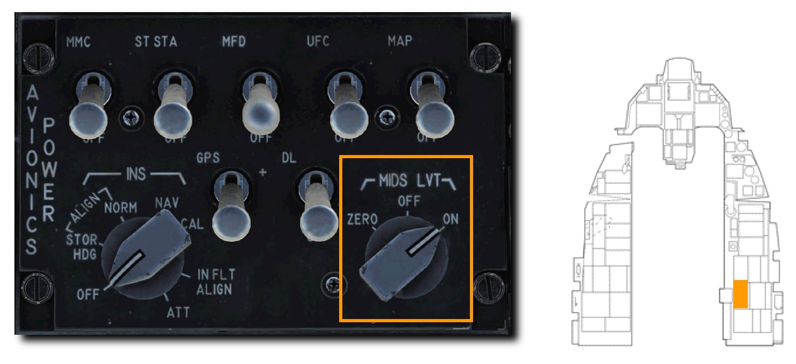

Link 16/MIDS の目的は、操縦する航空機の周囲の戦術状況を準リアルタイムで共有することです。
自機に搭載されたセンサー、ネットワーク上の友軍戦闘機、AWACS のような警戒監視アセットからのデータを集約し、統合された戦術状況図 (シチュエーショナル・アウェアネス) を作り出します。
これによって、より統制された交戦が可能になり、誤爆の可能性を低下させます。

## Display Symbology: ディスプレイシンボル

それぞれのトラックファイルはシンボルに変換されて HSD と レーダー画面に表示されます。
シンボルの形状と色によって敵味方の識別と、そのトラックファイルの情報源 (ソース) を判別できます。
ソースの種類は、自機のセンサーか他のドナー (提供者) によるものか、もしくはその両方です。

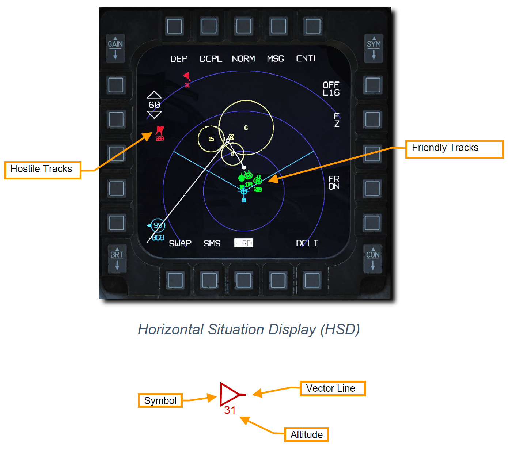

- **Symbol (シンボル)**: 基本的なシンボルは形状と色によって差別化されます。詳細は後述します。
- **Vector Line (ベクターライン)**: トラックファイルの針路を示す線です。
- **Altitude (高度)**: 1,000 フィート単位で示されるトラックファイルの高度です。

レーダー画面に表示されるほとんどの情報は HSD のものと同じですが、ネットワーク上の他のドナー機が目標を主目標として "バグ" した場合、識別 ID 表示が現れます。
こうすることで、作戦地域内にいる他の友軍機の標的になっていない目標に優先度をつけることができるため、目標のソーティングを補助します。

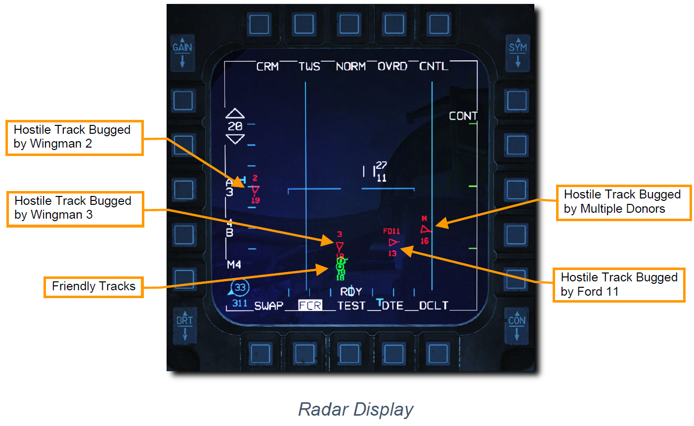

- Hostile Track Bugged by Wingman 2: 2番目の僚機によってバグされているホスタイルトラック
- Hostile Track Bugged by Wingman 3: 3番目の僚機によってバグされているホスタイルトラック
- Hostile Track Bugged by Multiple Donors: 複数のドナーによってバグされているホスタイルトラック
- Hostile Track Bugged by Ford 11: Ford 11 によってバグされているホスタイルトラック
- Friendly Track: 友軍機のトラックファイル

**Bugged Target ID (バグターゲット ID)**: ホスタイルトラック (敵性目標) として識別されている航空機のターゲット ID には次のようなものがあります。
- **2, 3, 4**: 編隊内の他の戦闘機よって現在バグされている目標の識別子です。
- **FD11, EN23, CY14**: その目標をバグしている、同じ編隊には属していない他の戦闘機のコールサインです。例えば、FD11 は Ford 11, CY14 は Chevy 14 を意味しています。
- **M**: 複数のドナーによってバグされている目標です。

HSD に表示されるバグされた目標はレーダー画面のそれとは異なります。
僚機とその僚機が現在バグしている目標を結ぶ、シアン色の **Wingman Lockline (ウィングマンロックライン)** が表示されます。
ウィングマンロックラインは編隊内の機体に限られ、ネットワーク上の他のドナーには表示されません。

バグターゲット ID はレーダー画面にのみ、ウィングマンロックラインは HSD にのみ表示されます。

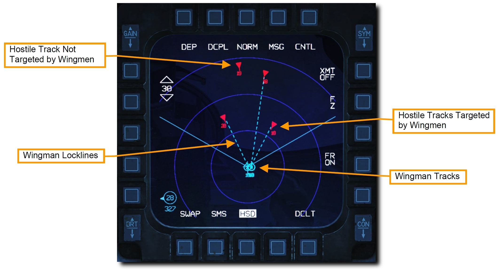

Link 16/MIDS には3種類のトラックファイルがあります。

- **Suveillance Track (サベイランストラック)**: AWACS や地上レーダー施設から受信したトラックファイルです。

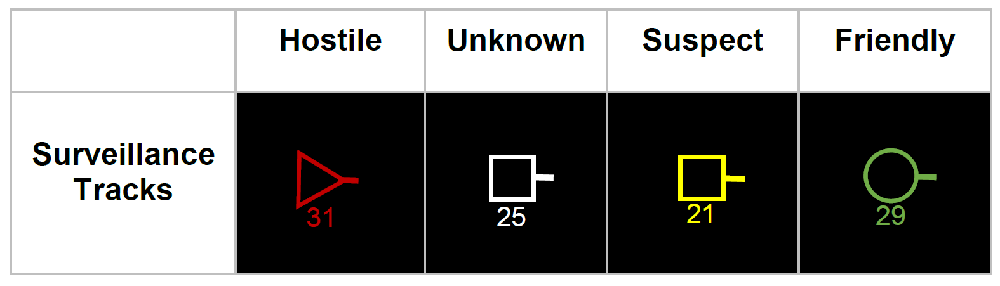

- **Fighter Track (ファイタートラック)**: ネットワーク上の他のドナー航空機や、トラックデータを送信している戦闘機から提供されるトラックファイルです。これらのトラックファイルは混同を避けるために互いに同期しています。見た目はサベイランストラックと同じです。

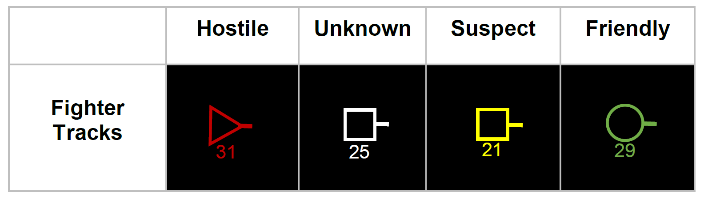

- **Precise Participant Location and Identification (PPLI) Tracks (PPLI トラック)**: 同じ編隊内のフライトメンバーに加えて、4つまでの他のドナー機の位置を示します。

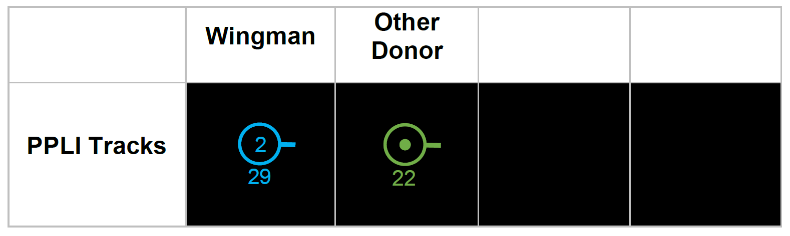

上記の3種類のソースによるトラックファイルと、自機のレーダーで捉えた目標は互いに同期しています。
このようなオフボードセンサー (自機に搭載されていないセンサー) とオンボードセンサー (自機に搭載されているセンサー) の両方で捉えていることを **Multi Sorce Integration (MSI)** と呼びます。

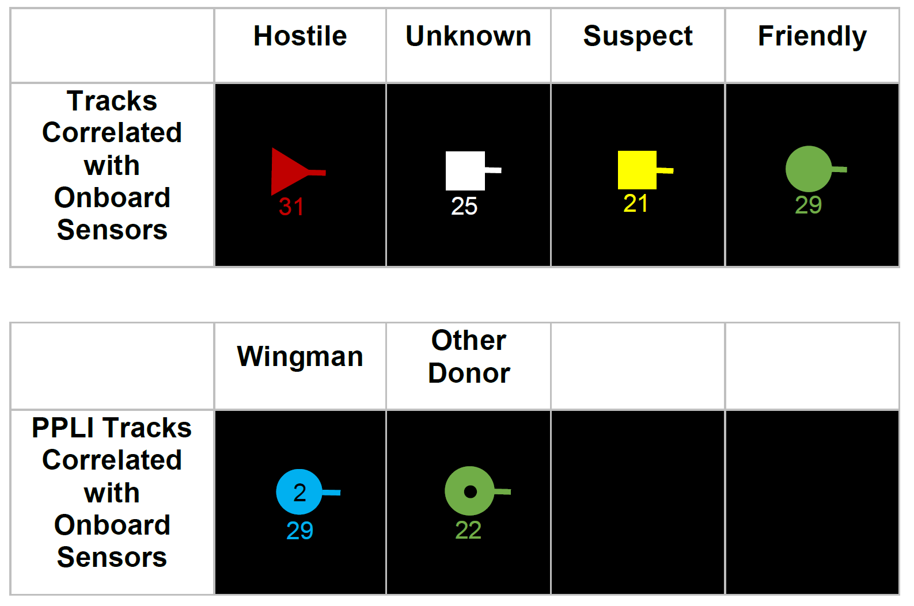

### Radar Display Filtering: レーダー画面のフィルタリング

レーダー画面 (FCR ページ) に表示されているトラックファイルのシンボルは、スロットルの UHF VHF 通信スイッチでフィルタリングすることができます。
この操作が反映されるのはレーダー画面のみで、HSD ページには適応されません。

スイッチを内側 (右) に 0.5 秒以下の短押しすると、3種類のフィルターを掛けられます。

- **ALL**: すべてのシンボルが表示されます。
- **FTR+**: サベイランストラックファイルが表示されなくなります。
- **TGTS**: サベイランストラックファイルと PPLI トラックファイルが表示されなくなります。

スイッチを外側 (左) に 0.5 秒以下の短押しすると、**NONE** が選択され、すべてのトラックファイルを非表示にします。
もう一度押すと元の表示オプションに戻ります。

現在選択している表示オプションはレーダー画面の左下に表示されています。

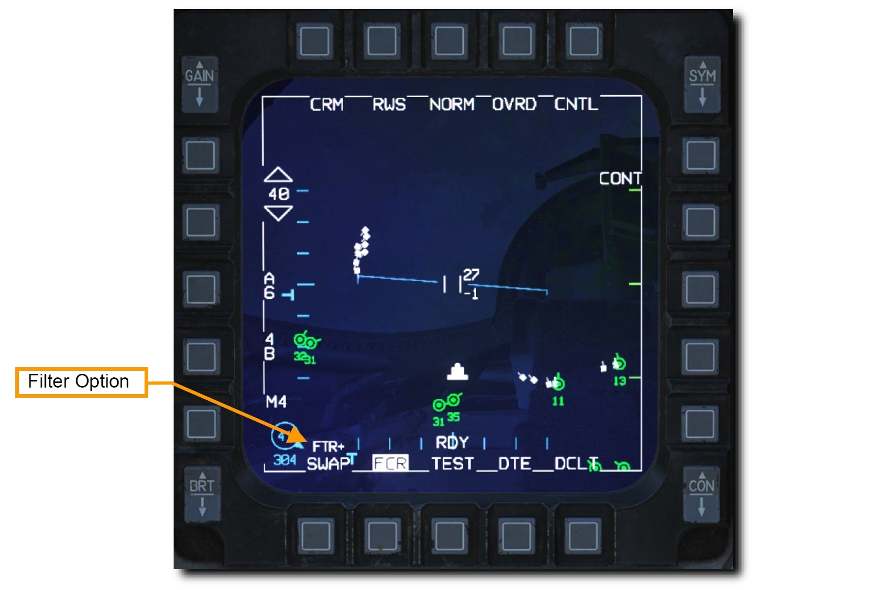

## DED DLNK ページ

DED の データリンク (DLNK) ページでは、Link 16 システムの状態の確認と設定が行えます。
ICP の **LIST** ボタンを押してから **ENTR** を押すと最初のページが表示されます。
次のページに移行するには DCS スイッチを右の **SEQ** 方向へ倒します。

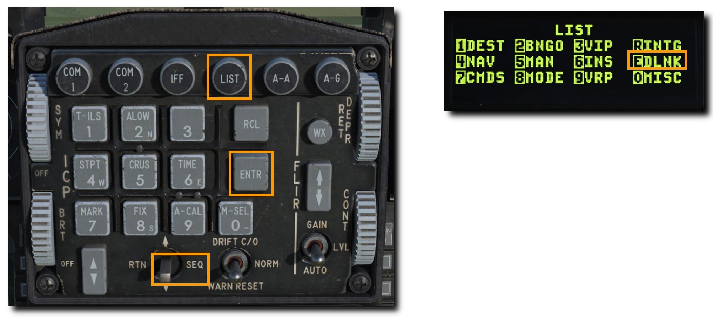

### Network Status: ネットワークステータス

1ページ目は、ネットワークの状態とタイムリファレンス (共通時間) を表示します。

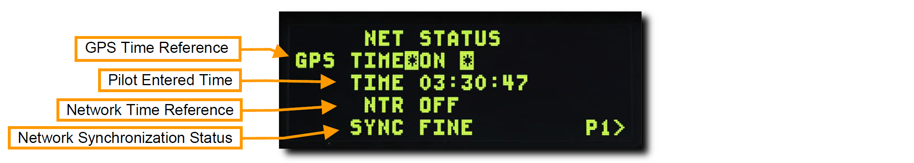

- **GPS Time Reference**: Link 16 ネットワークに接続しているすべてのアセットで共通化されている時間です。これは、設定が ON のときに GPS 時計データによってもたらされます。
- **Pilot Entered Time**: GPS が無効な場合に、ネットワーク接続アセット同士で事前に調整した時間が表示されます。
- **Network Time Reference**: 有効であれば、自機がネットワーク時間の基準となります。通常は OFF にしておきます。
- **Network Synchronization Status**: 共有されたネットワーク時間の精度を表示します。

### MIDS Radio Options: MIDS 設定

2ページ目は、受信するデータのチャンネルと通信強度を含む MIDS 通信設定を表示します。

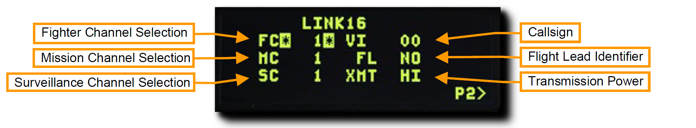

- **Fighter, Mission and Surveillance Channel Selection**: 編隊内のメンバー、他の戦闘機、AWACS のそれぞれから受信する MIDS データのチャンネルです。これは事前に設定されているため変更する必要はありません。
- **Callsign**: データを送受信するときの自機のコールサインです。
- **Flight Lead Identifier**: 有効であれば、自機が編隊長として登録されます。
- **Transmission Power**: 送信する MIDS の通信強度を選択できます。

### Flight Management: フライトマネジメント

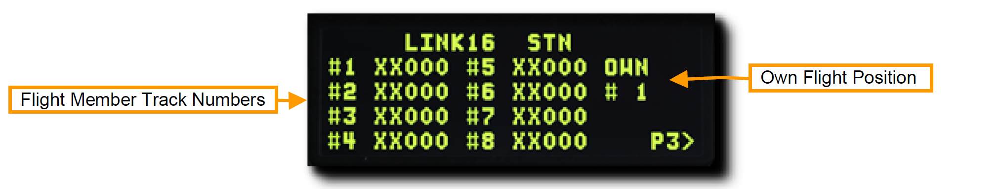

3ページ目では、ネットワークに接続しているフライトメンバーの管理と識別設定を行います。

- **Flight Member Track Numbers**: 編隊内の航空機の識別 ID です。これは事前に設定されているため変更する必要はありません。
- **Own Flight Position**: 編隊内での自機の役職を設定します。
