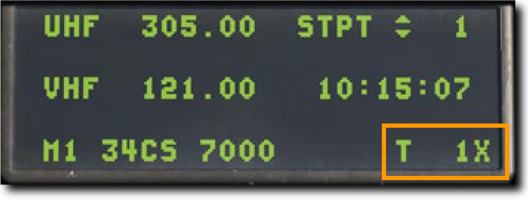
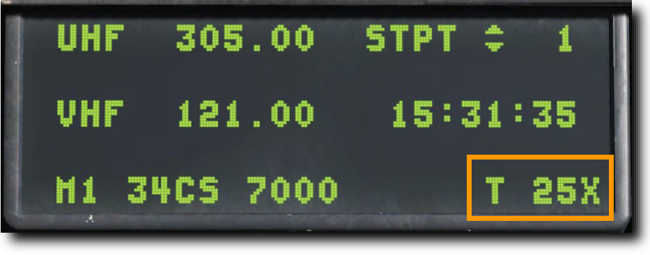

# 航法システム

F-16 は, 作戦地域に向かうために様々な航法装置を搭載している.
作戦や作戦段階に応じて, 異なる航法装置を使用するかもしれない.
コックピットの章で紹介した航法システムを, この章ではより実用的なレベルで確認する.

- [Embedded GPS/INS (EGI): GPS組込慣性航法装置](#embedded-gpsins-egi-gps)
- [TACAN (TCN): 戦術航法装置](#tacan-tcn)
- [Instrument Landing System (ILS): 計器着陸装置](#instrument-landing-system-ils)

## Embedded GPS/INS (EGI): GPS組込慣性航法装置

EGI は, 姿勢, 航法, 垂直および水平操舵の正確な情報を得るための F-16 の主要な航法システムである.
EGI の主な操作インターフェースは UFC である.
この章では, EGI を航法に使うための運用方法を紹介する.

※ EGI: 補正用に GPS が組み込まれた慣性航法装置 (INS) のこと

### INS アライメント

航法装置のアラインは地上もしくは空中において様々な方法で行われる.
アビオニクス電力パネルの INS ノブを適切な位置に回すことでアラインが開始される.
アラインメントが完了したら, INS ノブを NAV に動かす.

- **Normal (NORM: 通常)**: アラインメントの基本となるモードである. NORM アラインの完了には約8分間を要する.
- **Stored Heading (STOR HDG: ストアヘディング)**: 30秒以下の迅速なアラインを実行する. これは航空機がアラインのために事前にセットアップされている場合にのみ使用できる.
- **Inflight Alignment (INFLT ALIGN: インフライトアライン)**: 飛行中に GPS データが利用できる場合に行うことができる. アラインが完了するまでは, 限定的な航法情報しか得られない.
- **Attitude (ATT: 姿勢維持)**: 電気的な故障によりアラインが失われた場合に, 空中で姿勢情報を復元できる. 航法情報は NORM もしくは INFLT ALIGN が完了するまで利用できない.

!!! missing "Not Implemented in DCS"
    INFLT ALIGN と ATT は早期版では未実装

#### Normal Gyrocompass (NORM) Alignment: 通常アライン

毎回の飛行の前に NORM 位置での INS アラインを完了すべきである.
通常は, エンジンが始動し, アビオニクスの電源を入れた後に行い, タキシングの前には完了しておくようにする.

**1.** **INS ノブを NORM 位置に回す**

INS アラインの開始は, DED の INS ページから確認できる.
アラインの進行度も, ここから同様に確認できる.

- **Time Into Alignment (アラインメント経過時間)**: INS アラインメント開始からの経過時間が分および10進秒で表示される.
- **Alignment Status (アラインメント状況)**: 推定のアラインメント精度である. 99から開始され, 減少するにつれて次の意味がある.
    - 99: 初期化
    - 90: 姿勢データの有効化, 初期アラインの開始
    - 79: 方位データの有効化
    - 70: 低精度ナビゲーション状態, DED に RDY が, HUD に ALIGN が点灯表示される
    - 60~20: アライン完了時と比較した位置の推定誤差 (60=通常の6.0倍, 20=通常の2.0倍)
    - 10: INS アライン完了, DED の RDY と, HUD の ALIGN が点滅
    - 6: INS アラインが完了し, GPS や他の技術を利用して誤差が通常の0.6倍にまで減った状態
- **Latitude (緯度)**: 始動地点の緯度
- **Longitude (経度)**: 始動地点の経度
- **System Altitude (システム高度)**: 空対地兵装用の火器管制コンピューターに用いられる高度
- **True Heading (機首真方位)**: 最後の機首真方位もしくはアラインで得られた方位
- **Ground Speed (対地速度)**: 現在の対地速度

**2.** **始動地点の緯度経度および高度の入力**

アラインメント開始時には, DED にシャットダウン時の位置座標と推定高度が表示される.
もしこれらのデータが正しい場合であっても, 再入力を行わなくてはならない.

データが正確であれば, DCS スイッチを使って, それぞれの入力欄をハイライトしてから ENTR を押す.
データが正確でなければ, ICP のキーボードを使って, それぞれの入力欄に正しい数値を入力する.

データの入力に失敗すると, アラインメントの低精度フラッグが表示され, INS の重要な追跡機能を実行できない.
また, 航法, ウェポンデリバリー, 目標指示ポッドなどのエラーも引き起こす.

**3.** **アラインメント進行度の監視後, INS ノブを NAV に**

アラインメントが完了すると, DED の RDY 表示と, HUD の ALIGN 表示が点滅し始める.
アラインは8分以内に完了する.
完了後, アラインを確定するために INS ノブを NAV 位置に回す.

### HUD Indication: HUD 表示

航空機の現在方位は, マスターモードに応じて HUD の上部か下部に表示される.
目盛りの中央にある符号によって現在の磁方位が確認できる.

**Steerpoint Cue (ステアポイントキュー)** は選択中のステアポイントに対する針路を示す.
航空機のフライトパスマーカーがキューに沿っていれば, ステアポイントに向かって飛行していることになる.

### Horizontal Situation Display (HSD): 水平状況表示

選択中のステアポイントは, HSD に白塗りの丸で表示される.
他のステアポイントは空の丸で表示され, それらすべてを線で繋いだ経路も表示される.
自機マーカーは現在の航空機の位置を示す.

### Horizontal Situation Indicator (HSI): 水平姿勢指示器

HSI は, ステアポイント, TACAN ビーコン, ラジオビーコンまでの航法を補助する主要な計器である.
HUD シンボルを用いれば航法の目的のほとんどが果たせるが, HUD や DED に表示されない情報や, それらが故障してしまった場合に追加の航法データにアクセスするには HSI の理解が不可欠である.

- **Compass Card (コンパス度目盛)**: HSI の周囲に表示され, コンパスの頂点が航空機の磁気方位を示すように回転する.
- **Aircraft Symbol (自機シンボル)**: 計器の中央には, 自機のシンボルが動かず常に表示される. HSI のすべてのシンボルは, これを基準に表示される.
- **Lubber Line (ラバーライン)**: 自機シンボルから計器の上部まで伸びる固定された線である. コンパス目盛りに対応した自機の方位を示す.
- **Range Indicator (距離表示)**: 選択中のステアポイントもしくは TACAN ステーションへの直線距離が3桁で表示される.
- **Bearing Pointor (方位ポインター)**: この矢印型の表示はコンパス目盛りの外側を移動し, 選択中のステアポイントもしくは TACAN ステーションへの方向を示す. ポインターの先端から 180° 回転した位置には, 逆方位を表す尾部の表示がある.
- **Heading Set Knob (方位設定ノブ)**: 計器の左下にあるこのノブを回すと, コンパス上の Heading Marker (方位マーカー) を設定できる.
- **Heading Marker (方位マーカー)**: Heading Set Knob によってコンパスの周囲を移動する2つの正方形マーカーである. 設定後はコンパス目盛りとともに回転し, 選択した磁気方位の方向を表示する.
- **Course Set Knob (コース設定ノブ)**: 計器の右下にあるこのノブを回すと, Course Indicator の数値と コンパス周囲の Course Pointer を設定できる.
- **Course Indicator (コース表示)**: この小窓には, コース設定ノブで設定したコースが数字で表示される.
- **Course Pointer (コースポインター)**: コース設定ノブで設定された2本の線は, コースとコンパス目盛り上の逆方位を表す.
- **Course Deviation Indicator (コース偏差表示)**: 計器の中央にある線で, 設定されたコースをどれだけ正確に飛行しているかを表す. 線が自機シンボルを通る場合はコース上にあり, どちらかに開いている場合はコースに復帰するために機首方位を修正する.
- **To-From Indicator**: コースラインに沿って表示される2つの三角形で, 航空機がステアポイントもしくは TACAN ステーションに近づいているのか離れているのかを表示する.
- **Current Mode (現在のモード)**: 現在表示中のモードを示す.
- **Mode Selector (モードセレクター)**: 表示するモードを変更する.

## TACAN (TCN): 戦術航法装置

戦術航法装置 (TACAN) は, 全世界で使われる全方向式無線標識装置であり, 主に軍用機で使用するための固有の周波数をもつ.
民間機が利用するよく似たシステムは VOR (超短波全方向式無線標識施設) と呼ばれ, 異なる周波数帯を用いる.
VOR ステーションの多くは TACAN と併設されている.
それらのステーション (局) は両方の信号を発信しているため, 軍民両方の航空機が利用できる.
そういったステーションは **VORTACS** としても知られている.

TACAN ビーコンは地上だけでなく, 航空機や空母のような艦船にも搭載できる.
TACAN は設置された位置への迅速な航法装置として機能する.

TACAN は MIDS (多機能情報伝達システム) の一部であるため, 有効にするためにアビオニクス電源パネルの **MIDS LVT** ノブを **ON** 位置に回す必要がある.
TACAN のトーン音声は AUDIO 2 パネルから調節できる.

現在選択している TACAN ステーションは, DED の CNI ページ右下に常に表示されている.
下図の例では 1X のステーションが選択されている.

TACAN による航法を利用するには以下の手順を行う.

### TACAN ステーションの選択

1. 新たなステーションを選択するには ICP の **T-ILS Priority Function Button (主要機能ボタン)** を押して DED に TACAN/ILS ページを表示する. TACAN システムの情報はページ左側に表示される.

2. ICP の DCS スイッチを下に倒して **CHAN** の項目をハイライトする. ICP のキーボードで新たなチャンネルを入力し, ENTR を押して確定する.

例ではチャンネル 25 が入力されている. システムは GTB というトビリシ空港の TACAN ステーションのビーコンを受信している.

3. 必要であれば CHAN 入力欄か上のスクラッチパッドで **0 (M-SEL)** を押して周波数バンドを変更する. バンドは X か Y に切り替わる.

4. ICP の DCS スイッチを右に倒して以下の項目のいずれかを選択する.

- **REC (受信)**: TACAN ステーションの ID と距離, コース偏差を得られる受信モードにする.
- **T/R (送受信)**: TACAN ステーションの ID と距離, 方位, コース偏差を得られる送受信モードにする. TACAN の最も一般的な設定である.
- **A/A REC (空中局受信)**: 航空機に搭載された TACAN ステーションの ID と距離, コース偏差が得られる空中局モードである.
- **A/A T/R (空中局送受信)**: 航空機に搭載された TACAN ステーションの ID と距離, 方位, コース偏差が得られる空中局の送受信モードである.
  
ほとんどの場合において TACAN は T/R モードを使用する.

5. DCS スイッチを **RTN** に倒して, CNI ページ右下の TACAN チャンネルが正しく表示されているか確認する.

### 選択した TACAN ステーションへのナビゲーション

DED で入力した TACAN ステーションが利用可能な距離内まで接近すると, HIS に操縦情報が表示される.

モードに **TCN** と表示されるまでモードセレクターを押す.
HSI の動作は Bearing Pointer (方位ポインター) がステアポイントではなく TACAN ステーションを指している事以外は, ステアポイント選択時と同様です.

??? Note
    TACAN の有効距離は 130 海里とされているため, TACAN ステーション同士の距離は通常 260 海里である.

## Instrument Landing System (ILS): 計器着陸装置

### ILS 周波数の選択

### ILS グライドスロープとローカライザーを用いたナビゲーション
