# 航法システム

F-16 は作戦地域に向かうために様々な航法装置を搭載しています。
作戦や作戦段階に応じて、あなたは異なる航法装置を使用するかもしれません。
コックピットの章で紹介した航法システムを、この章ではより実用的なレベルで確認します。

- [Embedded GPS/INS (EGI): GPS組込慣性航法装置](#embedded-gpsins-egi-gps)
- [TACAN (TCN): 戦術航法装置](#tacan-tcn)
- [Instrument Landing System (ILS): 計器着陸装置](#instrument-landing-system-ils)

## Embedded GPS/INS (EGI): GPS組込慣性航法装置

EGI は、姿勢、航法、垂直および水平操舵の正確な情報を得るための F-16 の主要な航法システムです。
EGI の主な操作インターフェースは UFC です。
この章では、EGI を航法に使うための運用方法を紹介します。

※ EGI: 補正用に GPS が組み込まれた慣性航法装置 (INS) のこと

### INS アライメント

航法装置のアラインは地上もしくは空中において様々な方法で行われます。
アビオニクス電力パネルの INS ノブを適切な位置に回すことでアラインが開始されます。
アラインメントが完了したら、INS ノブを NAV に動かします。

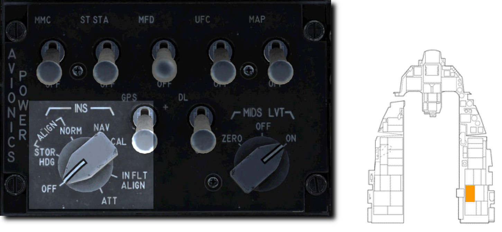

- **Normal (NORM: 通常)**: アラインメントの基本となるモードです。NORM アラインの完了には約8分間を要します。
- **Stored Heading (STOR HDG: ストアヘディング)**: 30秒以下の迅速なアラインを実行します。これは航空機がアラインのために事前にセットアップされている場合にのみ使用できます。
- **Inflight Alignment (INFLT ALIGN: インフライトアライン)**: 飛行中に GPS データが利用できる場合に行うことができます。アラインが完了するまでは、限定的な航法情報しか得られません。
- **Attitude (ATT: 姿勢維持)**: 電気的な故障によりアラインが失われた場合に、空中で姿勢情報を復元できます。 航法情報は NORM もしくは INFLT ALIGN が完了するまで利用できません。

!!! missing "Not Implemented in DCS"
    INFLT ALIGN と ATT は早期版では未実装

#### Normal Gyrocompass (NORM) Alignment: 通常アライン

毎回の飛行の前に NORM 位置での INS アラインを完了すべきです。
通常はエンジンが始動しアビオニクスの電源を入れた後に行い、タキシングの前には完了しておくようにします。

**1.** **INS ノブを NORM 位置に回す**

INS アラインの開始は DED の INS ページから確認できます。
アラインの進行度もここから同様に確認できます。

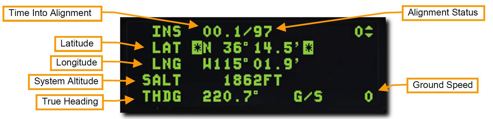

- **Time Into Alignment (アラインメント経過時間)**: INS アラインメント開始からの経過時間が、分数と10進秒で表示されます。
- **Alignment Status (アラインメント状況)**: 推定のアラインメント精度です。99から開始され、減少するにつれて次の意味があります。
    - 99: 初期化
    - 90: 姿勢データの有効化、初期アラインの開始
    - 79: 方位データの有効化
    - 70: 低精度ナビゲーション状態、DED に RDY が、HUD に ALIGN が点灯表示されます
    - 60~20: アライン完了時と比較した位置の推定誤差 (60=通常の6。0倍、20=通常の2。0倍)
    - 10: INS アライン完了、DED の RDY と、HUD の ALIGN が点滅
    - 6: INS アラインが完了し、GPS や他の技術を利用して誤差が通常の0。6倍にまで減った状態
- **Latitude (緯度)**: 始動地点の緯度
- **Longitude (経度)**: 始動地点の経度
- **System Altitude (システム高度)**: 空対地兵装用の火器管制コンピューターに用いられる高度
- **True Heading (機首真方位)**: 最後の機首真方位もしくはアラインで得られた方位
- **Ground Speed (対地速度)**: 現在の対地速度

**2.** **始動地点の緯度経度および高度の入力**

アラインメント開始時には DED にシャットダウン時の位置座標と推定高度が表示されます。
もしこれらのデータが正しい場合であっても、再入力を行わなくてはなりません。

データが正確であれば、DCS スイッチを使ってそれぞれの入力欄をハイライトしてから ENTR を押します。
データが正確でなければ、ICP のキーボードを使ってそれぞれの入力欄に正しい数値を入力します。

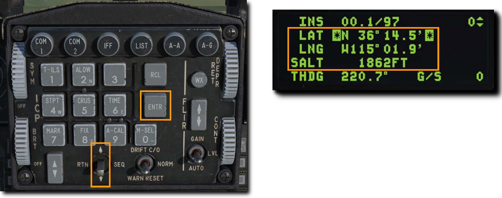

データの入力に失敗すると、アラインメントの低精度フラッグが表示され、INS の重要な追跡機能を実行できません。
また、航法、ウェポンデリバリー、目標指示ポッドなどのエラーも引き起こします。

**3.** **アラインメント進行度の監視後、INS ノブを NAV に**

アラインメントが完了すると DED の RDY 表示と HUD の ALIGN 表示が点滅しはじめます。
アラインは8分以内に完了します。
完了後、アラインを確定するために INS ノブを NAV 位置に回します。

### HUD Indication: HUD 表示

自機の現在方位は、マスターモードに応じて HUD の上部か下部に表示されます。
目盛りの中央にある符号によって現在の磁方位が確認できます。

**Steerpoint Cue (ステアポイントキュー)** は選択中のステアポイントに対する針路を示します。
自機のフライトパスマーカーがキューに沿っていれば、ステアポイントに向かって飛行していることになります。

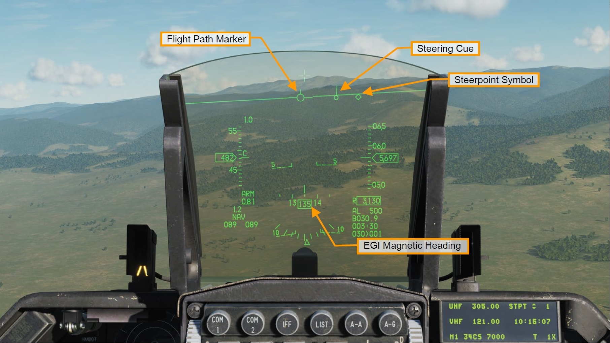

### Horizontal Situation Display (HSD): 水平状況表示

選択中のステアポイントは HSD 上に白塗りの丸で表示されます。
他のステアポイントは空の丸で表示され、それらすべてを線で繋いだ経路も表示されます。
自機マーカーは現在の航空機の位置を示します。

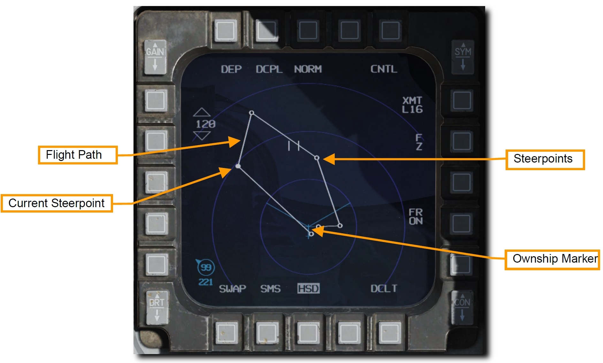

### Horizontal Situation Indicator (HSI): 水平姿勢指示器

HSI は、ステアポイント、TACAN ビーコン、ラジオビーコンまでの航法を補助する主要な計器です。
HUD シンボルを用いれば航法の目的のほとんどが果たせますが、HUD や DED に表示されない情報や、それらが故障してしまった場合に追加の航法データにアクセスするには HSI の理解が不可欠です。

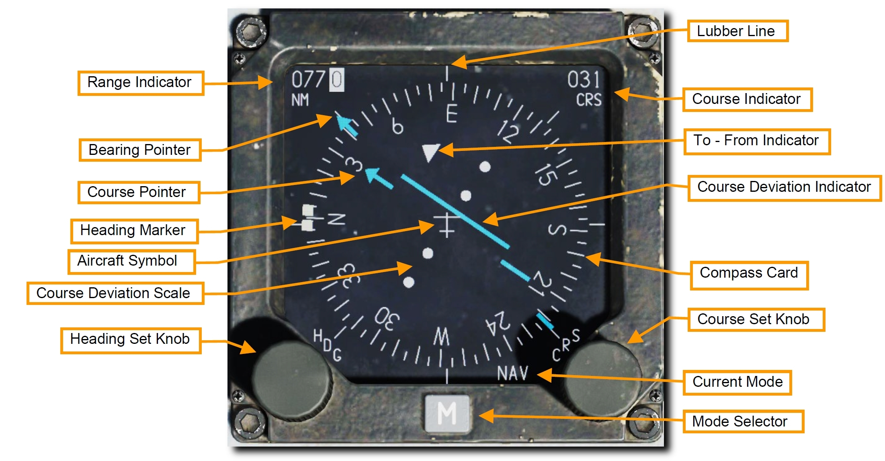

- **Compass Card (コンパス度目盛)**: HSI の周囲に表示され、コンパスの頂点が航空機の磁気方位を示すように回転します。
- **Aircraft Symbol (自機シンボル)**: 計器の中央には自機のシンボルが動かず常に表示されています。HSI のすべてのシンボルはこれを基準に表示されます。
- **Lubber Line (ラバーライン)**: 自機シンボルから計器の上部まで伸びる固定された線です。コンパス目盛りに対応した自機の方位を示す。
- **Range Indicator (距離表示)**: 選択中のステアポイントもしくは TACAN ステーションへの直線距離が3桁で表示されます。
- **Bearing Pointor (方位ポインター)**: この矢印型の表示はコンパス目盛りの外側を移動し、選択中のステアポイントもしくは TACAN ステーションへの方向を示します。ポインターの先端から 180° 回転した位置には、逆方位を表す尾部の表示があります。
- **Heading Set Knob (方位設定ノブ)**: 計器の左下にあるこのノブを回すと、コンパス上の Heading Marker (方位マーカー) を設定できます。
- **Heading Marker (方位マーカー)**: Heading Set Knob によってコンパスの周囲を移動する2つの正方形マーカーです。設定後はコンパス目盛りとともに回転し、選択した磁気方位の方向を表示します。
- **Course Set Knob (コース設定ノブ)**: 計器の右下にあるこのノブを回すと、Course Indicator の数値とコンパス周囲の Course Pointer を設定できます。
- **Course Indicator (コース表示)**: この小窓には、コース設定ノブで設定したコースが数字で表示されます。
- **Course Pointer (コースポインター)**: コース設定ノブで設定された2本の線は、コースとコンパス目盛り上の逆方位を表します。
- **Course Deviation Indicator (コース偏差表示)**: 計器の中央にある線で、設定されたコースをどれだけ正確に飛行しているかを表します。線が自機シンボルを通る場合はコース上にあり、どちらかに開いている場合はコースに復帰するために機首方位を修正します。
- **To-From Indicator**: コースラインに沿って表示される2つの三角形で、航空機がステアポイントもしくは TACAN ステーションに近づいているのか離れているのかを表示します。
- **Current Mode (現在のモード)**: 現在表示中のモードを示します。
- **Mode Selector (モードセレクター)**: 表示するモードを変更します。

## TACAN (TCN): 戦術航法装置

戦術航法装置 (TACAN) は、全世界で使われる全方向式無線標識装置であり、主に軍用機で使用するための固有の周波数をもっています。
民間機が利用するよく似たシステムは VOR (超短波全方向式無線標識施設) と呼ばれ、異なる周波数帯を用います。
VOR ステーションの多くは TACAN と併設されています。
それらのステーション (局) は両方の信号を発信しているため、軍民両方の航空機が利用できます。
そのようなステーションは **VORTACS** としても知られています。

TACAN ビーコンは地上だけでなく、航空機や空母のような艦船にも搭載できます。
TACAN は設置された位置への迅速な航法装置として機能します。

TACAN は MIDS (多機能情報伝達システム) の一部であるため、有効にするためにアビオニクス電源パネルの **MIDS LVT** ノブを **ON** 位置に回す必要があります。
TACAN のトーン音声は AUDIO 2 パネルから調節できます。

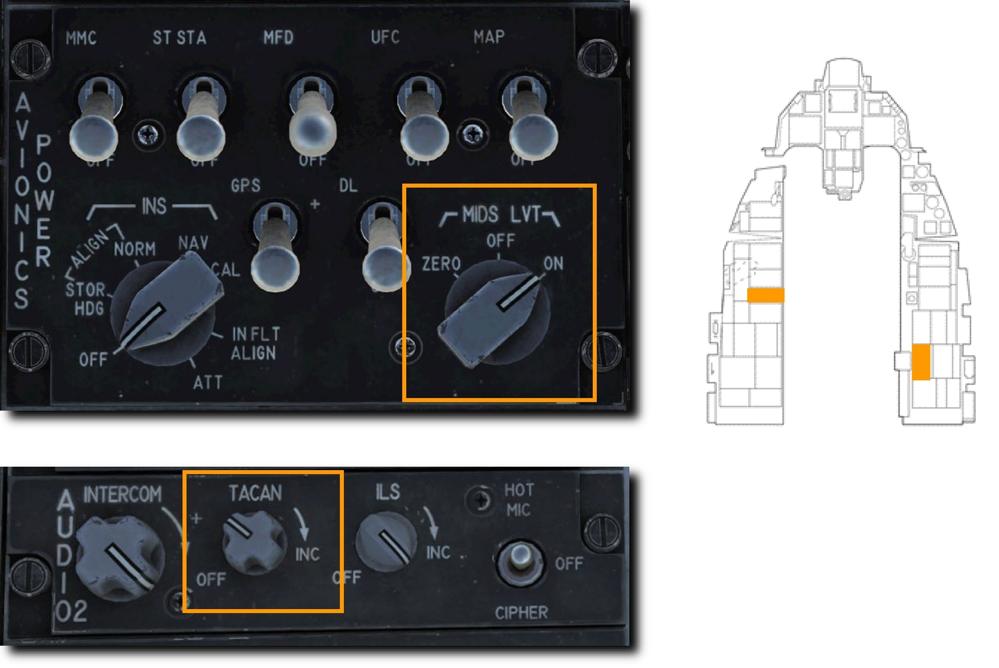

現在選択している TACAN ステーションは、DED の CNI ページ右下に常に表示されています。
下図の例では 1X のステーションが選択されています。

TACAN による航法を利用するには以下の手順を行います。

### TACAN ステーションの選択

1. 新たなステーションを選択するには ICP の **T-ILS Priority Function Button (主要機能ボタン)** を押して DED に TACAN/ILS ページを表示します。TACAN システムの情報はページ左側に表示されます。

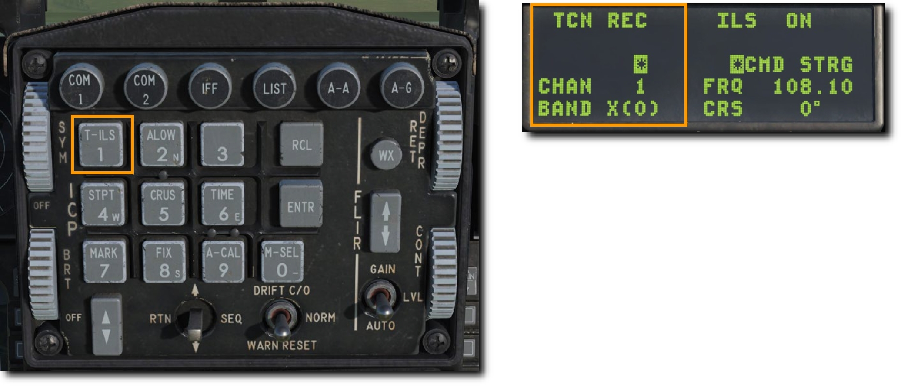
2. ICP の DCS スイッチを下に倒して **CHAN** の項目をハイライトします。ICP のキーボードで新たなチャンネルを入力し、ENTR を押して確定します。

例ではチャンネル 25 が入力されています。システムは **GTB** というトビリシ空港の TACAN ステーションのビーコンを受信しています。

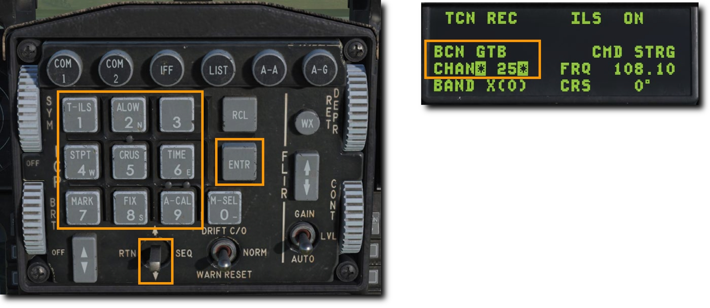
3. 必要であれば CHAN 入力欄か上のスクラッチパッドで **0 (M-SEL)** を押して周波数バンドを変更します。 バンドは **X** か **Y** に切り替わります。

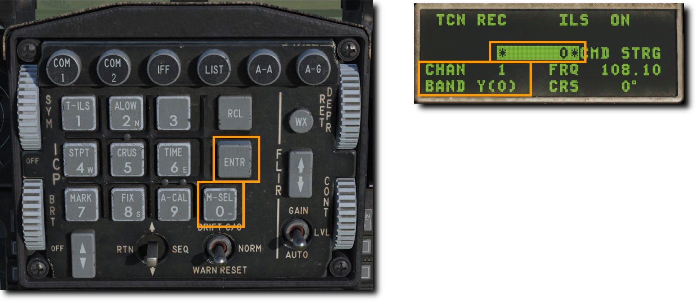
4. ICP の DCS スイッチを右に倒して以下の項目のいずれかを選択します。

- **REC (受信)**: TACAN ステーションの ID と距離、コース偏差を得られる受信モードにします。
- **T/R (送受信)**: TACAN ステーションの ID と距離、方位、コース偏差を得られる送受信モードにします。 TACAN の最も一般的な設定です。
- **A/A REC (空中局受信)**: 航空機に搭載された TACAN ステーションの ID と距離、コース偏差が得られる空中局モードです。
- **A/A T/R (空中局送受信)**: 航空機に搭載された TACAN ステーションの ID と距離、方位、コース偏差が得られる空中局の送受信モードです。
  
TACAN は、ほとんどの場合において T/R モードを使用します。

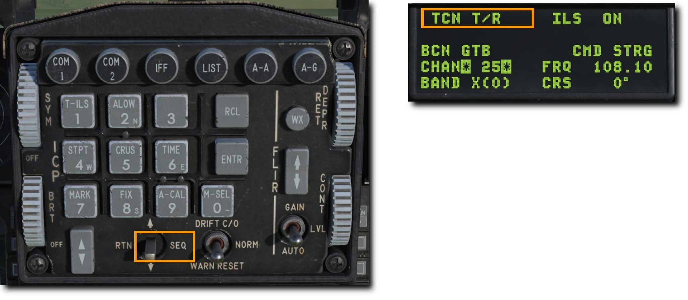
5. DCS スイッチを **RTN** に倒して、CNI ページ右下の TACAN チャンネルが正しく表示されているか確認します。

### 選択した TACAN ステーションへのナビゲーション

DED で入力した TACAN ステーションが利用可能な距離内まで接近すると、HIS に操縦情報が表示されます。

モードに **TCN** と表示されるまでモードセレクターを押します。
HSI の動作は Bearing Pointer (方位ポインター) がステアポイントではなく TACAN ステーションを指していること以外は、ステアポイント選択時と同様です。

??? Note
    TACAN の有効距離は 130 海里とされているため、TACAN ステーション同士の距離は通常 260 海里です。

## Instrument Landing System (ILS): 計器着陸装置

計器着陸装置 (ILS) を用いたランディングアプローチは通常、夜間や悪天候時などの計器飛行方式 (IFR) が適応される環境において行われます。
ILS を使うと、安全な着陸を行うための正しいグライドスロープと機首方位へ飛行するのを補助する、垂直および水平操舵情報 (Steering Infomation) が表示されます。
ILS の周波数は UFC から設定し、ステアリングの表示は HSI から行えます。
操舵情報は HUD、ADI、HSI 計器に表示されます。
ILS はコースに直接進入するためのステアリング (操舵線) を表示します。

計器表示に加えて、ILS はローカライザーの音声シグナルを送信します。
外側か内側の着陸ビーコンの上を飛行したときに ILS の音声シグナルが発信されます。
このシグナルの音量は AUDIO 2 制御パネルで調節できます。

ほとんどの滑走路は風向きに応じてどちら側からでも着陸できるようになっています。
ILS システムは、ATC から指示されたアクティブランウェイ (運用中の滑走路) のものを使用すべきです。

ILS システムは、Audio 2 制御パネルの **ILS ノブ** を OFF 位置から回すことでオンにできます。

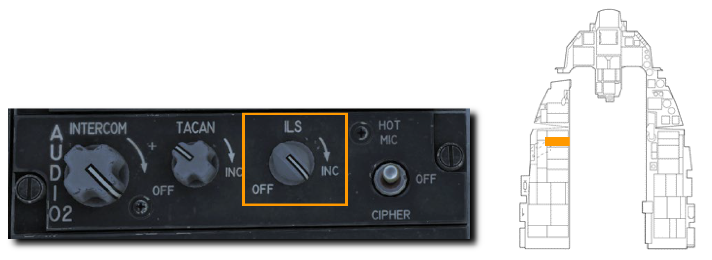

ILS には 108。1~111。95 Mhz の周波数帯が用いられます。
ILS 設備のある滑走路の周波数はミッションスタート前のミッションプランナー画面、もしくはゲーム内の F10 マップから確認できます。
空港をクリックすると詳細情報が表示されます。

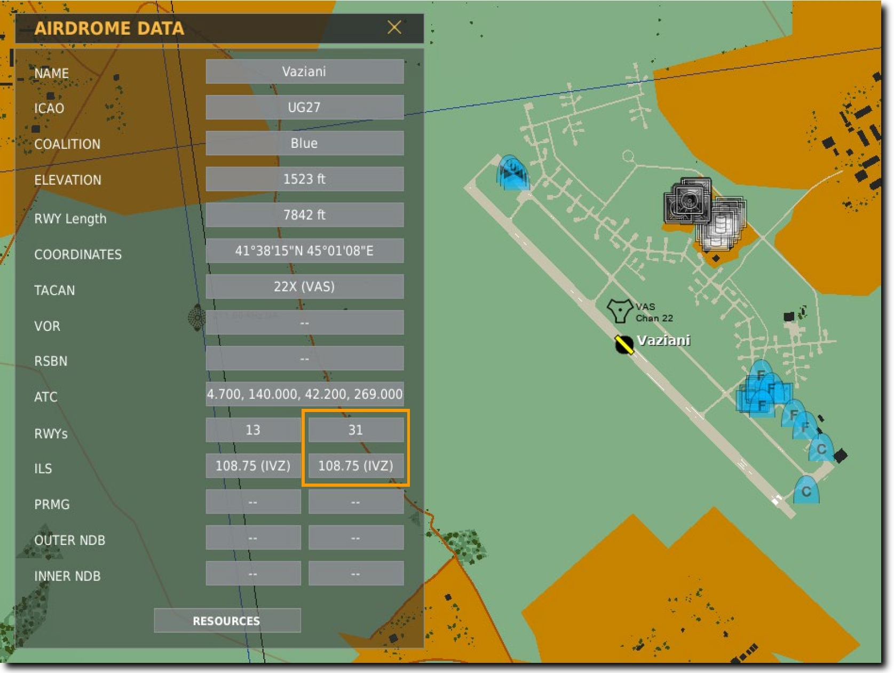

上図の例では、ヴァザニ空港のランウェイ 31 に装備された ILS システムの周波数が 108.75 MHz であることを確認できます。

### ILS 周波数の選択

1. 新たなステーションを選択するには ICP の **T-ILS Priority Function Button (主要機能ボタン)** を押して DED に TACAN/ILS ページを表示します。ILS システムの情報はページ右側に表示されます。

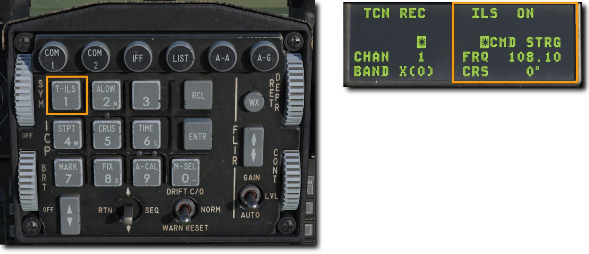
2. ICP の DCS スイッチを下に倒して **FREQ (周波数)** の項目をハイライトします。ICP のキーボードで新たなチャンネルを入力し、ENTR を押して変更を確定します。
3. DCS スイッチを下に倒して **CRS (コース)** の項目をハイライトします。ICP のキーボードでアクティブランウェイのコースに適した数値を入力し、ENTR を押して変更を確定します。

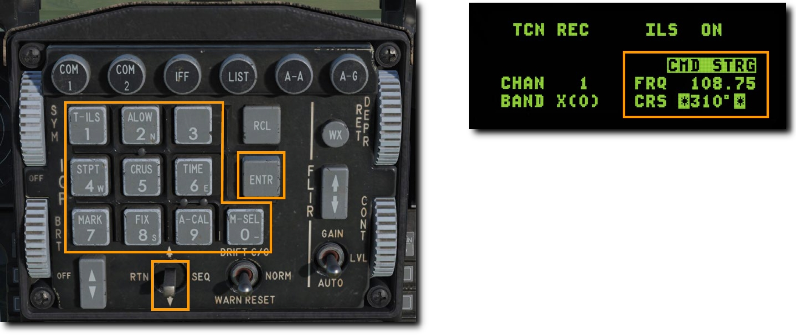

上記の例では、ヴァザニ空港のランウェイ 31 の ILS である 108.75 MHz の周波数に合わせています。
**CMD STRG** がハイライトされていれば ILS の電波を受信しています。

### ILS グライドスロープとローカライザーを用いたナビゲーション

HSI のモードセレクターを PLS にして ILS ステーションが利用可能な距離内まで接近すると、TACAN のときのように HSI と ADI に選択した ILS ステーションまでの操縦情報が表示されます。

HSI、ADI、HUD に ILS のグライドスロープとローカライザーを表示する前に、HSI で **PLS (Precision Landing System: 精密着陸システム)** モードを選択する必要があります。

#### HSI 表示

モードに **PLS NAV** もしくは **PLS TCN** と表示されるまでモードセレクターを押します。

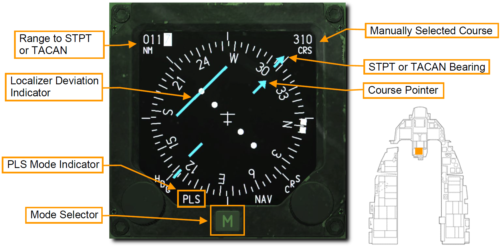

HSI の動作は Bearing Pointer (方位ポインター) がステアポイントではなく ILS ローカライザーを指していること以外は、ステアポイント選択時と同様です。

#### ADI 表示

ADI にはローカライザー (進入方向) とグライドスロープ (進入角) に対する自機の位置が表示されます。

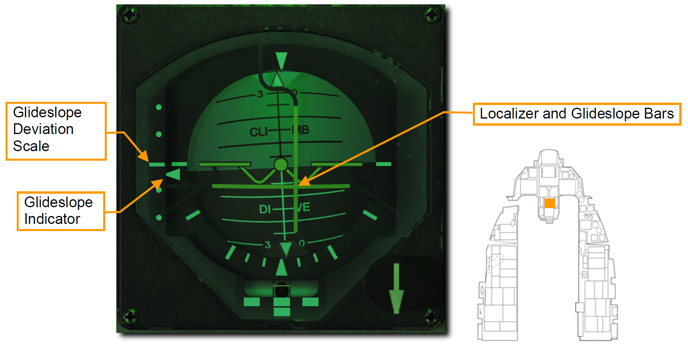

- **Localizear and Glide Slope Bars (ローカライザーバー/グライドスロープバー)**: 水平のグライドスロープバーが ADI の中央にある場合、自機は ILS から得られる進入角に沿って降下しています。バーが ADI の半分より上にある場合は、グライドスロープより低いパスを飛行しており、高度を上げる必要があることを意味します。垂直のローカライザーバーは、自機が滑走路に対して左右どちらにいるかを表示します。バーが ADI の中央より右にある場合は、コースの右側を飛行しています。適切なグライドスロープ進入を行うには、2本のバーが ADI の中央で十字を形成するように飛行します。この状態は "center the bars" とも呼ばれます。
- **Glide Slope Deviation Scale and Glide Slope Indicator (グライドスロープ偏差目盛り/グライドスロープ表示)**: ADI の左側にある固定の目盛りと上下する符号は、グライドスロープに対する自機の位置を表しています。符号はグライドスロープに準じています。中央より高い位置にある場合は、あなたの航空機がグライドスロープより低いことを意味します。例えば、符号が一番下のドットの位置にあればグライドスロープよりも上を飛んでいることになります。これを表す一般的な言い回しは "You are 2 dots high" です。反対に、符号が中央から1つ上のドット位置にあればグライドスロープより低い高度を飛んでいます。このときは "You are 1 dot low" です。1ドット以上低いときか2ドット以上高いときはアプローチから大幅に外れているため、通常であれば着陸を履行すべきです。
- **Glide Slope and Localizer Warning Flags (グライドスロープ/ローカライザー警報フラッグ)**: ILS のグライドスロープもしくはローカライザー電波の受信に問題があるときに表示されます。(上図には表記無し)

#### HUD 表示

グライドスロープに対する自機の位置は HUD にも表示されます。
DED の ILS ページで **CMD STRG** がハイライトされていれば、Command Steering Guidance (操縦指令誘導) が有効です。

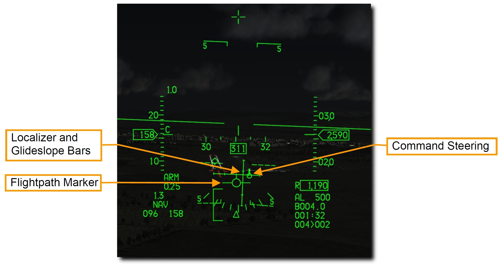

- **Command Steering Symbol (操縦指令シンボル)**: ローカライザーのデータが受信できている場合に HUD に表示され、着陸進入を補助します。グライドスロープの中心に近づくと、ピッチ操縦データが有効であることを示す小さな線がシンボルに表示されます。
- **Localizer and Glide Slope Bars (ローカライザーバー/グライドスロープバー)**: ADI に表示されているバーと同一です。水平のグライドスロープバーがフライトパスマーカー (FPM) の中心にあれば、航空機は ILS から得られる進入角に沿って降下しています。バーが FPM の中心より上にある場合はグライドスロープより低いパスを飛行しており、高度を上げる必要があることを意味します。垂直のローカライザーバーは、自機が滑走路に対して左右どちらにいるかを表示します。バーが FPM の中央より右にある場合は、コースの右側を飛行しています。適切なグライドスロープ進入を行うには、2本のバーが FPM の中央で十字を形成するように飛行します。この状態は "center the bars" とも呼ばれます。
