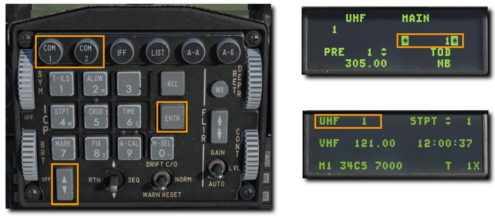
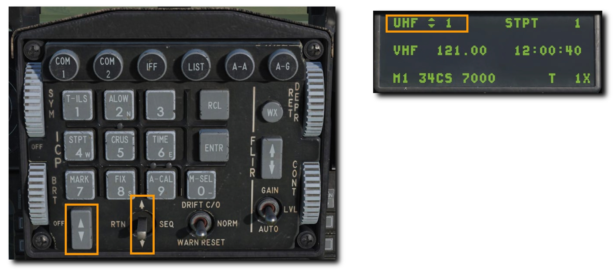
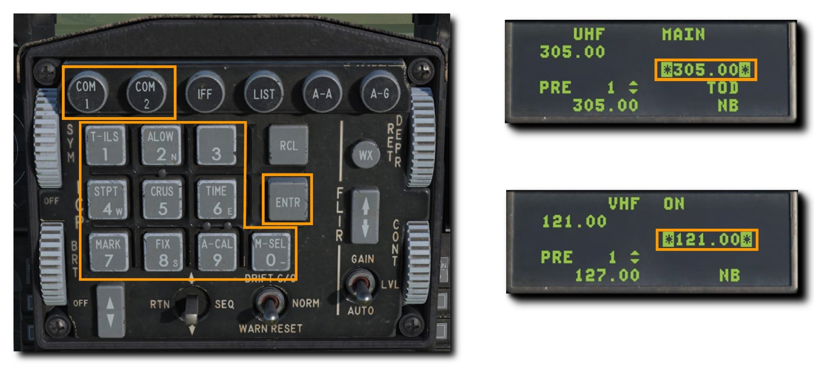

# 無線通信システム

作戦に参加する他のアセットからの無線を受信したりメッセージを送信するには、無線機を適切に設定しなければなりません。
設定されていなければ独り言を喋っているのと同じです。

## Radio Frequencies: 無線周波数

UHF (COM 1) 無線機と VHF (COM 2) 無線機に設定されている現在の周波数は DED の CNI ページに表示されています。

ミッションが作製されると、それぞれの局に UHF か VHF 周波数が割り当てられます。
周波数はそれぞれ、プリセットチャンネルとして保存されていますが、手動で周波数を入力することもできます。
使用する周波数はミッションブリーフィングで共有されるので、作戦を開始するまえに周波数を合わせておきましょう。

一般的に以下の決まりがあります。

- 編隊内でもっとも使用する機会が多いのは VHF 無線です。編隊内無線周波数に対応したチャンネルを使います。
- 作戦地域で活動する他の航空機は普通、 UHF 無線を使います。正しく設定されてれば作戦地域で活動する航空機の無線通信が聞こえてくるでしょう。AWACS (早期警戒管制機) も普通はこの共通無線を使用します。
- JTAC はほとんどの場合において、固有の VHF か UHF 周波数が割り当てられます。
- 各飛行場の ATC は固有の VHF か UHF 周波数をもっています。
- 空中給油機はそれぞれ別の VHF もしくは UHF 周波数を使います。

このように、作戦中はいくつもの無線周波数を切り替えています。
無線周波数のプリセット機能がこれらの助けになるでしょう。

### 無線周波数プリセットの変更

1. ICP の **COM 1** か **COM 2** オーバーライドボタンを押します。
2. 希望するプリセットチャンネルの番号を入力し ENTR を押します。
3. 無線機は新たなプリセット周波数で送受信されます。

プリセットチャンネルが選択されていれば、それらを順番に切り替えることができます。

1. DCS スイッチを、プリセットチャンネルの隣に矢印が表示されるまで上に倒します。
2. インクリメント/デクリメントスイッチでチャンネルを切り替えます

### 無線周波数の手動変更

1. ICP の **COM 1** か **COM 2** オーバーライドボタンを押します。
2. 希望する無線周波数を入力し ENTR を押します。
3. 無線機は新たな無線周波数で送受信されます。

## Radio Commands: 無線の交信

他のアセットへの命令や要求は無線システムを通じて行います。
地上では **[ \ ]** **バックスラッシュキー**を押して無線メニューを開きます。
飛行中は HOTAS コントロールからしか通信できません。

**UHF VHF 無線通信スイッチ**

- **前**: VHF 補助無線機 **[RCtrl + \ ]**
- **後**: UHF 主無線機 **[RAlt + \ ]**
- **左**: 機能なし
- **右**: 機能なし

無線を使うには DCS の設定の GAMEPLAY タブにある **"EASY COMMUNICATION"** OPTION による2通りの方法があります。

### Easy Communication 無効時

それぞれの通信対象の正しい変調方式と周波数を知っていなければならない、より現実的なモードです。
正しいチャンネルプリセット、もしくは正しい無線周波数を入力する必要があります。

### Easy Communication 有効時

[ \ ] バックスラッシュキーで無線メニューが開けるモードです。
無線メニューには交信相手とサブコマンドウィンドウを開くためのファンクションキーが表示されます。

無線メニューの文字の色によって以下の違いがあります。

- 白文字であれば、少なくとも1つの無線機が通信できるように調整されています。
- グレーであれば、少なくとも1つの無線機の周波数を合わせれば通信できます。
- 黒文字であれば、地形もしくは地球の曲面による見通し線の影響によって通信ができません。

メニューにはそれぞれの交信相手の変調方式と周波数も表示されます。
交信相手を選択すると、無線機は自動的に周波数を合わせます。

UHF VHF 無線送信スイッチを使うと、その変調方式に応じて交信相手が色分けされます。
