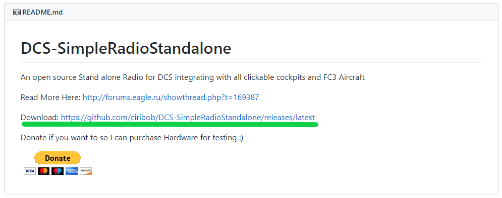
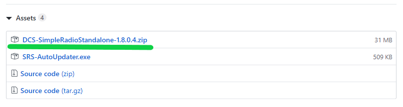
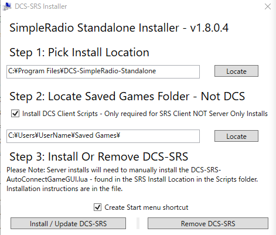
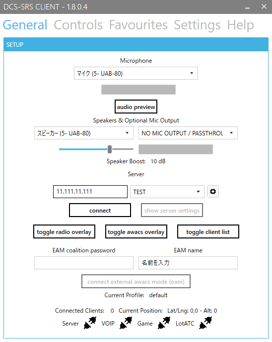
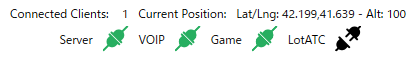
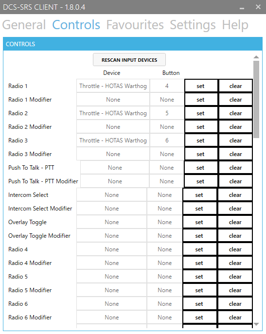
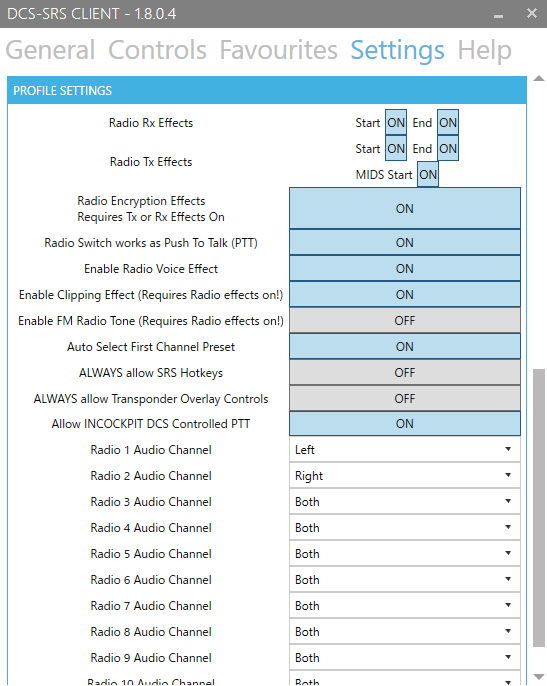

# 導入と設定

## 導入

1. 以下の URL を開き、一番下の README の項目から Downlod リンクを開きます。

    :fa-external-link: [DCS-SimpleRadioStandalone](https://github.com/ciribob/DCS-SimpleRadioStandalone)

    

2. ページ一番下の Assets から "DCS-SimpleRadioStandalone-1.8.X.X.zip" をダウンロードします。

    ※Donation Link は寄付用のリンクなので注意 (しなくてもOK)

    

3. ダウンロードしたファイルを解凍し、Installer.exe を起動します。
4. Step 1 に SRS Mod のインストール先を指定します。

    Step 2 に Saved Game (保存したゲーム) フォルダのパスを指定します。

    

5. Install / Update DCS-SRS ボタンを押して完了です。

## 設定

### General

"Microphone" と "Speakers" をご使用のものに設定してください。

"Server" の左項に SRS サーバーのアドレスを入力します。

"connect" で接続でき、正しく接続されると下部のコンセントのマークが以下の通りになるはずです。

"EAM name" は AWACS オーバーレイでの自分の表示名です。

### Controls

それぞれの項目はゲーム内の機体の無線機に対応しています。
ゲーム内の無線機のキーバインドと同じもので大丈夫です。

例えば3つの無線機をもつ A-10C であれば "Radio 1" "Radio 2" "Radio 3" を設定します。
("Radio 1" が VHF AM、"Radio 2" が UHF、"Radio 3" が VHF FM 無線機に対応しています)

F/A-18C であれば無線機は2つなので "Radio 1" と "Radio 2" を設定します。
("Radio 1" が COMM1 UHF、"Radio 2" が COMM2 UHF 無線機に対応しています)

現在のバージョンではプリセットとして保存できないため、機体ごとに変更する必要があります。

### Favourites

サーバーアドレスをプリセットとして保存できます。

### Settings

"Grobal Settings" はデフォルトのままで大丈夫です。

**"Profile Settings" の "Radio Switch works as Push To Talk (PTT)" をオンにしましょう。**
これでコントロールで設定したボタンを押している間、無線を送信できます。

"Radio X Audio Channel" はそれぞれの無線機からの音声の聞こえ方を設定できます。
"Left" にするとヘッドセットの左側から聞こえ、"Right" にすると右側から聞こえるようになります。
"Both" はステレオ (両方) から聞こえます。

以上の設定を行い、ゲーム内で機体の周波数を正しく設定していれば、同じ周波数同士で無線通信が行えるはずです。

## アップデート

SRS は DCS 本体の更新などに合わせてアップデート版がリリースされますが、インストールフォルダ内の "SRS-AutoUpdater.exe" を起動することでアップデートできます。

アップデートは DCS を終了している必要があります。

アップデート版のダウンロードが終わると、インストールするかどうか尋ねられますので「はい」を押して完了です。

