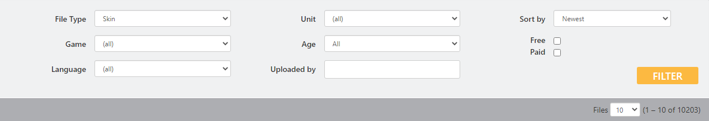

# ユーザースキン 導入手順

**※多くのユーザースキンは二次配布が禁止されています。**

ユーザーによって作成されたカスタムスキンをDCSで使う方法について紹介します。

1. DCSの公式サイトからユーザースキンをダウンロードします。

     :fa-external-link: [DCS-Downloads User Files](https://www.digitalcombatsimulator.com/en/files/)

    "File Type" を **Skin** にして、"Unit" からお好みの機体を選択します。

    